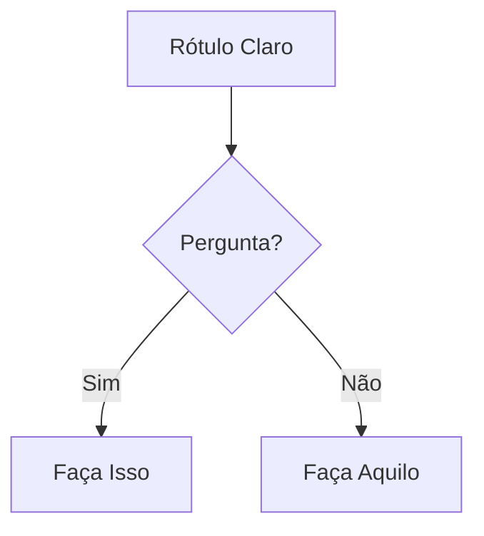

# Padrões de Documentação Técnica para BMAD

**Para o Agente: Escritor Técnico**
**Propósito: Referência concisa para criação e revisão de documentação**

---

## REGRAS CRÍTICAS

### Regra 1: Conformidade Estrita com CommonMark

TODA a documentação DEVE seguir a especificação CommonMark exatamente. Sem exceções.

### Regra 2: SEM ESTIMATIVAS DE TEMPO

NUNCA documente estimativas de tempo, durações ou tempos de conclusão para qualquer fluxo de trabalho, tarefa ou atividade. Isso inclui:

- Tempo de execução de fluxo de trabalho (ex: "30-60 min", "2-8 horas")
- Estimativas de duração de tarefa
- Estimativas de tempo de leitura
- Faixas de tempo de implementação
- Quaisquer medidas temporais

O tempo varia dramaticamente baseado em:

- Complexidade do projeto
- Experiência do time
- Ferramentas e ambiente
- Troca de contexto
- Bloqueadores imprevistos

**Em vez disso:** Foque em passos do fluxo de trabalho, dependências e saídas. Deixe os usuários determinarem seus próprios cronogramas.

### Essenciais do CommonMark

**Cabeçalhos:**

- Use estilo ATX APENAS: `#` `##` `###` (NÃO sublinhados Setext)
- Espaço único após `#`: `# Título` (NÃO `#Título`)
- Sem `#` à direita: `# Título` (NÃO `# Título #`)
- Ordem hierárquica: Não pule níveis (h1→h2→h3, não h1→h3)

**Blocos de Código:**

- Use blocos cercados com identificador de linguagem:
  ````markdown
  ```javascript
  const exemplo = 'codigo';
  ```
  ````
- NÃO blocos de código indentados (ambíguo)

**Listas:**

- Marcadores consistentes dentro da lista: todos `-` ou todos `*` ou todos `+` (não misture)
- Indentação adequada para itens aninhados (2 ou 4 espaços, mantenha consistência)
- Linha em branco antes/depois da lista para clareza

**Links:**

- Inline: `[texto](url)`
- Referência: `[texto][ref]` então `[ref]: url` no final
- SEM URLs soltas sem colchetes `<>`

**Ênfase:**

- Itálico: `*texto*` ou `_texto_`
- Negrito: `**texto**` ou `__texto__`
- Estilo consistente dentro do documento

**Quebras de Linha:**

- Dois espaços no final da linha + nova linha, OU
- Linha em branco entre parágrafos
- SEM quebras de linha únicas (elas são ignoradas)

---

## Diagramas Mermaid: Sintaxe Válida Necessária

**Regras Críticas:**

1. Sempre especifique o tipo de diagrama na primeira linha
2. Use sintaxe Mermaid v10+ válida
3. Teste a sintaxe antes de gerar a saída (validação mental)
4. Mantenha focado: 5-10 nós ideal, máx 15

**Seleção de Tipo de Diagrama:**

- **flowchart** - Fluxos de processo, árvores de decisão, fluxos de trabalho
- **sequenceDiagram** - Interações de API, fluxos de mensagem, processos baseados em tempo
- **classDiagram** - Modelos de objeto, relacionamentos de classe, estrutura de sistema
- **erDiagram** - Esquemas de banco de dados, relacionamentos de entidade
- **stateDiagram-v2** - Máquinas de estado, estágios de ciclo de vida
- **gitGraph** - Estratégias de branch, fluxos de controle de versão

**Formatação:**

````markdown

````

---

## Princípios do Guia de Estilo (Destilado)

Aplique nesta hierarquia:

1. **Guia específico do projeto** (se existir) - sempre pergunte primeiro
2. **Convenções BMAD** (este documento)
3. **Estilo Google Developer Docs** (padrões abaixo)
4. **Especificação CommonMark** (quando em dúvida)

### Regras Principais de Escrita

**Foco Orientado a Tarefa:**

- Escreva para OBJETIVOS do usuário, não listas de funcionalidades
- Comece com POR QUE, depois COMO
- Todo documento responde: "O que eu posso realizar?"

**Princípios de Clareza:**

- Voz ativa: "Clique no botão" NÃO "O botão deve ser clicado"
- Tempo presente: "A função retorna" NÃO "A função retornará"
- Linguagem direta: "Use X para Y" NÃO "X pode ser usado para Y"
- Segunda pessoa: "Você configura" NÃO "Usuários configuram" ou "Alguém configura"

**Estrutura:**

- Uma ideia por sentença
- Um tópico por parágrafo
- Cabeçalhos descrevem o conteúdo com precisão
- Exemplos seguem explicações

**Acessibilidade:**

- Texto de link descritivo: "Veja a referência da API" NÃO "Clique aqui"
- Texto alternativo para diagramas: Descreva o que ele mostra
- Hierarquia de cabeçalho semântica (não pule níveis)
- Tabelas têm cabeçalhos
- Emojis são aceitáveis se as preferências do usuário permitirem (ferramentas de acessibilidade modernas suportam bem emojis)

---

## Documentação OpenAPI/API

**Elementos Necessários:**

- Caminho do endpoint e método
- Requisitos de autenticação
- Parâmetros da requisição (caminho, query, corpo) com tipos
- Exemplo de requisição (realista, funcional)
- Esquema de resposta com tipos
- Exemplos de resposta (sucesso + erros comuns)
- Códigos de erro e significados

**Padrões de Qualidade:**

- Conformidade com especificação OpenAPI 3.0+
- Esquemas completos (sem campos faltando)
- Exemplos que realmente funcionam
- Mensagens de erro claras
- Esquemas de segurança documentados

---

## Tipos de Documentação: Referência Rápida

**README:**

- O quê (visão geral), Por que (propósito), Como (início rápido)
- Instalação, Uso, Contribuindo, Licença
- Abaixo de 500 linhas (link para docs detalhados)

**Referência de API:**

- Cobertura completa de endpoints
- Exemplos de requisição/resposta
- Detalhes de autenticação
- Tratamento de erro
- Limites de taxa se aplicável

**Guia do Usuário:**

- Seções baseadas em tarefas (Como fazer...)
- Instruções passo a passo
- Screenshots/diagramas onde útil
- Seção de solução de problemas

**Docs de Arquitetura:**

- Diagrama de visão geral do sistema (Mermaid)
- Descrições de componentes
- Fluxo de dados
- Decisões tecnológicas (ADRs)
- Arquitetura de implantação

**Guia do Desenvolvedor:**

- Requisitos de setup/ambiente
- Organização de código
- Fluxo de trabalho de desenvolvimento
- Abordagem de teste
- Diretrizes de contribuição

---

## Checklist de Qualidade

Antes de finalizar QUALQUER documentação:

- [ ] Compatível com CommonMark (sem violações)
- [ ] SEM estimativas de tempo em qualquer lugar (Regra Crítica 2)
- [ ] Cabeçalhos na hierarquia adequada
- [ ] Todos os blocos de código têm tags de linguagem
- [ ] Links funcionam e têm texto descritivo
- [ ] Diagramas Mermaid renderizam corretamente
- [ ] Voz ativa, tempo presente
- [ ] Orientado a tarefa (responde "como eu faço...")
- [ ] Exemplos são concretos e funcionais
- [ ] Padrões de acessibilidade atendidos
- [ ] Ortografia/gramática verificada
- [ ] Lê-se claramente no nível de habilidade alvo

---

## Convenções Específicas do BMAD

**Organização de Arquivo:**

- `README.md` na raiz de cada componente principal
- Pasta `docs/` para documentação extensa
- Docs específicos de fluxo de trabalho na pasta do fluxo de trabalho
- Referências cruzadas usam caminhos relativos

**Frontmatter:**
Use frontmatter YAML quando apropriado:

```yaml
---
title: Título do Documento
description: Breve descrição
author: Nome do autor
date: AAAA-MM-DD
---
```

**Metadados:**

- Sempre inclua data da última atualização
- Informação de versão para docs versionados
- Atribuição de autor para responsabilidade

---

**Lembre-se: Esta é sua fundação. Siga estas regras consistentemente, e toda a documentação será clara, acessível e sustentável.**
