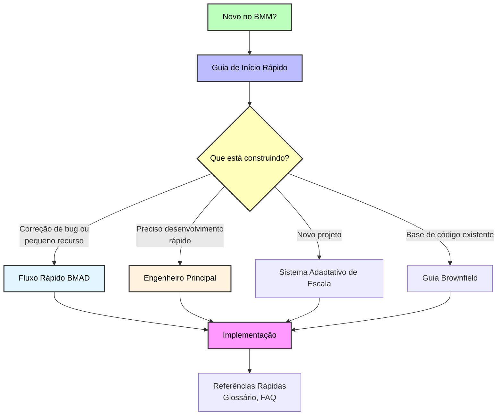

# Documentação BMM

Guias completos para o Módulo de Método BMad (BMM) - fluxos de trabalho de desenvolvimento ágil movidos por IA que se adaptam à complexidade do seu projeto.

---

## 🚀 Introdução

**Novo no BMM?** Comece aqui:

- **[Guia de Início Rápido](./quick-start.md)** - Guia passo-a-passo para construir seu primeiro projeto (15 min de leitura)
  - Instalação e configuração
  - Compreensão das quatro fases
  - Executando seus primeiros fluxos de trabalho
  - Fluxo de desenvolvimento baseado em agentes

**Caminho Rápido:** Instalar → workflow-init → Seguir orientação do agente

### 📊 Visão Geral Visual

**[Diagrama Completo do Fluxo de Trabalho](./images/workflow-method-greenfield.svg)** - Fluxograma visual mostrando todas as fases, agentes (coloridos), e pontos de decisão para o método padrão BMad de greenfield.

---

## 📖 Conceitos Principais

Compreendendo como o BMM se adapta às suas necessidades:

- **[Sistema Adaptativo de Escala](./scale-adaptive-system.md)** - Como o BMM se adapta ao tamanho e complexidade do projeto (42 min de leitura)
  - Três faixas de planejamento (Fluxo Rápido, Método BMad, Método Empresarial)
  - Recomendação automática de faixa
  - Requisitos de documentação por faixa
  - Roteamento de fluxo de trabalho de planejamento

- **[Fluxo Rápido BMAD](./bmad-quick-flow.md)** - Fluxo de trabalho de desenvolvimento rápido (32 min de leitura)
  - Processo de 3 etapas: especificação → desenvolvimento → revisão opcional
  - Perfeito para correções de bugs e pequenos recursos
  - Prototipagem rápida com qualidade de produção
  - Horas até implementação, não dias
  - Agente Barry (Desenvolvedor Solo de Fluxo Rápido) proprietário

- **[Agente Desenvolvedor Solo de Fluxo Rápido](./quick-flow-solo-dev.md)** - Desenvolvedor solo de elite para desenvolvimento rápido (18 min de leitura)
  - Barry é um desenvolvedor de elite que prospera na execução autônoma
  - Vive e respira o fluxo de trabalho de Fluxo Rápido BMAD
  - Leva projetos de conceito para implantação com eficiência implacável
  - Sem transferências, sem atrasos - apenas desenvolvimento focado puro

---

## 🤖 Agentes e Colaboração

Guia completo da equipe de agentes IA do BMM:

- **[Guia de Agentes](./agents-guide.md)** - Referência abrangente de agentes (45 min de leitura)
  - 12 agentes BMM especializados + Mestre BMad
  - Funções de agentes, fluxos de trabalho, e quando usar
  - Sistema de customização de agentes
  - Práticas recomendadas e padrões comuns

- **[Guia do Modo Festa](./party-mode.md)** - Colaboração multi-agente (20 min de leitura)
  - Como o modo festa funciona (19+ agentes colaboram em tempo real)
  - Quando usar (estratégico, criativo, cross-functional, complexo)
  - Composições de festa de exemplo
  - Integração multi-módulo (BMM + CIS + BMB + custom)
  - Customização de agentes no modo festa
  - Práticas recomendadas

---

## 🔧 Trabalhando com Código Existente

Guia abrangente para desenvolvimento brownfield:

- **[Guia de Desenvolvimento Brownfield](./brownfield-guide.md)** - Guia completo para bases de código existentes (53 min de leitura)
  - Estratégias de fase de documentação
  - Seleção de faixas para brownfield
  - Integração com padrões existentes
  - Orientação de fluxo de trabalho fase-por-fase
  - Cenários comuns

---

## 📚 Referências Rápidas

Materiais de referência essenciais:

- **[Glossário](./glossary.md)** - Terminologia e conceitos chave
- **[FAQ](./faq.md)** - Perguntas frequentes em todos os tópicos
- **[Desenvolvimento Agêncico Empresarial](./enterprise-agentic-development.md)** - Estratégias de colaboração em equipe

---

## 🎯 Escolha Seu Caminho

### Eu preciso...

**Construir algo novo (greenfield)**
→ Comece com [Guia de Início Rápido](./quick-start.md)
→ Então revise [Sistema Adaptativo de Escala](./scale-adaptive-system.md) para entender faixas

**Corrigir um bug ou adicionar pequeno recurso**
→ Vá para [Fluxo Rápido BMAD](./bmad-quick-flow.md) para desenvolvimento rápido
→ Ou use [Desenvolvedor Solo de Fluxo Rápido](./quick-flow-solo-dev.md) diretamente

**Trabalhar com base de código existente (brownfield)**
→ Leia [Guia de Desenvolvimento Brownfield](./brownfield-guide.md)
→ Preste atenção especial aos requisitos de documentação para projetos brownfield

**Entender faixas de planejamento e metodologia**
→ Veja [Sistema Adaptativo de Escala](./scale-adaptive-system.md)

**Encontrar comandos específicos ou respostas**
→ Verifique [FAQ](./faq.md)

---

## 📋 Guias de Fluxo de Trabalho

Documentação abrangente para todos os fluxos de trabalho BMM organizados por fase:

- **[Fase 1: Fluxos de Trabalho de Análise](./workflows-analysis.md)** - Fluxos de trabalho opcionais de exploração e pesquisa (595 linhas)
  - brainstorm-project, product-brief, research, e mais
  - Quando usar fluxos de trabalho de análise
  - Ferramentas criativas e estratégicas

- **[Fase 2: Fluxos de Trabalho de Planejamento](./workflows-planning.md)** - Planejamento adaptativo de escala (967 linhas)
  - prd, tech-spec, gdd, narrativa, ux
  - Abordagem de planejamento baseada em faixa (Fluxo Rápido, Método BMad, Método Empresarial)
  - Qual fluxo de trabalho de planejamento usar

- **[Fase 3: Fluxos de Trabalho de Solução](./workflows-solutioning.md)** - Arquitetura e validação (638 linhas)
  - arquitetura, create-epics-and-stories, implementation-readiness
  - V6: Épicos criados APÓS arquitetura para melhor qualidade
  - Obrigatório para faixas Método BMad e Método Empresarial
  - Prevenção de conflitos de agentes

- **[Fase 4: Fluxos de Trabalho de Implementação](./workflows-implementation.md)** - Desenvolvimento baseado em sprint (1.634 linhas)
  - sprint-planning, create-story, dev-story, code-review
  - Ciclo de vida completo da história
  - Disciplina de uma-história-de-cada-vez

- **[Fluxos de Trabalho de Teste e QA](./test-architecture.md)** - Garantia abrangente de qualidade (1.420 linhas)
  - Estratégia de teste, automação, portões de qualidade
  - Agente TEA e cura de teste
  - Modos BMad-integrated vs standalone

**Total: 34 fluxos de trabalho documentados em todas as fases**

### Referências Avançadas de Fluxo de Trabalho

Para documentação técnica detalhada em fluxos de trabalho complexos específicos:

- **[Referência de Fluxo de Trabalho Documentar Projeto](./workflow-document-project-reference.md)** - Mergulho técnico profundo (445 linhas)
  - Arquitetura safe-context v1.2.0
  - Níveis de scan, resumabilidade, write-as-you-go
  - Detecção de projeto multi-parte
  - Modo deep-dive para análise direcionada

- **[Referência de Fluxo de Trabalho Arquitetura](./workflow-architecture-reference.md)** - Guia de arquitetura de decisão (320 linhas)
  - Inteligência de template inicial
  - Design de padrão novo
  - Padrões de implementação para consistência de agentes
  - Abordagem de facilitação adaptativa

---

## 🧪 Teste e Qualidade

Orientação de garantia de qualidade:

<!-- Documentação de Test Architect a ser adicionada -->

- Fluxos de trabalho de design de teste
- Portões de qualidade
- Avaliação de risco

## 🏗️ Estrutura do Módulo

Compreendendo componentes BMM:

- **[README do Módulo BMM](../README.md)** - Visão geral da estrutura do módulo
  - Roster de agentes e funções
  - Organização de fluxos de trabalho
  - Equipes e colaboração
  - Práticas recomendadas

---

## 🌐 Recursos Externos

### Comunidade e Suporte

- **[Comunidade Discord](https://discord.gg/gk8jAdXWmj)** - Obtenha ajuda da comunidade (#general-dev, #bugs-issues)
- **[Issues do GitHub](https://github.com/bmad-code-org/BMAD-METHOD/issues)** - Reporte bugs ou solicite recursos
- **[Canal YouTube](https://www.youtube.com/@BMadCode)** - Tutoriais em vídeo e walkthroughs

### Documentação Adicional

- **[Guias de Configuração IDE](../../../docs/ide-info/)** - Configure seu ambiente de desenvolvimento
  - Claude Code
  - Cursor
  - Windsurf
  - VS Code
  - Outros IDEs

---

## 📊 Mapa de Documentação

---

## 💡 Dicas para Usar Esta Documentação

1. **Comece com Início Rápido** se você é novo - fornece a fundação essencial
2. **Use o FAQ** para encontrar respostas rápidas sem ler guias inteiros
3. **Marque Glossário** para referências de terminologia ao ler outros documentos
4. **Siga os caminhos sugeridos** acima baseado na sua situação específica
5. **Junte-se ao Discord** para ajuda interativa e insights da comunidade

---

**Pronto para começar?** → [Comece com o Guia de Início Rápido](./quick-start.md)
