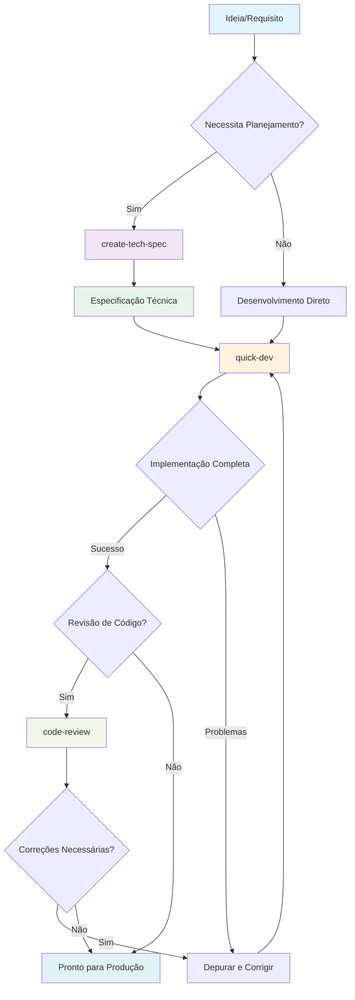
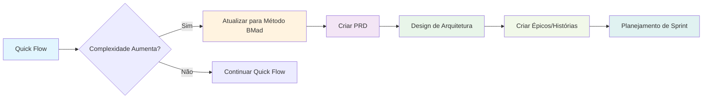

# BMAD Quick Flow

**Trilha:** Quick Flow
**Agente Primário:** Quick Flow Solo Dev (Barry)
**Ideal Para:** Correções de bugs, pequenas funcionalidades, prototipagem rápida

---

## Visão Geral

BMAD Quick Flow é o caminho mais rápido da ideia à produção no ecossistema do Método BMAD. É um processo simplificado de 3 etapas projetado para desenvolvimento rápido sem sacrificar a qualidade. Perfeito para equipes experientes que precisam se mover rápido ou para funcionalidades menores que não requerem planejamento extensivo.

### Quando Usar Quick Flow

**Perfeito Para:**

- Correções de bugs e patches
- Adições de pequenas funcionalidades (1-3 dias de trabalho)
- Provas de conceito e protótipos
- Otimizações de desempenho
- Adições de endpoint de API
- Melhorias de componentes de UI
- Mudanças de configuração
- Ferramentas internas

**Não Recomendado Para:**

- Redesigns de sistema em larga escala
- Projetos complexos de múltiplas equipes
- Lançamentos de novos produtos
- Projetos exigindo design UX extensivo
- Iniciativas em toda a empresa
- Sistemas de missão crítica com requisitos de conformidade

---

## O Processo Quick Flow



### Passo 1: Especificação Técnica Opcional

O fluxo de trabalho `create-tech-spec` transforma requisitos em especificações prontas para implementação.

**Recursos Chave:**

- Engenharia de especificação conversacional
- Detecção automática de padrões da base de código
- Coleta de contexto de código existente
- Quebra de tarefas pronta para implementação
- Definição de critérios de aceitação

**Fluxo do Processo:**

1. **Entendimento do Problema**
   - Cumprimentar usuário e coletar requisitos
   - Fazer perguntas de esclarecimento sobre escopo e restrições
   - Verificar contexto de projeto existente

2. **Investigação de Código (Brownfield)**
   - Analisar padrões de base de código existentes
   - Documentar stack técnico e convenções
   - Identificar arquivos para modificar e dependências

3. **Geração de Especificação**
   - Criar especificação técnica estruturada
   - Definir tarefas claras e critérios de aceitação
   - Documentar decisões técnicas
   - Incluir contexto de desenvolvimento

4. **Revisar e Finalizar**
   - Apresentar especificação para validação
   - Fazer ajustes conforme necessário
   - Salvar em artefatos de sprint

**Saída:** `{sprint_artifacts}/tech-spec-{slug}.md`

### Passo 2: Desenvolvimento

O fluxo de trabalho `quick-dev` executa a implementação com flexibilidade e velocidade.

**Dois Modos de Execução:**

**Modo A: Impulsionado por Tech-Spec**

```bash
# Executar a partir da especificação técnica
quick-dev tech-spec-feature-x.md
```

- Carrega e analisa especificação técnica
- Extrai tarefas, contexto e critérios de aceitação
- Executa todas as tarefas em sequência
- Atualiza status da especificação na conclusão

**Modo B: Instruções Diretas**

```bash
# Comandos de desenvolvimento direto
quick-dev "Adicionar redefinição de senha ao serviço de autenticação"
quick-dev "Corrigir vazamento de memória no processamento de imagem"
```

- Aceita instruções de desenvolvimento diretas
- Oferece etapa de planejamento opcional
- Executa imediatamente com atrito mínimo

**Processo de Desenvolvimento:**

1. **Carregamento de Contexto**
   - Carregar contexto do projeto se disponível
   - Entender padrões e convenções
   - Identificar arquivos relevantes e dependências

2. **Loop de Implementação**
   Para cada tarefa:
   - Carregar arquivos relevantes e contexto
   - Implementar seguindo padrões estabelecidos
   - Escrever testes apropriados
   - Executar e verificar se testes passam
   - Marcar tarefa completa e continuar

3. **Execução Contínua**
   - Trabalha através de todas as tarefas sem parar
   - Lida com falhas solicitando orientação
   - Garante que testes passem antes de continuar

4. **Verificação**
   - Confirma todas as tarefas completas
   - Valida critérios de aceitação
   - Atualiza status da especificação técnica se usada

### Passo 3: Revisão de Código Opcional

O fluxo de trabalho `code-review` fornece revisão de desenvolvedor sênior do código implementado.

**Quando Usar:**

- Funcionalidades críticas para produção
- Implementações sensíveis à segurança
- Otimizações de desempenho
- Cenários de desenvolvimento em equipe
- Aprendizado e transferência de conhecimento

**Processo de Revisão:**

1. Carregar contexto da história e critérios de aceitação
2. Analisar implementação de código
3. Verificar contra padrões do projeto
4. Validar cobertura de testes
5. Fornecer notas de revisão estruturadas
6. Sugerir melhorias se necessário

---

## Quick Flow vs Outras Trilhas

| Aspecto           | Quick Flow       | Método BMad     | Método Empresarial |
| ----------------- | ---------------- | --------------- | ------------------ |
| **Planejamento**  | Mínimo/Opcional  | Estruturado     | Abrangente         |
| **Documentação**  | Apenas essencial | Moderada        | Extensiva          |
| **Tamanho Equipe**| 1-2 desenvolvedores | 3-7 especialistas | 8+ equipe empresarial |
| **Cronograma**    | Horas a dias     | Semanas a meses | Meses a trimestres |
| **Cerimônia**     | Mínima           | Equilibrada     | Governança completa|
| **Flexibilidade** | Alta             | Moderada        | Estruturada        |
| **Perfil Risco**  | Médio            | Baixo           | Muito Baixo        |

---

## Melhores Práticas

### Antes de Iniciar Quick Flow

1. **Validar Seleção de Trilha**
   - A funcionalidade é pequena o suficiente?
   - Você tem requisitos claros?
   - A equipe está confortável com desenvolvimento rápido?

2. **Preparar Contexto**
   - Tenha documentação do projeto pronta
   - Conheça seus padrões de base de código
   - Identifique componentes afetados antecipadamente

3. **Definir Limites Claros**
   - Defina itens dentro e fora do escopo
   - Estabeleça critérios de aceitação
   - Identifique dependências

### Durante o Desenvolvimento

1. **Manter Velocidade**
   - Não super-engenheire soluções
   - Siga padrões existentes
   - Mantenha testes proporcionais ao risco

2. **Manter Foco**
   - Resista ao aumento de escopo
   - Lide com casos extremos mais tarde se possível
   - Documente decisões brevemente

3. **Comunicar Progresso**
   - Atualize status da tarefa regularmente
   - Sinalize bloqueios imediatamente
   - Compartilhe aprendizado com a equipe

### Após Conclusão

1. **Portões de Qualidade**
   - Garanta que testes passem
   - Verifique critérios de aceitação
   - Considere revisão de código opcional

2. **Transferência de Conhecimento**
   - Atualize documentação relevante
   - Compartilhe decisões chave
   - Note quaisquer padrões descobertos

3. **Prontidão de Produção**
   - Verifique requisitos de implantação
   - Verifique necessidades de monitoramento
   - Planeje estratégia de rollback

---

## Modelos Quick Flow

### Modelo de Especificação Técnica

```markdown
# Tech-Spec: {Título da Funcionalidade}

**Criado:** {data}
**Status:** Pronto para Desenvolvimento
**Esforço Estimado:** Pequeno (1-2 dias)

## Visão Geral

### Declaração do Problema

{Descrição clara do que precisa ser resolvido}

### Solução

{Abordagem de alto nível para resolver o problema}

### Escopo (Dentro/Fora)

**Dentro:** {O que será implementado}
**Fora:** {Itens explicitamente excluídos}

## Contexto para Desenvolvimento

### Padrões da Base de Código

{Padrões chave a seguir, convenções}

### Arquivos para Referência

{Lista de arquivos relevantes e seu propósito}

### Decisões Técnicas

{Escolhas técnicas importantes e justificativa}

## Plano de Implementação

### Tarefas

- [ ] Tarefa 1: {Tarefa de implementação específica}
- [ ] Tarefa 2: {Tarefa de implementação específica}
- [ ] Tarefa 3: {Teste e validação}

### Critérios de Aceitação

- [ ] AC 1: {Formato Dado/Quando/Então}
- [ ] AC 2: {Formato Dado/Quando/Então}

## Contexto Adicional

### Dependências

{Dependências externas ou pré-requisitos}

### Estratégia de Teste

{Como a funcionalidade será testada}

### Notas

{Considerações adicionais}
```

### Comandos Quick Dev

```bash
# A partir da especificação técnica
quick-dev sprint-artifacts/tech-spec-user-auth.md

# Desenvolvimento direto
quick-dev "Adicionar middleware CORS aos endpoints da API"
quick-dev "Corrigir exceção de ponteiro nulo no serviço de usuário"
quick-dev "Otimizar consulta de banco de dados para lista de usuários"

# Com planejamento opcional
quick-dev "Implementar funcionalidade de upload de arquivo" --plan
```

---

## Integração com Outros Fluxos de Trabalho

### Atualizando Trilhas

Se uma funcionalidade Quick Flow crescer em complexidade:



### Usando Modo Festa

Para desafios complexos do Quick Flow:

```bash
# Iniciar Barry
/bmad:bmm:agents:quick-flow-solo-dev

# Começar modo festa para resolução colaborativa de problemas
party-mode
```

O modo festa traz especialistas relevantes:

- **Arquiteto** - Para decisões de design
- **Dev** - Para pareamento de implementação
- **QA** - Para estratégia de teste
- **UX Designer** - Para experiência do usuário
- **Analista** - Para clareza de requisitos

### Integração de Garantia de Qualidade

Quick Flow pode integrar com agente TEA para testes automatizados:

- Geração de casos de teste
- Execução de teste automatizado
- Análise de cobertura
- Cura de teste

---

## Cenários Comuns Quick Flow

### Cenário 1: Correção de Bug

```
Requisito: "Usuários não conseguem redefinir senhas"
Processo: Desenvolvimento direto (sem necessidade de especificação)
Passos: Investigar → Corrigir → Testar → Implantar
Tempo: 2-4 horas
```

### Cenário 2: Pequena Funcionalidade

```
Requisito: "Adicionar funcionalidade de exportar para CSV"
Processo: Especificação Técnica → Desenvolvimento → Revisão de Código
Passos: Especificação → Implementar → Testar → Revisar → Implantar
Tempo: 1-2 dias
```

### Cenário 3: Correção de Desempenho

```
Requisito: "Otimizar consulta lenta de busca de produtos"
Processo: Especificação Técnica → Desenvolvimento → Revisão
Passos: Análise → Otimizar → Benchmark → Implantar
Tempo: 1 dia
```

### Cenário 4: Adição de API

```
Requisito: "Adicionar endpoints webhook para integrações"
Processo: Especificação Técnica → Desenvolvimento → Revisão
Passos: Design → Implementar → Documentar → Implantar
Tempo: 2-3 dias
```

---

## Métricas e KPIs

Rastreie essas métricas para garantir eficácia do Quick Flow:

**Métricas de Velocidade:**

- Funcionalidades concluídas por semana
- Tempo médio de ciclo (horas)
- Tempo de resolução de correção de bug
- Tempo de retorno de revisão de código

**Métricas de Qualidade:**

- Taxa de escape de defeito
- Porcentagem de cobertura de teste
- Taxa de incidente de produção
- Descobertas de revisão de código

**Métricas de Equipe:**

- Satisfação do desenvolvedor
- Frequência de compartilhamento de conhecimento
- Adesão ao processo
- Índice de autonomia

---

## Solução de Problemas Quick Flow

### Problemas Comuns

**Problema: Aumento de escopo durante desenvolvimento**
**Solução:** Referir de volta à especificação técnica, documentar explicitamente novos requisitos

**Problema: Padrões ou convenções desconhecidos**
**Solução:** Usar party-mode para trazer arquiteto ou dev sênior

**Problema: Gargalo de teste**
**Solução:** Aproveitar agente TEA para geração de teste automatizado

**Problema: Conflitos de integração**
**Solução:** Documentar dependências, coordenar com equipes afetadas

### Procedimentos de Emergência

**Hotfix de Produção:**

1. Criar branch a partir de produção
2. Quick dev com mudanças mínimas
3. Implantar para staging
4. Teste de regressão rápido
5. Implantar para produção
6. Merge para main

**Bug Crítico:**

1. Investigação imediata
2. Party-mode se não claro
3. Correção rápida com plano de rollback
4. Documentação post-mortem

---

## Documentação Relacionada

- **[Agente Quick Flow Solo Dev](./quick-flow-solo-dev_pt-br.md)** - Agente primário para Quick Flow
- **[Guia de Agentes](./agents-guide_pt-br.md)** - Referência completa de agentes
- **[Sistema Adaptativo de Escala](./scale-adaptive-system_pt-br.md)** - Orientação de seleção de trilha
- **[Modo Festa](./party-mode_pt-br.md)** - Colaboração multiagente
- **[Implementação de Fluxo de Trabalho](./workflows-implementation_pt-br.md)** - Detalhes de implementação

---

## FAQ

**P: Como sei se minha funcionalidade é muito grande para Quick Flow?**
R: Se requer mais de 3-5 dias de trabalho, afeta múltiplos sistemas significativamente, ou precisa de design UX extensivo, considere a trilha Método BMad.

**P: Posso mudar de Quick Flow para Método BMad no meio do desenvolvimento?**
R: Sim, você pode atualizar. Crie os artefatos faltantes (PRD, arquitetura) e transicione para desenvolvimento baseado em sprint.

**P: Quick Flow é adequado para funcionalidades críticas para produção?**
R: Sim, com revisão de código. Quick Flow não sacrifica qualidade, apenas cerimônia.

**P: Como lido com dependências entre funcionalidades Quick Flow?**
R: Documente dependências claramente, considere agrupar funcionalidades relacionadas, ou atualize para Método BMad para interdependências complexas.

**P: Desenvolvedores júnior podem usar Quick Flow?**
R: Sim, mas podem se beneficiar da estrutura do Método BMad. Quick Flow assume familiaridade com padrões e autonomia.

---

**Pronto para enviar rápido?** → Comece com `/bmad:bmm:agents:quick-flow-solo-dev`
