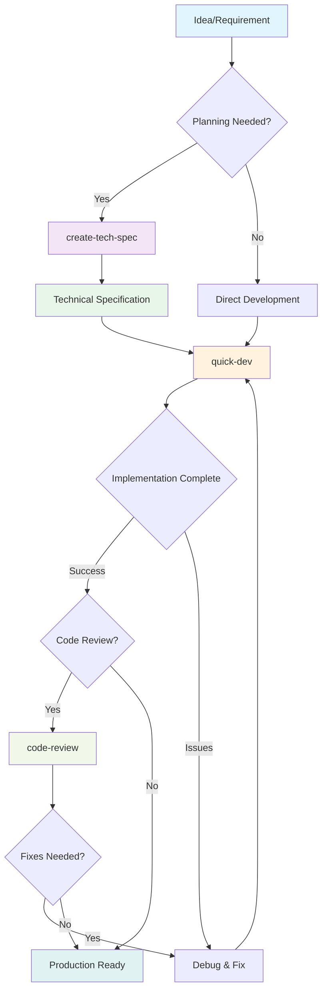

# Fluxo Rápido BMAD

**Track:** Fluxo rápido
**Agente primário:** Quick Flow Solo Dev (Barry)
**Ideal For:** Correcções de erros, pequenas funcionalidades, prototipagem rápida

---

## Overview

BMAD Quick Flow is the fastest path from idea to production in the BMAD Method ecosystem. It's a streamlined 3-step process designed for rapid development without sacrificing quality. Perfect for experienced teams who need to move fast or for smaller features that don't require extensive planning.

### When to Use Quick Flow

**Perfect For:**

- Bug fixes and patches
- Small feature additions (1-3 days of work)
- Proof of concepts and prototypes
- Performance optimizations
- API endpoint additions
- UI component enhancements
- Configuration changes
- Internal tools

**Not Recommended For:**

- Large-scale system redesigns
- Complex multi-team projects
- New product launches
- Projects requiring extensive UX design
- Enterprise-wide initiatives
- Mission-critical systems with compliance requirements

---

## O processo de fluxo rápido



### Passo 1: Especificação técnica opcional

O fluxo de trabalho `create-tech-spec` transforma os requisitos em especificações prontas para implementation.

**Características-chave:**

- Engenharia de especificações conversacionais
- Detecção automática de padrões de base de código
- Coleta de contexto do código existente
- BMADPROTECT005end-ready task repartition
- Definição dos critérios de aceitação

**Flow de processo:**

1. **Compreensão dos Problemas**
- Cumprimente o usuário e reúna requisitos
- Pergunte questões esclarecedoras sobre escopo e restrições
- Verificar o contexto do projeto existente

2. **Code Investigation (Brownfield)**
- Analisar os padrões de base de código existentes
- Document tech stack e convenções
- Identificar arquivos para modificar e dependências

3. **Geração da especificação**
- Criar especificações tecnológicas estruturadas
- Definir tarefas claras e critérios de aceitação
- Decisões técnicas do documento
- Incluir contexto de desenvolvimento

4. **Revisão e Finalização**
- Apresentar especificação para validação
- Faça ajustes conforme necessário
- Salvar para artefatos sprint

**Saída:** `{sprint_artifacts}/tech-spec-{slug}.md`

### Etapa 2: Desenvolvimento

O fluxo de trabalho `quick-dev` executa implementation com flexibilidade e velocidade.

**Dois modos de execução:**

**Mode A: Tech-Spec Driven**

```bash

# Execute from tech spec
quick-dev tech-spec-feature-x.md

```

- Especificações técnicas de carga e análise
- Extrai tarefas, contexto e critérios de aceitação
- Executa todas as tarefas em sequência
- Atualiza o estado específico ao completar

**Modo B: Instruções Diretas**

```bash

# Direct development commands
quick-dev "Add password reset to auth service"
quick-dev "Fix the memory leak in image processing"

```

- Aceita instruções de desenvolvimento direto
- Oferece passo opcional planning
- Executa imediatamente com fricção mínima

**Processo de desenvolvimento:**

1. **Carregamento de contexto**
- Carregar o contexto do projeto se disponível
- Compreender padrões e convenções
- Identificar arquivos e dependências relevantes

2. **Implementation Loop**
Para cada tarefa:
- Carregar arquivos relevantes e contexto
- Aplicar seguindo padrões estabelecidos
- Escreva testes apropriados
- Executar e verificar o passe de testes
- Marcar tarefa completa e continuar

3. **Execução contínua**
- Funciona em todas as tarefas sem parar
- Lida com falhas solicitando orientação
- Garante que os testes passem antes de continuar

4. **Verificação**
- Confirma todas as tarefas completas
- Valida critérios de aceitação
- Atualiza o estado técnico da especificação se usado

### Passo 3: Revisão opcional do código

O fluxo de trabalho `code-review` fornece revisão sênior do código implementado.

**Quando usar:**

- Características críticas à produção
- Implementações sensíveis à segurança
- Otimização de desempenho
- Cenários de desenvolvimento de equipe
- Aprendizagem e transferência de conhecimentos

**Processo de revisão:**

1. Carregar contexto da história e critérios de aceitação
2. Analisar código implementation
3. Verificar contra padrões de projeto
4. Validar cobertura de teste
5. Fornecer notas de revisão estruturadas
6. Sugerir melhorias se necessário

---

## Fluxo Rápido vs Outras Faixas

| Aspect            | Quick Flow       | BMad Method     | Enterprise Method  |
| ----------------- | ---------------- | --------------- | ------------------ |
**Planning**