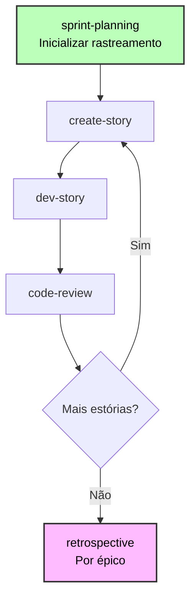
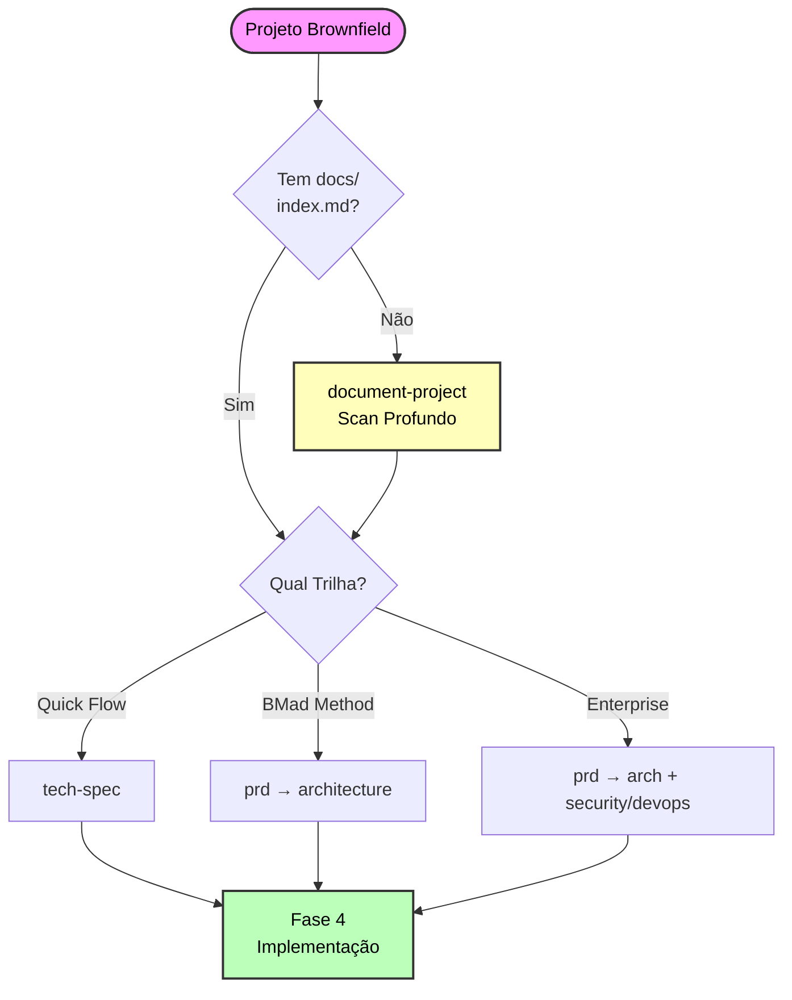

# Guia de Desenvolvimento Brownfield do Método BMad

**Guia completo para trabalhar com bases de código existentes**

**Tempo de Leitura:** ~35 minutos

---

## Navegação Rápida

**Pular para:**

- [Referência Rápida](#referência-rápida) - Comandos e arquivos
- [Cenários Comuns](#cenários-comuns) - Exemplos do mundo real
- [Melhores Práticas](#melhores-práticas) - Dicas de sucesso

---

## O que é Desenvolvimento Brownfield?

Projetos Brownfield envolvem trabalhar dentro de bases de código existentes em vez de começar do zero:

- **Correções de bugs** - Mudanças em arquivo único
- **Pequenas funcionalidades** - Adicionar a módulos existentes
- **Conjuntos de funcionalidades** - Múltiplas funcionalidades relacionadas
- **Integrações maiores** - Adições arquiteturais complexas
- **Expansões de sistema** - Melhorias em escala empresarial

**Diferença Chave do Greenfield:** Você deve entender e respeitar padrões, arquitetura e restrições existentes.

**Princípio Central:** Agentes de IA precisam de documentação abrangente para entender o código existente antes que possam planejar ou implementar mudanças efetivamente.

---

## Começando

### Entendendo Trilhas de Planejamento

Para detalhes completos de trilha, veja [Sistema Adaptativo à Escala](./scale-adaptive-system.md).

**Trilhas Brownfield num relance:**

| Trilha                | Escopo                     | Estórias Típicas | Diferença Chave                                 |
| --------------------- | -------------------------- | ---------------- | ----------------------------------------------- |
| **Quick Flow**        | Fixes de bug, features peq | 1-15             | Deve entender código afetado e padrões          |
| **BMad Method**       | Feature sets, integrações  | 10-50+           | Integrar com arquitetura existente              |
| **Enterprise Method** | Expansões Enterprise       | 30+              | Doc completa de sistema + compliance necessária |

**Nota:** Contagem de estórias é orientação, não definição. Trilhas são escolhidas baseadas em necessidades de planejamento.

### Seleção de Trilha para Brownfield

Quando você roda `workflow-init`, ele lida com brownfield inteligentemente:

**Passo 1: Mostra o que encontrou**

- Docs de planejamento antigos (PRD, épicos, estórias)
- Base de código existente

**Passo 2: Pergunta sobre SEU trabalho**

> "Esses são trabalhos em andamento, esforço anterior ou trabalho proposto?"

- **(a) Trabalhos em andamento** → Usa artefatos para determinar nível
- **(b) Esforço anterior** → Pede para descrever NOVO trabalho
- **(c) Trabalho proposto** → Usa artefatos como orientação
- **(d) Nenhum desses** → Você explica seu trabalho

**Passo 3: Analisa sua descrição**

- Palavras-chave: "fix", "bug" → Quick Flow, "dashboard", "platform" → BMad Method, "enterprise", "multi-tenant" → Enterprise Method
- Avaliação de complexidade
- Confirma trilha sugerida com você

**Princípio Chave:** O sistema pergunta sobre SEU trabalho atual primeiro, usa artefatos antigos apenas como contexto.

**Exemplo: PRD Complexo Antigo, Trabalho Simples Novo**

```
Sistema: "Encontrei PRD.md (trilha BMad Method, 30 estórias, 6 meses de idade)"
Sistema: "Isso é trabalho em andamento ou esforço anterior?"
Você: "Esforço anterior - Estou apenas corrigindo um bug agora"
Sistema: "Me conte sobre seu trabalho atual"
Você: "Atualizar enums de método de pagamento"
Sistema: "Trilha Quick Flow (abordagem tech-spec). Correto?"
Você: "Sim"
✅ Cria fluxo de trabalho Quick Flow
```

---

## Documentação: Primeiro Passo Crítico

🚨 **Para projetos brownfield: Sempre garanta documentação adequada utilizável por IA antes de planejar**

### Recomendação Padrão: Rode document-project

**Melhor prática:** Rode o fluxo de trabalho `document-project` a menos que você tenha **documentação confirmada, confiável e otimizada para IA**.

### Por que Document-Project é Quase Sempre a Escolha Certa

Documentação existente frequentemente tem problemas de qualidade que quebram fluxos de trabalho de IA:

**Problemas Comuns:**

- **Muita Informação (TMI):** Arquivos markdown massivos com 10s ou 100s de seções nível 2
- **Desatualizada:** Documentação não foi atualizada com mudanças de código recentes
- **Formato Errado:** Escrita para humanos, não agentes de IA (falta estrutura, índice, padrões claros)
- **Cobertura Incompleta:** Faltando arquitetura crítica, padrões ou info de setup
- **Qualidade Inconsistente:** Algumas áreas bem documentadas, outras nem um pouco

**Impacto em Agentes de IA:**

- Agentes de IA atingem limites de token lendo arquivos massivos
- Docs desatualizados causam alucinações (agente acha que padrões antigos ainda se aplicam)
- Falta de estrutura significa que agentes não conseguem encontrar informação relevante
- Cobertura incompleta leva a suposições incorretas

### Árvore de Decisão de Documentação

**Passo 1: Avaliar Qualidade da Documentação Existente**

Pergunte-se:

- ✅ É **atual** (atualizada nos últimos 30 dias)?
- ✅ É **otimizada para IA** (estruturada com index.md, seções claras, <500 linhas por arquivo)?
- ✅ É **abrangente** (arquitetura, padrões, setup todos documentados)?
- ✅ Você **confia** nela completamente para consumo de agentes de IA?

**Se QUALQUER resposta for NÃO → Rode `document-project`**

**Passo 2: Checar por Documentos Massivos**

Se você tem documentação mas arquivos são enormes (>500 linhas, 10+ seções nível 2):

1. **Primeiro:** Rode a ferramenta `shard-doc` para dividir arquivos grandes:

   ```bash
   # Carregue Mestre BMad ou qualquer agente
   _bmad/core/tools/shard-doc.xml --input docs/massive-doc.md
   ```

   - Divide em seções nível 2 por padrão
   - Cria arquivos organizados e gerenciáveis
   - Preserva integridade de conteúdo

2. **Então:** Rode a tarefa `index-docs` para criar navegação:

   ```bash
   _bmad/core/tasks/index-docs.xml --directory ./docs
   ```

3. **Finalmente:** Valide qualidade - se docs fragmentados ainda parecerem incompletos/desatualizados → Rode `document-project`

### Quatro Cenários do Mundo Real

| Cenário | Você Tem                                   | Ação                       | Por que                                 |
| ------- | ------------------------------------------ | -------------------------- | --------------------------------------- |
| **A**   | Nenhuma documentação                       | `document-project`         | Única opção - gerar do zero             |
| **B**   | Docs existem mas massivos/velhos/incomp.   | `document-project`         | Mais seguro regenerar que confiar ruim  |
| **C**   | Bons docs mas sem estrutura                | `shard-doc` → `index-docs` | Estruturar conteúdo existente para IA   |
| **D**   | Docs confirmados IA-otimizados com índice  | Pular Documentação         | Raro - apenas se 100% confiante         |

### Cenário A: Nenhuma Documentação (Mais Comum)

**Ação: Rode fluxo de trabalho document-project**

1. Carregue agente Analista ou Escritor Técnico (Paige)
2. Rode `*document-project`
3. Escolha nível de scan:
   - **Rápido** (2-5min): Análise de padrão, sem leitura de fonte
   - **Profundo** (10-30min): Lê caminhos críticos - **Recomendado**
   - **Exaustivo** (30-120min): Lê todos os arquivos

**Saídas:**

- `docs/index.md` - Ponto de entrada mestre IA
- `docs/project-overview.md` - Resumo executivo
- `docs/architecture.md` - Análise de arquitetura
- `docs/source-tree-analysis.md` - Estrutura de diretório
- Arquivos adicionais baseados no tipo de projeto (API, web app, etc.)

### Cenário B: Docs Existem Mas Qualidade Desconhecida/Ruim (Muito Comum)

**Ação: Rode fluxo de trabalho document-project (regenerar)**

Mesmo se pasta `docs/` existir, se você está incerto sobre qualidade → **regenere**.

**Por que regenerar em vez de indexar?**

- Docs desatualizados → IA faz suposições erradas
- Docs incompletos → IA inventa informação faltante
- Docs TMI → IA atinge limites de token, perde info chave
- Docs focados em humano → Faltando estrutura crítica para IA

**document-project** irá:

- Escanear base de código real (fonte da verdade)
- Gerar documentação fresca e precisa
- Estruturar corretamente para consumo de IA
- Incluir apenas informação relevante e atual

### Cenário C: Bons Docs Mas Precisa de Estrutura

**Ação: Fragmentar arquivos massivos, então indexar**

Se você tem **documentação boa e atual** mas está em arquivos massivos:

**Passo 1: Fragmentar documentos grandes**

```bash
# Para cada doc massivo (>500 linhas ou 10+ seções nível 2)
_bmad/core/tools/shard-doc.xml \
  --input docs/api-documentation.md \
  --output docs/api/ \
  --level 2  # Dividir em headers ## (padrão)
```

**Passo 2: Gerar índice**

```bash
_bmad/core/tasks/index-docs.xml --directory ./docs
```

**Passo 3: Validar**

- Revise `docs/index.md` gerado
- Cheque se arquivos fragmentados são <500 linhas cada
- Verifique se conteúdo é atual e preciso
- **Se algo parecer errado → Rode document-project**

### Cenário D: Documentação IA-Otimizada Confirmada (Raro)

**Ação: Pular Documentação**

Apenas pule se TODAS condições atendidas:

- ✅ `docs/index.md` existe e é abrangente
- ✅ Documentação atualizada nos últimos 30 dias
- ✅ Todos arquivos de doc <500 linhas com estrutura clara
- ✅ Cobre arquitetura, padrões, setup, superfície de API
- ✅ Você verificou pessoalmente a qualidade para consumo de IA
- ✅ Agentes de IA anteriores usaram com sucesso

**Se incerto → Rode document-project** (custa 10-30 minutos, salva horas de confusão)

### Por que document-project é Crítico

Sem documentação IA-otimizada, fluxos de trabalho falham:

- **tech-spec** (Quick Flow) não consegue auto-detectar stack/padrões → Faz suposições erradas
- **PRD** (BMad Method) não consegue referenciar código existente → Projeta funcionalidades incompatíveis
- **create-architecture** não consegue construir sobre estrutura existente → Sugere padrões conflitantes
- **create-story** não consegue fornecer contexto de padrão existente → Estórias faltam orientação de integração
- **dev-story** inventa implementações → Quebra integrações existentes

### Princípio Chave

**Na dúvida, rode document-project.**

É melhor gastar 10-30 minutos gerando docs frescos e precisos do que desperdiçar horas debugando agentes de IA trabalhando com documentação ruim.

---

## Fases de Fluxo de Trabalho por Trilha

### Fase 1: Análise (Opcional)

**Fluxos de Trabalho:**

- `brainstorm-project` - Exploração de solução
- `research` - Pesquisa técnica/mercado
- `product-brief` - Planejamento estratégico (Apenas trilhas BMad Method/Enterprise)

**Quando usar:** Funcionalidades complexas, decisões técnicas, adições estratégicas

**Quando pular:** Correções de bugs, funcionalidades bem entendidas, mudanças sensíveis ao tempo

Veja a [seção de Fluxos de Trabalho no README BMM](../README.md) para detalhes.

### Fase 2: Planejamento (Obrigatório)

**Abordagem de planejamento adapta por trilha:**

**Quick Flow:** Use fluxo de trabalho `tech-spec`

- Cria tech-spec.md
- Auto-detecta stack existente (brownfield)
- Confirma convenções com você
- Gera estórias prontas para implementação

**BMad Method/Enterprise:** Use fluxo de trabalho `prd`

- Cria PRD.md com RFs/RNFs apenas
- Referencia arquitetura existente
- Planeja pontos de integração
- Épicos+Estórias criados APÓS fase de arquitetura

**Específico Brownfield:** Veja [Sistema Adaptativo à Escala](./scale-adaptive-system.md) para caminhos de fluxo de trabalho completos por trilha.

### Fase 3: Solução (Apenas BMad Method/Enterprise)

**Crítico para brownfield:**

- Revisar arquitetura existente PRIMEIRO
- Documentar pontos de integração explicitamente
- Planejar compatibilidade reversa
- Considerar estratégia de migração

**Fluxos de Trabalho:**

- `create-architecture` - Estender docs de arquitetura (BMad Method/Enterprise)
- `create-epics-and-stories` - Criar épicos e estórias APÓS arquitetura
- `implementation-readiness` - Validar antes da implementação (BMad Method/Enterprise)

### Fase 4: Implementação (Todas as Trilhas)

**Desenvolvimento baseado em sprint através de iteração de estória:**



**Progressão de Status:**

- Épico: `backlog → in-progress → done`
- Estória: `backlog → ready-for-dev → in-progress → review → done`

**Dicas de Implementação Específicas Brownfield:**

1. **Respeite padrões existentes** - Siga convenções estabelecidas
2. **Teste integração extensivamente** - Valide interações com código existente
3. **Use feature flags** - Habilite lançamento gradual

---

## Melhores Práticas

### 1. Sempre Documente Primeiro

Mesmo se você conhece o código, agentes de IA precisam da saída do `document-project` para contexto. Rode-o antes de planejar.

### 2. Seja Específico Sobre Trabalho Atual

Quando workflow-init perguntar sobre seu trabalho:

- ✅ "Atualizar enums de método de pagamento para incluir Apple Pay"
- ❌ "Consertar coisas"

### 3. Escolha Abordagem de Documentação Certa

- **Tem bons docs, sem índice?** → Rode tarefa `index-docs` (rápido)
- **Sem docs ou precisa de análise de base de código?** → Rode `document-project` (Scan profundo)

### 4. Respeite Padrões Existentes

Fluxos tech-spec e create-story detectarão convenções da documentação existente. Siga-as a menos que modernizando explicitamente.

### 5. Planeje Pontos de Integração Explicitamente

Documente em tech-spec/arquitetura:

- Quais módulos existentes você modificará
- Quais APIs/serviços você integrará
- Como dados fluem entre código novo e existente

### 6. Projete para Lançamento Gradual

- Use feature flags para nova funcionalidade
- Planeje estratégias de rollback
- Mantenha compatibilidade reversa
- Crie scripts de migração se necessário

### 7. Teste Integração Extensivamente

- Teste de regressão de funcionalidades existentes
- Validação de ponto de integração
- Avaliação de impacto de performance
- Verificação de contrato de API

### 8. Use Planejamento de Sprint Efetivamente

- Rode `sprint-planning` no início da Fase 4
- Contextualize épicos antes de criar estórias
- Atualize `sprint-status.yaml` conforme trabalho progride

### 9. Aprenda Continuamente

- Rode `retrospective` após cada épico
- Incorpore aprendizados nas próximas estórias
- Atualize padrões descobertos
- Compartilhe insights através do time

---

## Cenários Comuns

### Cenário 1: Correção de Bug (Quick Flow)

**Situação:** Expiração de token de autenticação causando problemas de logout

**Trilha:** Quick Flow

**Fluxo de Trabalho:**

1. **Documentar:** Pule se sistema de auth documentado, senão rode `document-project` (Scan rápido)
2. **Planejar:** Carregue PM → rode `tech-spec`
   - Analisa bug
   - Detecta stack (Express, Jest)
   - Confirma convenções
   - Cria tech-spec.md + estória
3. **Implementar:** Carregue DEV → rode `dev-story`
4. **Revisar:** Carregue DEV → rode `code-review`

**Tempo:** 2-4 horas

---

### Cenário 2: Funcionalidade Pequena (Quick Flow)

**Situação:** Adicionar "esqueci senha" ao sistema de auth existente

**Trilha:** Quick Flow

**Fluxo de Trabalho:**

1. **Documentar:** Rode `document-project` (Scan profundo do módulo auth se não documentado)
2. **Planejar:** Carregue PM → rode `tech-spec`
   - Detecta Next.js 13.4, NextAuth.js
   - Analisa padrões de auth existentes
   - Confirma convenções
   - Cria tech-spec.md + épico + 3-5 estórias
3. **Implementar:** Carregue SM → `sprint-planning` → `create-story`
   Carregue DEV → `dev-story` para cada estória
4. **Revisar:** Carregue DEV → `code-review`

**Tempo:** 1-3 dias

---

### Cenário 3: Conjunto de Funcionalidades (BMad Method)

**Situação:** Adicionar dashboard de usuário com analytics, preferências, atividade

**Trilha:** BMad Method

**Fluxo de Trabalho:**

1. **Documentar:** Rode `document-project` (Scan profundo) - Crítico para entender padrões de UI existentes
2. **Analisar:** Carregue Analista → `research` (se avaliando bibliotecas de analytics)
3. **Planejar:** Carregue PM → `prd` (cria RFs/RNFs)
4. **Solução:** Carregue Arquiteto → `create-architecture` → `create-epics-and-stories` → `implementation-readiness`
5. **Implementar:** Baseado em sprint (10-15 estórias)
   - Carregue SM → `sprint-planning`
   - Carregue SM → `create-story` por estória
   - Carregue DEV → `dev-story` por estória
6. **Revisar:** Por conclusão de estória

**Tempo:** 1-2 semanas

---

### Cenário 4: Integração Complexa (BMad Method)

**Situação:** Adicionar colaboração tempo-real ao editor de documentos

**Trilha:** BMad Method

**Fluxo de Trabalho:**

1. **Documentar:** Rode `document-project` (Exaustivo se não documentado) - **Obrigatório**
2. **Analisar:** Carregue Analista → `research` (WebSocket vs WebRTC vs CRDT)
3. **Planejar:** Carregue PM → `prd` (cria RFs/RNFs)
4. **Solução:**
   - Carregue Arquiteto → `create-architecture` (estender para camada tempo-real)
   - Carregue Arquiteto → `create-epics-and-stories`
   - Carregue Arquiteto → `implementation-readiness`
5. **Implementar:** Baseado em sprint (20-30 estórias)

**Tempo:** 3-6 semanas

---

### Cenário 5: Expansão Enterprise (Enterprise Method)

**Situação:** Adicionar multi-tenancy a plataforma SaaS single-tenant

**Trilha:** Enterprise Method

**Fluxo de Trabalho:**

1. **Documentar:** Rode `document-project` (Exaustivo) - **Obrigatório**
2. **Analisar:** **Obrigatório**
   - `brainstorm-project` - Explorar abordagens multi-tenancy
   - `research` - Database sharding, isolamento de tenant, precificação
   - `product-brief` - Documento estratégico
3. **Planejar:** Carregue PM → `prd` (RFs/RNFs abrangentes)
4. **Solução:**
   - `create-architecture` - Arquitetura de sistema completa incluindo design multi-tenancy
   - `create-epics-and-stories` - Criar épicos e estórias
   - `implementation-readiness` - Validação final antes da implementação
5. **Implementar:** Faseado baseado em sprint (50+ estórias)

**Tempo:** 3-6 meses

---

## Solução de Problemas

### Agentes de IA Faltam Entendimento da Base de Código

**Sintomas:**

- Sugestões não alinham com padrões existentes
- Ignora componentes disponíveis
- Não referencia código existente

**Solução:**

1. Rode `document-project` com Scan profundo
2. Verifique se `docs/index.md` existe
3. Cheque completude da documentação
4. Rode deep-dive em áreas específicas se necessário

### Tem Documentação Mas Agentes Não Conseguem Encontrar

**Sintomas:**

- README.md, ARCHITECTURE.md existem
- Agentes de IA fazem perguntas já respondidas
- Sem arquivo `docs/index.md`

**Solução:**

- **Conserto rápido:** Rode tarefa `index-docs` (2-5min)
- **Abrangente:** Rode fluxo de trabalho `document-project` (10-30min)

### Pontos de Integração Pouco Claros

**Sintomas:**

- Não tem certeza de como conectar código novo ao existente
- Incerto quais arquivos modificar

**Solução:**

1. Garanta que `document-project` capturou arquitetura existente
2. Cheque arquivos de estória criados por `create-story` - deve incluir contexto de integração
3. Em tech-spec/arquitetura - documente explicitamente:
   - Quais módulos existentes modificar
   - Quais APIs/serviços integrar
   - Fluxo de dados entre código novo e existente
4. Revise documento de arquitetura para orientação de integração

### Testes Existentes Quebrando

**Sintomas:**

- Falhas em testes de regressão
- Funcionalidade previamente funcionando quebrada

**Solução:**

1. Revise mudanças contra padrões existentes
2. Verifique contratos de API inalterados (a menos que intencionalmente versionados)
3. Rode fluxo de trabalho `test-review` (Agente TEA)
4. Adicione teste de regressão ao DoD
5. Considere feature flags para lançamento gradual

### Padrões Inconsistentes Sendo Introduzidos

**Sintomas:**

- Novo estilo de código não combina com existente
- Abordagem arquitetural diferente

**Solução:**

1. Cheque detecção de convenção (Quick Spec Flow deve detectar padrões)
2. Revise documentação - garanta que `document-project` capturou padrões
3. Use fluxo de trabalho `create-story` - ele carrega contexto da documentação existente
4. Adicione ao checklist de code-review: aderência a padrão, consistência de convenção
5. Rode retrospectiva para identificar desvios cedo

---

## Referência Rápida

### Comandos por Fase

```bash
# Documentação (Se Necessário)
# Agente Analista:
document-project        # Criar docs abrangentes (10-30min)
# OU carregar tarefa index-docs para docs existentes (2-5min)

# Fase 1: Análise (Opcional)
# Agente Analista:
brainstorm-project      # Explorar soluções
research                # Coletar dados
product-brief           # Planejamento estratégico (Apenas BMad Method/Enterprise)

# Fase 2: Planejamento (Obrigatório)
# Agente PM:
tech-spec               # Trilha Quick Flow
prd                     # Trilhas BMad Method/Enterprise

# Fase 3: Solução (BMad Method/Enterprise)
# Agente Arquiteto:
create-architecture          # Criar/estender arquitetura
create-epics-and-stories     # Criar épicos e estórias (após arquitetura)
implementation-readiness     # Validação final

# Fase 4: Implementação (Todas as Trilhas)
# Agente SM:
sprint-planning              # Inicializar rastreamento
create-story                 # Criar estória

# Agente DEV:
dev-story                    # Implementar
code-review                  # Revisar

# Agente SM:
retrospective                # Após épico
correct-course               # Se problemas
```

### Arquivos Chave

**Saída de Documentação:**

- `docs/index.md` - **Ponto de entrada mestre IA (OBRIGATÓRIO)**
- `docs/project-overview.md`
- `docs/architecture.md`
- `docs/source-tree-analysis.md`

**Rastreamento Fases 1-4:**

- `docs/bmm-workflow-status.yaml` - Rastreador de progresso

**Planejamento Fase 2:**

- `docs/tech-spec.md` (Trilha Quick Flow)
- `docs/PRD.md` (Trilhas BMad Method/Enterprise - RFs/RNFs apenas)

**Solução Fase 3:**

- Quebra de épico (criado após arquitetura)

**Arquitetura Fase 3:**

- `docs/architecture.md` (Trilhas BMad Method/Enterprise)
- `docs/epics.md` + pastas de épico (de create-epics-and-stories)

**Implementação Fase 4:**

- `docs/sprint-status.yaml` - **Fonte única da verdade**
- `docs/epic-{n}-context.md`
- `docs/stories/{epic}-{story}-{title}.md`
- `docs/stories/{epic}-{story}-{title}-context.md`

### Fluxograma de Decisão



---

## Dicas de Prevenção

**Evite problemas antes que aconteçam:**

1. ✅ **Sempre rode document-project para brownfield** - Salva problemas de contexto depois
2. ✅ **Use chats frescos para fluxos complexos** - Previne alucinações
3. ✅ **Verifique existência de arquivos antes de fluxos** - Cheque se PRD, épicos, estórias presentes
4. ✅ **Leia menu do agente primeiro** - Confirme se agente tem o fluxo de trabalho
5. ✅ **Comece com trilha mais simples se incerto** - Fácil de atualizar (Quick Flow → BMad Method)
6. ✅ **Mantenha arquivos de status atualizados** - Atualizações manuais quando necessário
7. ✅ **Rode retrospectivas após épicos** - Pegue problemas cedo
8. ✅ **Siga sequência de fase** - Não pule fases obrigatórias

---

## Documentação Relacionada

- **[Sistema Adaptativo à Escala](./scale-adaptive-system.md)** - Entendendo trilhas e complexidade
- **[Quick Spec Flow](./quick-spec-flow.md)** - Fast-track para Quick Flow
- **[Guia de Início Rápido](./quick-start.md)** - Começando com BMM
- **[Glossário](./glossary.md)** - Terminologia chave
- **[FAQ](./faq.md)** - Perguntas comuns
- **[Solução de Problemas](./troubleshooting.md)** - Resolução de problemas
- **[Documentação de Fluxo de Trabalho](./README.md#-workflow-guides)** - Referência completa de fluxo

---

## Suporte e Recursos

**Comunidade:**

- [Discord](https://discord.gg/gk8jAdXWmj) - #general-dev, #bugs-issues
- [GitHub Issues](https://github.com/bmad-code-org/BMAD-METHOD/issues)
- [YouTube Channel](https://www.youtube.com/@BMadCode)

**Documentação:**

- **[Guia do Arquiteto de Testes](./test-architecture.md)** - Estratégia de teste abrangente
- [README do Módulo BMM](../README.md) - Referência completa de módulo e fluxo

---

_Desenvolvimento Brownfield é sobre entender e respeitar o que existe enquanto o estende cuidadosamente._
