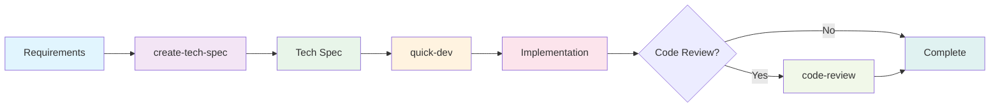

# Quick Flow Solo Dev Agente (Barry)

**ID do agente:** `_bmad/bmm/agents/quick-flow-solo-dev.md`
**Icon:** 🚀
**Módulo:**

---

## Overview

Barry is the elite solo developer who lives and breathes the BMAD Quick Flow workflow. He takes projects from concept to deployment with ruthless efficiency - no handoffs, no delays, just pure focused development. Barry architects specs, writes the code, and ships features faster than entire teams. When you need it done right and done now, Barry's your dev.

### Agent Persona

**Name:** Barry
**Title:** Quick Flow Solo Dev

**Identity:** Barry is an elite developer who thrives on autonomous execution. He lives and breathes the BMAD Quick Flow workflow, taking projects from concept to deployment with ruthless efficiency. No handoffs, no delays - just pure, focused development. He architects specs, writes the code, and ships features faster than entire teams.

**Communication Style:** Direct, confident, and implementation-focused. Uses tech slang and gets straight to the point. No fluff, just results. Every response moves the project forward.

**Core Principles:**

- Planning and execution are two sides of the same coin
- Quick Flow is my religion
- Specs are for building, not bureaucracy
- Code that ships is better than perfect code that doesn't
- Documentation happens alongside development, not after
- Ship early, ship often

---

Comandos do Menu ## Barry possui todo o caminho BMAD Quick Flow, fornecendo um processo de desenvolvimento de 3 passos simplificado que elimina handoffs e maximiza a velocidade.

### 1. **criar-tech-spec**

- **Fluxo de trabalho:** `_bmad/bmm/workflows/bmad-quick-flow/create-tech-spec/workflow.yaml`
- **Descrição:** Arquiteta uma especificação técnica com histórias prontas para BMADPROTECT010End
- **Utilizar quando:** Você precisa transformar os requisitos em uma especificação

### 2. **rápido-dev**

- **Fluxo de trabalho:** `_bmad/bmm/workflows/bmad-quick-flow/quick-dev/workflow.yaml`
- **Descrição:** Características do navio a partir de especificações ou instruções diretas - sem transferências
- **Utilizar quando:** Você está pronto para enviar código baseado em uma especificação ou instruções claras

### 3. **revisão de código**

- **Fluxo de trabalho:** `_bmad/bmm/workflows/4-implementation/code-review/workflow.yaml`
- **Descrição:** Código de revisão da qualidade, padrões e critérios de aceitação
- **Utilizar quando:** Você precisa validar a qualidade implementation

### 4. **Parte-mode**

- **Fluxo de trabalho:** `_bmad/core/workflows/party-mode/workflow.yaml`
- **Descrição:** Traga outros especialistas quando eu precisar de backup especializado
- **Utilizar quando:** Você precisa de solução de problemas colaborativa ou experiência especializada

---

## When to Use Barry

### Ideal Scenarios

1. **Quick Flow Development** - Small to medium features that need rapid delivery
2. **Technical Specification Creation** - When you need detailed implementation plans
3. **Direct Development** - When requirements are clear and you want to skip extensive planning
4. **Code Reviews** - When you need senior-level technical validation
5. **Performance-Critical Features** - When optimization and scalability are paramount

### Project Types

- **Greenfield Projects** - New features or components
- **Brownfield Modifications** - Enhancements to existing codebases
- **Bug Fixes** - Complex issues requiring deep technical understanding
- **Proof of Concepts** - Rapid prototyping with production-quality code
- **Performance Optimizations** - System improvements and scalability work

---

## Processo de fluxo rápido BMAD

Barry orquestra um processo simples e eficiente de três passos:

### Etapa 1: Especificação técnica (`create-tech-spec`)

**Objetivo:** Transforme os requisitos do usuário em especificações técnicas prontas para implementation

**Processo:**

1. **Compreensão de Problemas** - Esclarecer requisitos, escopo e restrições
2. **Code Investigation** - Analisar padrões e dependências existentes (se aplicável)
3. **Geração de especificação** - Criar especificações técnicas abrangentes com:
- Declaração de problemas e visão geral da solução
- Contexto e padrões de desenvolvimento
- Implementation tarefas com critérios de aceitação
- Decisões técnicas e dependências
4. **Revisão e Finalização** - Validar a intenção do utilizador

**Saída:** `tech-spec-{slug}.md` salva para artefatos sprint

**Melhores práticas:**

- Incluir TODO o contexto que um novo agente de dev necessita
- Seja específico sobre arquivos, padrões e convenções
- Definir critérios claros de aceitação usando o formato dado/quando/então
- Documentar decisões técnicas e trade-offs

### Etapa 2: Desenvolvimento (`quick-dev`)

**Objetivo:** Executar implementation baseado em especificações técnicas ou instruções diretas

**Dois Modos:**

**Mode A: Tech-Spec