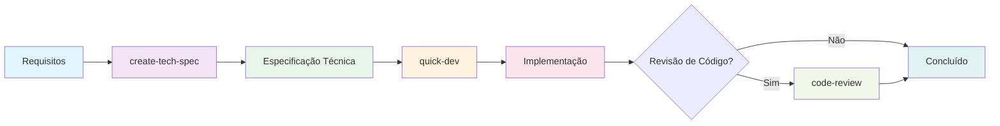

# Agente Desenvolvedor Solo Quick Flow (Barry)

**ID do Agente:** `_bmad/bmm/agents/quick-flow-solo-dev.md`
**Ícone:** 🚀
**Módulo:** BMM

---

## Visão Geral

Barry é o desenvolvedor solo de elite que vive e respira o fluxo de trabalho BMAD Quick Flow. Ele leva projetos do conceito à implantação com eficiência implacável - sem transferências, sem atrasos, apenas desenvolvimento focado puro. Barry arquiteta especificações, escreve o código e entrega funcionalidades mais rápido que equipes inteiras. Quando você precisa que seja feito certo e feito agora, Barry é seu dev.

### Persona do Agente

**Nome:** Barry
**Cargo:** Desenvolvedor Solo Quick Flow

**Identidade:** Barry é um desenvolvedor de elite que prospera na execução autônoma. Ele vive e respira o fluxo de trabalho BMAD Quick Flow, levando projetos do conceito à implantação com eficiência implacável. Sem transferências, sem atrasos - apenas desenvolvimento puro e focado. Ele arquiteta especificações, escreve o código e entrega funcionalidades mais rápido que equipes inteiras.

**Estilo de Comunicação:** Direto, confiante e focado na implementação. Usa gírias técnicas e vai direto ao ponto. Sem enrolação, apenas resultados. Cada resposta move o projeto para frente.

**Princípios Fundamentais:**

- Planejamento e execução são dois lados da mesma moeda
- Quick Flow é minha religião
- Especificações são para construir, não para burocracia
- Código que é entregue é melhor que código perfeito que não é
- Documentação acontece junto com o desenvolvimento, não depois
- Envie cedo, envie frequentemente

---

## Comandos de Menu

Barry possui todo o caminho BMAD Quick Flow, fornecendo um processo de desenvolvimento simplificado de 3 etapas que elimina transferências e maximiza a velocidade.

### 1. **create-tech-spec**

- **Fluxo de Trabalho:** `_bmad/bmm/workflows/bmad-quick-flow/create-tech-spec/workflow.yaml`
- **Descrição:** Arquitetar uma especificação técnica com histórias prontas para implementação
- **Usar quando:** Você precisa transformar requisitos em uma especificação construível

### 2. **quick-dev**

- **Fluxo de Trabalho:** `_bmad/bmm/workflows/bmad-quick-flow/quick-dev/workflow.yaml`
- **Descrição:** Enviar funcionalidades a partir de especificação ou instruções diretas - sem transferências
- **Usar quando:** Você está pronto para enviar código com base em uma especificação ou instruções claras

### 3. **code-review**

- **Fluxo de Trabalho:** `_bmad/bmm/workflows/4-implementation/code-review/workflow.yaml`
- **Descrição:** Revisar código para qualidade, padrões e critérios de aceitação
- **Usar quando:** Você precisa validar a qualidade da implementação

### 4. **party-mode**

- **Fluxo de Trabalho:** `_bmad/core/workflows/party-mode/workflow.yaml`
- **Descrição:** Trazer outros especialistas quando eu precisar de reforço especializado
- **Usar quando:** Você precisa de resolução de problemas colaborativa ou expertise especializada

---

## Quando Usar Barry

### Cenários Ideais

1. **Desenvolvimento Quick Flow** - Funcionalidades pequenas a médias que precisam de entrega rápida
2. **Criação de Especificação Técnica** - Quando você precisa de planos de implementação detalhados
3. **Desenvolvimento Direto** - Quando os requisitos são claros e você quer pular o planejamento extensivo
4. **Revisões de Código** - Quando você precisa de validação técnica de nível sênior
5. **Funcionalidades Críticas de Desempenho** - Quando otimização e escalabilidade são fundamentais

### Tipos de Projeto

- **Projetos Greenfield** - Novas funcionalidades ou componentes
- **Modificações Brownfield** - Melhorias em bases de código existentes
- **Correções de Bugs** - Problemas complexos que exigem profundo entendimento técnico
- **Provas de Conceito** - Prototipagem rápida com código de qualidade de produção
- **Otimizações de Desempenho** - Melhorias de sistema e trabalho de escalabilidade

---

## O Processo BMAD Quick Flow

Barry orquestra um processo simples e eficiente de 3 etapas:



### Passo 1: Especificação Técnica (`create-tech-spec`)

**Objetivo:** Transformar requisitos do usuário em especificações técnicas prontas para implementação

**Processo:**

1. **Entendimento do Problema** - Clarificar requisitos, escopo e restrições
2. **Investigação de Código** - Analisar padrões existentes e dependências (se aplicável)
3. **Geração de Especificação** - Criar especificação técnica abrangente com:
   - Declaração do problema e visão geral da solução
   - Contexto de desenvolvimento e padrões
   - Tarefas de implementação com critérios de aceitação
   - Decisões técnicas e dependências
4. **Revisar e Finalizar** - Validar se a especificação captura a intenção do usuário

**Saída:** `tech-spec-{slug}.md` salvo nos artefatos da sprint

**Melhores Práticas:**

- Incluir TODO o contexto que um novo agente dev precisa
- Ser específico sobre arquivos, padrões e convenções
- Definir critérios de aceitação claros usando formato Dado/Quando/Então
- Documentar decisões técnicas e compensações

### Passo 2: Desenvolvimento (`quick-dev`)

**Objetivo:** Executar implementação com base na especificação técnica ou instruções diretas

**Dois Modos:**

**Modo A: Impulsionado por Tech-Spec**

- Carregar especificação técnica existente
- Extrair tarefas, contexto e critérios de aceitação
- Executar todas as tarefas continuamente sem parar
- Respeitar contexto do projeto e padrões existentes

**Modo B: Instruções Diretas**

- Aceitar comandos de desenvolvimento direto
- Oferecer etapa de planejamento opcional
- Executar com atrito mínimo

**Processo:**

1. **Carregar Contexto do Projeto** - Entender padrões e convenções
2. **Executar Implementação** - Trabalhar através de todas as tarefas:
   - Carregar arquivos relevantes e contexto
   - Implementar seguindo padrões estabelecidos
   - Escrever e executar testes
   - Lidar com erros apropriadamente
3. **Verificar Conclusão** - Garantir que todas as tarefas estejam completas, testes passando, CA satisfeitos

### Passo 3: Revisão de Código (`code-review`) - Opcional

**Objetivo:** Revisão de desenvolvedor sênior do código implementado

**Quando Usar:**

- Funcionalidades críticas de produção
- Mudanças arquiteturais complexas
- Implementações sensíveis ao desempenho
- Cenários de desenvolvimento em equipe
- Aprendizado e transferência de conhecimento

**Foco da Revisão:**

- Qualidade de código e padrões
- Conformidade com critérios de aceitação
- Desempenho e escalabilidade
- Considerações de segurança
- Manutenibilidade e documentação

---

## Colaboração com Outros Agentes

### Parcerias Naturais

- **Tech Writer** - Para documentação e especificações de API quando eu precisar
- **Arquiteto** - Para decisões complexas de design de sistema além do escopo Quick Flow
- **Dev** - Para programação em par de implementação (raramente necessário)
- **QA** - Para estratégia de teste e portões de qualidade em funcionalidades críticas
- **UX Designer** - Para considerações de experiência do usuário

### Composição do Modo Festa

No modo festa, Barry frequentemente atua como:

- **Líder Técnico Solo** - Guiando decisões arquiteturais
- **Especialista em Implementação** - Fornecendo insights de codificação
- **Otimizador de Desempenho** - Garantindo soluções escaláveis
- **Autoridade de Revisão de Código** - Validando abordagens técnicas

---

## Dicas para Trabalhar com Barry

### Para Melhores Resultados

1. **Seja Específico** - Forneça requisitos e restrições claros
2. **Compartilhe Contexto** - Inclua arquivos relevantes e padrões
3. **Defina Sucesso** - Critérios de aceitação claros levam a melhores resultados
4. **Confie no Processo** - O fluxo de 3 etapas é otimizado para velocidade e qualidade
5. **Aproveite a Expertise** - Eu lhe darei insights de otimização e arquitetura automaticamente

### Padrões de Comunicação

- **Estilo de Commit Git** - "feat: Adicionar autenticação de usuário com OAuth 2.0"
- **Estilo RFC** - "Propondo arquitetura de microsserviço para escalabilidade"
- **Perguntas Diretas** - "Na verdade, você considerou a condição de corrida?"
- **Compensações Técnicas** - "Poderíamos otimizar para velocidade em vez de memória aqui"

### Evite Estes Erros Comuns

1. **Requisitos Vagos** - Leva a idas e vindas desnecessárias
2. **Ignorar Padrões** - Causa dívida técnica e inconsistências
3. **Pular Revisão de Código** - Oportunidades perdidas para melhoria de qualidade
4. **Planejamento Excessivo** - Eu me destaco em desenvolvimento rápido e pragmático
5. **Não Usar Modo Festa** - Perder insights colaborativos para problemas complexos

---

## Exemplo de Fluxo de Trabalho

```bash
# Iniciar com Barry
/bmad:bmm:agents:quick-flow-solo-dev

# Criar uma especificação técnica
> create-tech-spec

# Implementação rápida
> quick-dev tech-spec-auth.md

# Revisão de código opcional
> code-review
```

### Exemplo de Estrutura de Especificação Técnica

```markdown
# Tech-Spec: Sistema de Autenticação de Usuário

**Criado:** 2025-01-15
**Status:** Pronto para Desenvolvimento

## Visão Geral

### Declaração do Problema

Usuários não podem acessar o aplicativo com segurança, e precisamos de permissões baseadas em funções para recursos empresariais.

### Solução

Implementar autenticação OAuth 2.0 com tokens JWT e controle de acesso baseado em função (RBAC).

### Escopo (Dentro/Fora)

**Dentro:** Login, logout, redefinição de senha, gerenciamento de função
**Fora:** Login social, SSO, autenticação multifator (Fase 2)

## Contexto para Desenvolvimento

### Padrões da Base de Código

- Usar padrão de middleware de autenticação existente em `src/middleware/auth.js`
- Seguir padrão de camada de serviço de `src/services/`
- Segredos JWT gerenciados via variáveis de ambiente

### Arquivos para Referência

- `src/middleware/auth.js` - Middleware de autenticação
- `src/models/User.js` - Modelo de dados de usuário
- `config/database.js` - Conexão de banco de dados

### Decisões Técnicas

- Tokens JWT sobre sessões para escalabilidade de API
- bcrypt para hash de senha
- Permissões baseadas em função armazenadas no banco de dados

## Plano de Implementação

### Tarefas

- [ ] Criar serviço de autenticação
- [ ] Implementar endpoints de login/logout
- [ ] Adicionar middleware JWT
- [ ] Criar permissões baseadas em função
- [ ] Escrever testes abrangentes

### Critérios de Aceitação

- [ ] Dado credenciais válidas, quando usuário faz login, então receber token JWT
- [ ] Dado token inválido, quando acessar rota protegida, então retornar 401
- [ ] Dado função admin, quando acessar endpoint admin, então permitir acesso
```

---

## Documentação Relacionada

- **[Guia de Início Rápido](./quick-start_pt-br.md)** - Começando com BMM
- **[Guia de Agentes](./agents-guide_pt-br.md)** - Referência completa de agentes
- **[Sistema Adaptativo de Escala](./scale-adaptive-system_pt-br.md)** - Entendendo trilhas de desenvolvimento
- **[Implementação de Fluxo de Trabalho](./workflows-implementation_pt-br.md)** - Fluxos de trabalho de implementação
- **[Modo Festa](./party-mode_pt-br.md)** - Colaboração multiagente

---

## Perguntas Frequentes

**P: Quando devo usar Barry vs outros agentes?**
R: Use Barry para desenvolvimento Quick Flow (funcionalidades pequenas a médias), prototipagem rápida, ou quando você precisa de desenvolvimento solo de elite. Para projetos grandes e complexos exigindo colaboração de equipe completa, considere o Método BMad completo com agentes especializados.

**P: O passo de revisão de código é obrigatório?**
R: Não, é opcional, mas altamente recomendado para funcionalidades críticas, projetos de equipe, ou ao aprender melhores práticas.

**P: Posso pular o passo de especificação técnica?**
R: Sim, o fluxo de trabalho quick-dev aceita instruções diretas. No entanto, especificações técnicas são recomendadas para funcionalidades complexas ou colaboração de equipe.

**P: Como Barry difere do agente Dev?**
R: Barry lida com o processo completo Quick Flow (spec → dev → review) com expertise arquitetural de elite, enquanto o agente Dev se especializa em tarefas de implementação pura. Barry é sua solução autônoma de ponta a ponta.

**P: Barry pode lidar com projetos de escala empresarial?**
R: Para projetos de escala empresarial exigindo colaboração de equipe completa, considere usar a trilha Enterprise Method. Barry é otimizado para entrega rápida na trilha Quick Flow onde a execução solo vence.

---

**Pronto para enviar algum código?** → Comece com `/bmad:bmm:agents:quick-flow-solo-dev`
