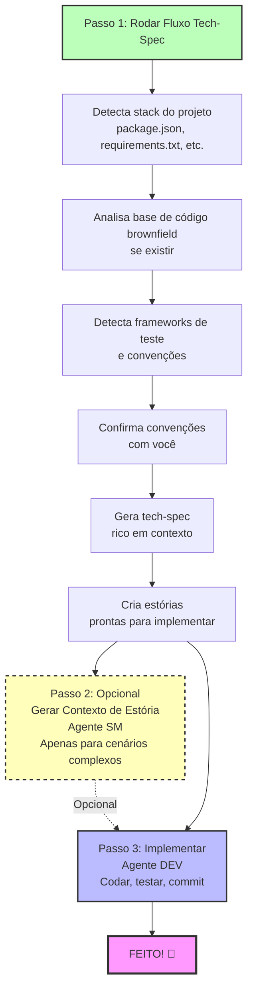

# Fluxo de Especificação Rápida BMad (Quick Spec Flow)

**Perfeito para:** Correções de bugs, pequenas funcionalidades, prototipagem rápida e melhorias rápidas

**Tempo para implementação:** Minutos, não horas

---

## O que é Quick Spec Flow?

O Quick Spec Flow é uma **alternativa otimizada** ao Método BMad completo para projetos de trilha Quick Flow. Em vez de passar por Resumo do Produto → PRD → Arquitetura, você vai **direto para uma especificação técnica consciente de contexto** e começa a codar.

### Quando Usar Quick Spec Flow

✅ **Use trilha Quick Flow quando:**

- Correção de bug única ou pequena melhoria
- Pequena funcionalidade com escopo claro (tipicamente 1-15 estórias)
- Prototipagem rápida ou experimentação
- Adicionar à base de código brownfield existente
- Você sabe exatamente o que quer construir

❌ **Use trilhas Método BMad ou Enterprise quando:**

- Construindo novos produtos ou funcionalidades principais
- Precisa de alinhamento com stakeholders
- Coordenação multi-equipe complexa
- Requer planejamento extensivo e arquitetura

💡 **Não tem certeza?** Rode `workflow-init` para obter uma recomendação baseada nas necessidades do seu projeto!

---

## Visão Geral do Quick Spec Flow



---

## Mudança Atômica Única

**Melhor para:** Correções de bugs, mudanças em arquivo único, melhorias isoladas

### O Que Você Obtém

1. **tech-spec.md** - Especificação técnica abrangente com:
   - Declaração do problema e solução
   - Versões de framework e dependências detectadas
   - Padrões de código brownfield (se aplicável)
   - Padrões de teste existentes para seguir
   - Caminhos de arquivo específicos para modificar
   - Orientação de implementação completa

2. **story-[slug].md** - Estória de usuário única pronta para desenvolvimento

### Comandos Quick Spec Flow

```bash
# Iniciar Quick Spec Flow (sem necessidade de workflow-init!)
# Carregue agente PM e rode tech-spec

# Quando completo, implemente diretamente:
# Carregue agente DEV e rode dev-story
```

### O Que Torna Rápido

- ✅ Sem necessidade de Resumo do Produto
- ✅ Sem necessidade de PRD
- ✅ Sem necessidade de doc de Arquitetura
- ✅ Auto-detecta sua stack
- ✅ Auto-analisa código brownfield
- ✅ Auto-valida qualidade
- ✅ Contexto de estória opcional (tech-spec é abrangente!)

### Exemplos de Cenários de Mudança Única

- "Corrigir o bug de validação de login"
- "Adicionar campo de email ao formulário de registro de usuário"
- "Atualizar endpoint de API para retornar campo adicional"
- "Melhorar tratamento de erro no processamento de pagamento"

---

## Pequena Funcionalidade Coerente

**Melhor para:** Pequenas funcionalidades com 2-3 estórias de usuário relacionadas

### O Que Você Obtém

1. **tech-spec.md** - Mesma especificação abrangente que projetos de mudança única
2. **epics.md** - Organização de épico com quebra de estória
3. **story-[epic-slug]-1.md** - Primeira estória
4. **story-[epic-slug]-2.md** - Segunda estória
5. **story-[epic-slug]-3.md** - Terceira estória (se necessária)

### Comandos Quick Spec Flow

```bash
# Iniciar Quick Spec Flow
# Carregue agente PM e rode tech-spec

# Opcional: Organize estórias como um sprint
# Carregue agente SM e rode sprint-planning

# Implemente estória-por-estória:
# Carregue agente DEV e rode dev-story para cada estória
```

### Sequenciamento de Estória

Estórias são **automaticamente validadas** para garantir sequência apropriada:

- ✅ Sem dependências futuras (Estória 2 não pode depender da Estória 3)
- ✅ Documentação clara de dependência
- ✅ Ordem Infraestrutura → Funcionalidades → Polimento
- ✅ Fluxo Backend → Frontend

### Exemplos de Cenários de Pequena Funcionalidade

- "Adicionar login social OAuth (Google, GitHub, Twitter)"
- "Construir página de perfil de usuário com upload de avatar"
- "Implementar busca básica com filtros"
- "Adicionar toggle de modo escuro à aplicação"

---

## Descoberta de Contexto Inteligente

Quick Spec Flow descobre e usa automaticamente:

### 1. Documentação Existente

- Resumos de produto (se existirem)
- Documentos de pesquisa
- Saída de `document-project` (mapa de base de código brownfield)

### 2. Stack do Projeto

- **Node.js:** package.json → frameworks, dependências, scripts, framework de teste
- **Python:** requirements.txt, pyproject.toml → pacotes, ferramentas
- **Ruby:** Gemfile → gems e versões
- **Java:** pom.xml, build.gradle → dependências Maven/Gradle
- **Go:** go.mod → módulos
- **Rust:** Cargo.toml → crates
- **PHP:** composer.json → pacotes

### 3. Padrões de Código Brownfield

- Estrutura e organização de diretório
- Padrões de código existentes (baseado em classe, funcional, MVC)
- Convenções de nomenclatura (camelCase, snake_case, PascalCase)
- Frameworks e padrões de teste
- Estilo de código (ponto e vírgula, aspas, indentação)
- Configs de linter/formatador
- Padrões de tratamento de erro
- Convenções de logging
- Estilo de documentação

### 4. Confirmação de Convenção

**IMPORTANTE:** Quick Spec Flow detecta suas convenções e **pede confirmação**:

```
Detectei estas convenções na sua base de código:

Estilo de Código:
- ESLint com config Airbnb
- Prettier com aspas simples, indentação de 2 espaços
- Sem ponto e vírgula

Padrões de Teste:
- Framework de teste Jest
- Nomenclatura de arquivo .test.js
- Estilo de asserção expect()

Devo seguir estas convenções existentes? (sim/não)
```

**Você decide:** Conformar aos padrões existentes ou estabelecer novos padrões!

---

## Melhores Práticas Modernas via WebSearch

Quick Spec Flow se mantém atual usando WebSearch quando apropriado:

### Para Projetos Greenfield

- Busca por últimas versões de framework
- Recomenda templates iniciais oficiais
- Sugere melhores práticas modernas

### Para Dependências Desatualizadas

- Detecta se suas dependências têm >2 anos
- Busca por guias de migração
- Nota complexidade de upgrade

### Recomendações de Template Inicial

Para projetos greenfield, Quick Spec Flow recomenda:

**React:**

- Vite (moderno, rápido)
- Next.js (full-stack)

**Python:**

- templates cookiecutter
- starter FastAPI

**Node.js:**

- NestJS CLI
- express-generator

**Benefícios:**

- ✅ Melhores práticas modernas embutidas
- ✅ Estrutura de projeto apropriada
- ✅ Ferramentas de build configuradas
- ✅ Framework de teste configurado
- ✅ Tempo mais rápido para primeira funcionalidade

---

## Considerações UX/UI

Para mudanças voltadas ao usuário, Quick Spec Flow captura:

- Componentes UI afetados (criar vs modificar)
- Mudanças de fluxo UX (atual vs novo)
- Necessidades de design responsivo (mobile, tablet, desktop)
- Requisitos de acessibilidade:
  - Navegação por teclado
  - Compatibilidade com leitor de tela
  - Labels ARIA
  - Padrões de contraste de cor
- Padrões de feedback do usuário:
  - Estados de carregamento
  - Mensagens de erro
  - Confirmações de sucesso
  - Indicadores de progresso

---

## Auto-Validação e Garantia de Qualidade

Quick Spec Flow **valida automaticamente** tudo:

### Validação de Tech-Spec (Sempre Roda)

Verifica:

- ✅ Completude de coleta de contexto
- ✅ Definitividade (sem declarações "use X ou Y")
- ✅ Qualidade de integração brownfield
- ✅ Alinhamento de stack
- ✅ Prontidão para implementação

Gera pontuações:

```
✅ Validação Passou!
- Coleta de Contexto: Abrangente
- Definitividade: Tudo definitivo
- Integração Brownfield: Excelente
- Alinhamento de Stack: Perfeito
- Prontidão para Implementação: ✅ Pronto
```

### Validação de Estória (Funcionalidades Multi-Estória)

Verifica:

- ✅ Sequência de estória (sem dependências futuras!)
- ✅ Qualidade de critérios de aceite (específico, testável)
- ✅ Completude (todas tarefas de tech spec cobertas)
- ✅ Documentação clara de dependência

**Auto-corrige problemas se encontrados!**

---

## Jornada Completa do Usuário

### Cenário 1: Correção de Bug (Mudança Única)

**Meta:** Corrigir bug de validação de login

**Passos:**

1. **Início:** Carregue agente PM, diga "Quero corrigir o bug de validação de login"
2. **PM roda fluxo tech-spec:**
   - Pergunta: "Qual problema você está resolvendo?"
   - Você explica o problema de validação
   - Detecta sua stack Node.js (Express 4.18.2, Jest para teste)
   - Analisa padrões de código UserService existentes
   - Pergunta: "Devo seguir suas convenções existentes?" → Você diz sim
   - Gera tech-spec.md com caminhos de arquivo específicos e padrões
   - Cria story-login-fix.md
3. **Implementar:** Carregue agente DEV, rode `dev-story`
   - DEV lê tech-spec (tem todo contexto!)
   - Implementa correção seguindo padrões existentes
   - Roda testes (seguindo padrões Jest existentes)
   - Feito!

**Tempo total:** 15-30 minutos (maioria implementação)

---

### Cenário 2: Pequena Funcionalidade (Multi-Estória)

**Meta:** Adicionar login social OAuth (Google, GitHub)

**Passos:**

1. **Início:** Carregue agente PM, diga "Quero adicionar login social OAuth"
2. **PM roda fluxo tech-spec:**
   - Pergunta sobre o escopo da funcionalidade
   - Você especifica: Google e GitHub OAuth
   - Detecta sua stack (Next.js 13.4, NextAuth.js já instalado!)
   - Analisa padrões de auth existentes
   - Confirma convenções com você
   - Gera:
     - tech-spec.md (guia de implementação abrangente)
     - epics.md (Épico de Integração OAuth)
     - story-oauth-1.md (Setup OAuth Backend)
     - story-oauth-2.md (Botões de login Frontend)
3. **Planejamento de Sprint Opcional:** Carregue agente SM, rode `sprint-planning`
4. **Implementar Estória 1:**
   - Carregue agente DEV, rode `dev-story` para estória 1
   - DEV implementa OAuth backend
5. **Implementar Estória 2:**
   - Agente DEV, rode `dev-story` para estória 2
   - DEV implementa frontend
   - Feito!

**Tempo total:** 1-3 horas (maioria implementação)

---

## Integração com Fluxos da Fase 4

Quick Spec Flow funciona perfeitamente com todos os fluxos de implementação da Fase 4:

### create-story (Agente SM)

- ✅ Pode trabalhar com tech-spec.md em vez de PRD
- ✅ Usa epics.md do fluxo tech-spec
- ✅ Cria estórias adicionais se necessário

### sprint-planning (Agente SM)

- ✅ Trabalha com epics.md de tech-spec
- ✅ Organiza funcionalidades multi-estória para implementação coordenada
- ✅ Rastreia progresso através de sprint-status.yaml

### dev-story (Agente DEV)

- ✅ Lê estórias geradas por tech-spec
- ✅ Usa tech-spec.md como contexto abrangente
- ✅ Implementa seguindo convenções detectadas

---

## Comparação: Quick Spec vs BMM Completo

| Aspecto               | Trilha Quick Flow            | Trilhas Método BMad/Enterprise     |
| --------------------- | ---------------------------- | ---------------------------------- |
| **Setup**             | Nenhum (standalone)          | workflow-init recomendado          |
| **Docs Planejamento** | tech-spec.md apenas          | Resumo Produto → PRD → Arquitetura |
| **Tempo até Codar**   | Minutos                      | Horas a dias                       |
| **Melhor Para**       | Correções de bug, peq funcs  | Novos produtos, funcionalidades principais |
| **Descoberta Contexto**| Automática                  | Manual + guiada                    |
| **Contexto Estória**  | Opcional (tech-spec é rico)  | Obrigatório (gerado do PRD)        |
| **Validação**         | Auto-valida tudo             | Passos de validação manual         |
| **Brownfield**        | Auto-analisa e conforma      | Documentação manual obrigatória    |
| **Convenções**        | Auto-detecta e confirma      | Documentar em PRD/Arquitetura      |

---

## Quando Graduar de Quick Flow para Método BMad

Comece com Quick Flow, mas mude para Método BMad quando:

- ❌ Projeto cresce além do escopo inicial
- ❌ Múltiplas equipes precisam de coordenação
- ❌ Stakeholders precisam de documentação formal
- ❌ Visão do produto é pouco clara
- ❌ Decisões arquiteturais precisam de análise profunda
- ❌ Requisitos de conformidade/regulatórios existem

💡 **Dica:** Você sempre pode rodar `workflow-init` depois para transicionar de Quick Flow para Método BMad!

---

## Quick Spec Flow - Benefícios Chave

### 🚀 **Velocidade**

- Sem Resumo do Produto
- Sem PRD
- Sem doc de Arquitetura
- Direto para implementação

### 🧠 **Inteligência**

- Auto-detecta stack
- Auto-analisa brownfield
- Auto-valida qualidade
- WebSearch para info atual

### 📐 **Respeito por Código Existente**

- Detecta convenções
- Pede confirmação
- Segue padrões
- Adapta vs. muda

### ✅ **Qualidade**

- Auto-validação
- Decisões definitivas (sem declarações "ou")
- Contexto abrangente
- Critérios de aceitação claros

### 🎯 **Foco**

- Mudanças atômicas únicas
- Pequenas funcionalidades coerentes
- Sem aumento de escopo
- Iteração rápida

---

## Começando

### Pré-requisitos

- Método BMad instalado (`npx bmad-method install`)
- Diretório do projeto com código (ou vazio para greenfield)

### Comandos de Início Rápido

```bash
# Para uma correção de bug rápida ou pequena mudança:
# 1. Carregue agente PM
# 2. Diga: "Quero [descreva sua mudança]"
# 3. PM perguntará se você quer rodar tech-spec
# 4. Responda perguntas sobre sua mudança
# 5. Obtenha tech-spec + estória
# 6. Carregue agente DEV e implemente!

# Para uma pequena funcionalidade com múltiplas estórias:
# Mesmo que acima, mas obtenha épico + 2-3 estórias
# Opcionalmente use SM sprint-planning para organizar
```

### Sem workflow-init Obrigatório!

Quick Spec Flow é **totalmente standalone**:

- Detecta se é mudança única ou funcionalidade multi-estória
- Pergunta por greenfield vs brownfield
- Funciona sem rastreamento de arquivo de status
- Perfeito para prototipagem rápida

---

## FAQ

### P: Posso usar Quick Spec Flow em um projeto existente?

**R:** Sim! É perfeito para projetos brownfield. Ele analisará seu código existente, detectará padrões e perguntará se você quer segui-los.

### P: E se eu não tiver package.json ou requirements.txt?

**R:** Quick Spec Flow funcionará em modo greenfield, recomendará templates iniciais e usará WebSearch para melhores práticas modernas.

### P: Preciso rodar workflow-init primeiro?

**R:** Não! Quick Spec Flow é standalone. Mas se você quiser orientação sobre qual fluxo usar, workflow-init pode ajudar.

### P: Posso usar isso para mudanças frontend?

**R:** Absolutamente! Quick Spec Flow captura considerações UX/UI, mudanças de componente e requisitos de acessibilidade.

### P: E se meu projeto Quick Flow crescer?

**R:** Sem problemas! Você sempre pode transicionar para Método BMad rodando workflow-init e create-prd. Seu tech-spec se torna entrada para o PRD.

### P: Posso pular validação?

**R:** Não, validação sempre roda automaticamente. Mas é rápida e pega problemas cedo!

### P: Funcionará com o estilo de código do meu time?

**R:** Sim! Ele detecta suas convenções e pede confirmação. Você controla se segue padrões existentes ou estabelece novos.

---

## Dicas e Melhores Práticas

### 1. **Seja Específico na Descoberta**

Ao descrever sua mudança, forneça especificidades:

- ✅ "Corrigir validação de email no UserService para permitir plus-addressing"
- ❌ "Corrigir bug de validação"

### 2. **Confie na Detecção de Convenção**

Se detectar seus padrões corretamente, diga sim! É mais rápido que estabelecer novas convenções.

### 3. **Use Recomendações WebSearch para Greenfield**

Templates iniciais salvam horas de tempo de configuração. Deixe o Quick Spec Flow encontrar os melhores.

### 4. **Revise a Auto-Validação**

Quando validação rodar, leia as pontuações. Elas dizem se sua spec está pronta para produção.

### 5. **Mantenha Mudanças Únicas Verdadeiramente Atômicas**

Se sua "mudança única" precisa de 3+ arquivos, pode ser uma funcionalidade multi-estória. Deixe o fluxo guiá-lo.

### 6. **Valide Sequência de Estória para Funcionalidades Multi-Estória**

Quando você obtiver múltiplas estórias, verifique a saída de validação de dependência. Sequência apropriada importa!

---

## Exemplos do Mundo Real

### Exemplo 1: Adicionando Logging (Mudança Única)

**Entrada:** "Adicionar logging estruturado ao processamento de pagamento"

**Saída Tech-Spec:**

- Detectado: winston 3.8.2 já no package.json
- Analisado: Serviços existentes usam winston com formato JSON
- Confirmado: Seguir padrões de logging existentes
- Gerado: Caminhos de arquivo específicos, níveis de log, exemplo de formato
- Estória: Pronta para implementar em 1-2 horas

**Resultado:** Logging consistente adicionado, seguindo padrões do time, sem necessidade de pesquisa.

---

### Exemplo 2: Funcionalidade de Busca (Multi-Estória)

**Entrada:** "Adicionar busca ao catálogo de produtos com filtros"

**Saída Tech-Spec:**

- Detectado: React 18.2.0, biblioteca de componentes MUI, backend Express
- Analisado: Padrões de componente ProductList existentes
- Confirmado: Seguir estrutura de API e componente existentes
- Gerado:
  - Épico: Funcionalidade de Busca de Produto
  - Estória 1: API de busca backend com filtros
  - Estória 2: Componente UI de busca frontend
- Auto-validado: Sequência Estória 1 → Estória 2 correta

**Resultado:** Funcionalidade de busca implementada em 4-6 horas com arquitetura apropriada.

---

## Resumo

Quick Spec Flow é seu **caminho rápido da ideia à implementação** para:

- 🐛 Correções de bugs
- ✨ Pequenas funcionalidades
- 🚀 Prototipagem rápida
- 🔧 Melhorias rápidas

**Recursos Chave:**

- Auto-detecta sua stack
- Auto-analisa código brownfield
- Auto-valida qualidade
- Respeita convenções existentes
- Usa WebSearch para práticas modernas
- Gera tech-specs abrangentes
- Cria estórias prontas para implementação

**Tempo para codar:** Minutos, não horas.

**Pronto para tentar?** Carregue o agente PM e diga o que você quer construir! 🚀

---

## Próximos Passos

- **Tente agora:** Carregue agente PM e descreva uma pequena mudança
- **Aprenda mais:** Veja os [Guias de Fluxo de Trabalho BMM](./README.md#-workflow-guides) para documentação de fluxo abrangente
- **Precisa de ajuda para decidir?** Rode `workflow-init` para obter uma recomendação
- **Tem perguntas?** Junte-se a nós no Discord: <https://discord.gg/gk8jAdXWmj>

---

_Quick Spec Flow - Porque nem toda mudança precisa de um Resumo do Produto._
