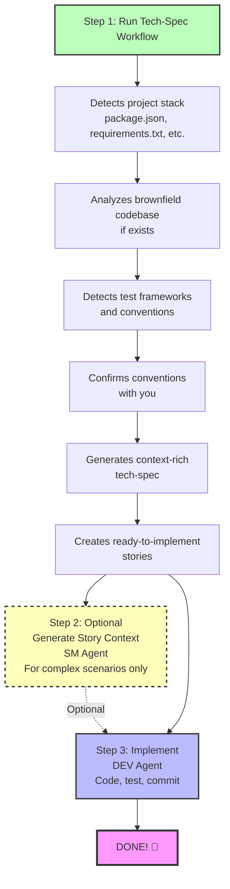

# Fluxo de espectro rápido BMad

**Perfeito para:** Correcções de erros, pequenas funcionalidades, prototipagem rápida e melhorias rápidas

**Hora de implementation:** Minutos, não horas

---

## What is Quick Spec Flow?

Quick Spec Flow is a **streamlined alternative**to the full BMad Method for Quick Flow track projects. Instead of going through Product Brief → PRD → Architecture, you go**straight to a context-aware technical specification** and start coding.

### When to Use Quick Spec Flow

✅ **Use Quick Flow track when:**

- Single bug fix or small enhancement
- Small feature with clear scope (typically 1-15 stories)
- Rapid prototyping or experimentation
- Adding to existing brownfield codebase
- You know exactly what you want to build

❌ **Use BMad Method or Enterprise tracks when:**

- Building new products or major features
- Need stakeholder alignment
- Complex multi-team coordination
- Requires extensive planning and architecture

💡 **Not sure?** Run `workflow-init` to get a recommendation based on your project's needs!

---

## Visão geral do fluxo de especificações rápidas



---

## Single Atomic Change

**Best for:** Bug fixes, single file changes, isolated improvements

### What You Get

1. **tech-spec.md** - Comprehensive technical specification with:
   - Problem statement and solution
   - Detected framework versions and dependencies
   - Brownfield code patterns (if applicable)
   - Existing test patterns to follow
   - Specific file paths to modify
   - Complete implementation guidance

2. **story-[slug].md** - Single user story ready for development

### Quick Spec Flow Commands

```bash

# Start Quick Spec Flow (no workflow-init needed!)

# Load PM agent and run tech-spec

# When complete, implement directly:

# Load DEV agent and run dev-story

```

### What Makes It Quick

- ✅ No Product Brief needed
- ✅ No PRD needed
- ✅ No Architecture doc needed
- ✅ Auto-detects your stack
- ✅ Auto-analyzes brownfield code
- ✅ Auto-validates quality
- ✅ Story context optional (tech-spec is comprehensive!)

### Example Single Change Scenarios

- "Fix the login validation bug"
- "Add email field to user registration form"
- "Update API endpoint to return additional field"
- "Improve error handling in payment processing"

---

## Pequena Característica Coerente

**Melhor para:** Pequenos recursos com 2-3 histórias de usuários relacionadas

### O que você ganha

1. **tech-spec.md** - Mesma especificação abrangente como projetos de mudança única
2. **epics.md** - Organização épica com quebra de história
3. **história-[epic-slug]-1.md** - Primeira história
4. **story-[epic-slug]-2.md** - Segunda história
5. **story-[epic-slug]-3.md** - Terceira história (se necessário)

### Comandos de Fluxo de Especificações Rápidas

```bash

# Start Quick Spec Flow

# Load PM agent and run tech-spec

# Optional: Organize stories as a sprint

# Load SM agent and run sprint-planning

# Implement story-by-story:

# Load DEV agent and run dev-story for each story

```

### Story Sequencing

As histórias são **validadas automaticamente** para garantir uma sequência adequada:

- ✅ Nenhuma dependência para a frente (A história 2 não pode depender da história 3)
- ✅ Limpar a documentação da dependência
- ✅ Infraestrutura → Características → Ordem polaca
- ✅ Infraestrutura → Fluxo Frontend

### Exemplo de cenários de pequenas características

- "Adicionar login social OAuth (Google, GitHub, Twitter)"
- "Construir página de perfil de usuário com upload avatar"
- "Implementar pesquisa básica com filtros"
- "Adicionar modo escuro comuta para aplicação"

---

## Descoberta de Contexto Inteligente

Quick Spec Flow descobre e usa automaticamente:

### 1. Documentação existente

- Cuecas de produtos (se existirem)
- Documentos de investigação
- saída `document-project` (mapa de base de código de campo marrom)

### 2. Pilha do Projeto

- **Node.js:** package.json → frameworks, dependências, scripts, test framework
- **Python:** requirements.txt, pyproject.toml → pacotes, ferramentas
- **Ruby:** Gemfile → gemas e versões
- **Java:** pom.xml, build.gradle → Dependências Maven/Gradle
- **Go:** go.mod → módulos
- **Rust:** Cargo.toml → engradados
- **PHP:** composer.json → pacotes