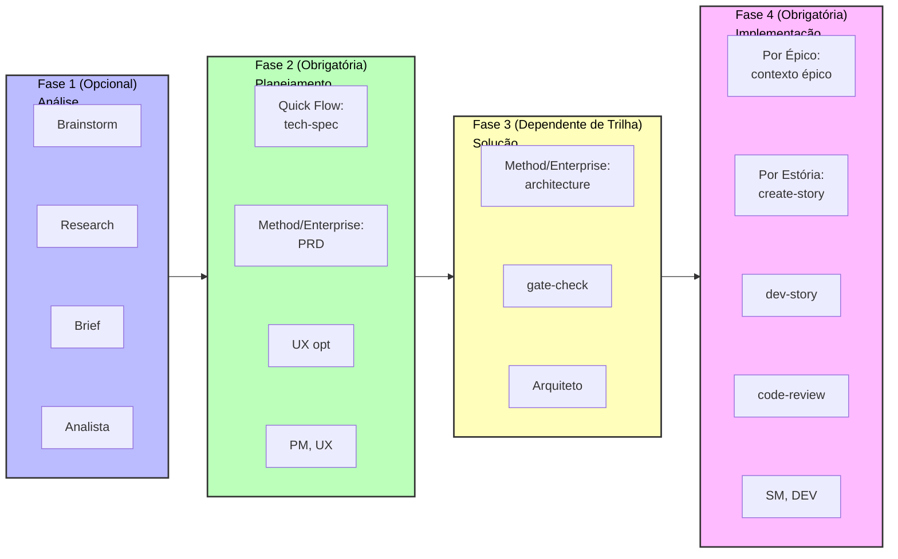

# Guia de Início Rápido Método BMad V6

Comece com o Método BMad v6 para seu novo projeto greenfield. Este guia acompanha você na construção de software do zero usando fluxos de trabalho movidos a IA.

## TL;DR - O Caminho Rápido

1. **Instalar**: `npx bmad-method@alpha install`
2. **Inicializar**: Carregue agente Analista → Rode "workflow-init"
3. **Planejar**: Carregue agente PM → Rode "prd" (ou "tech-spec" para projetos pequenos)
4. **Arquitetar**: Carregue agente Arquiteto → Rode "create-architecture" (apenas 10+ estórias)
5. **Construir**: Carregue agente SM → Rode fluxos para cada estória → Carregue agente DEV → Implemente
6. **Sempre use chats frescos** para cada fluxo de trabalho para evitar alucinações

---

## O que é Método BMad?

O Método BMad (BMM) ajuda você a construir software através de fluxos de trabalho guiados com agentes de IA especializados. O processo segue quatro fases:

1. **Fase 1: Análise** (Opcional) - Brainstorming, Pesquisa, Resumo do Produto
2. **Fase 2: Planejamento** (Obrigatório) - Crie seus requisitos (tech-spec ou PRD)
3. **Fase 3: Solução** (Dependente de trilha) - Design da arquitetura para trilhas Método BMad e Enterprise
4. **Fase 4: Implementação** (Obrigatório) - Construa seu software Épico por Épico, Estória por Estória

### Visualização Completa do Fluxo de Trabalho


_Fluxograma visual completo mostrando todas as fases, fluxos, agentes (coloridos), e pontos de decisão para o método padrão BMad de greenfield. Cada caixa é colorida pelo agente responsável por aquele fluxo._

## Instalação

```bash
# Instale v6 Alpha no seu projeto
npx bmad-method@alpha install
```

O instalador interativo irá guiá-lo através da configuração e criar uma pasta `_bmad/` com todos os agentes e fluxos.

---

## Começando

### Passo 1: Inicialize Seu Fluxo de Trabalho

1. **Carregue o agente Analista** na sua IDE - Veja suas instruções específicas de IDE em [docs/ide-info](https://github.com/bmad-code-org/BMAD-METHOD/tree/main/docs/ide-info) para como ativar agentes:
   - [Claude Code](https://github.com/bmad-code-org/BMAD-METHOD/blob/main/docs/ide-info/claude-code.md)
   - [VS Code/Cursor/Windsurf](https://github.com/bmad-code-org/BMAD-METHOD/tree/main/docs/ide-info) - Verifique sua pasta de IDE
   - Outras IDEs também suportadas
2. **Espere pelo menu do agente** aparecer
3. **Diga ao agente**: "Run workflow-init" ou digite "\*workflow-init" ou selecione o número do item do menu

#### O que acontece durante workflow-init?

Fluxos de trabalho são processos interativos na V6 que substituíram tarefas e templates de versões anteriores. Existem muitos tipos de fluxos, e você pode até criar os seus com o módulo BMad Builder. Para o Método BMad, você interagirá com fluxos desenhados por experts feitos para trabalhar com você para extrair o melhor de você e da LLM.

Durante workflow-init, você descreverá:

- Seu projeto e seus objetivos
- Se há uma base de código existente ou se é um projeto novo
- O tamanho geral e complexidade (você pode ajustar isso depois)

#### Trilhas de Planejamento

Baseado na sua descrição, o fluxo sugerirá uma trilha e deixará você escolher entre:

**Três Trilhas de Planejamento:**

- **Quick Flow** - Implementação rápida (tech-spec apenas) - correções de bug, funcionalidades simples, escopo claro (tipicamente 1-15 estórias)
- **Método BMad** - Planejamento completo (PRD + Arquitetura + UX) - produtos, plataformas, funcionalidades complexas (tipicamente 10-50+ estórias)
- **Método Enterprise** - Planejamento estendido (Método BMad + Segurança/DevOps/Teste) - requisitos enterprise, compliance, multi-tenant (tipicamente 30+ estórias)

**Nota**: Contagens de estória são orientação, não definições. Trilhas são escolhidas baseadas em necessidades de planejamento, não matemática de estória.

#### O que é criado?

Uma vez que você confirma sua trilha, o arquivo `bmm-workflow-status.yaml` será criado na pasta docs do seu projeto (assumindo local de instalação padrão). Este arquivo rastreia seu progresso através de todas as fases.

**Notas importantes:**

- Cada trilha tem caminhos diferentes através das fases
- Contagens de estória ainda podem mudar baseado na complexidade geral conforme você trabalha
- Para este guia, assumiremos um projeto de trilha Método BMad
- Este fluxo guiará você através da Fase 1 (opcional), Fase 2 (obrigatória), e Fase 3 (obrigatória para trilhas Método BMad e Enterprise)

### Passo 2: Trabalhe Através das Fases 1-3

Após workflow-init completar, você trabalhará através das fases de planejamento. **Importante: Use chats frescos para cada fluxo para evitar limitações de contexto.**

#### Verificando Seu Status

Se você estiver incerto sobre o que fazer a seguir:

1. Carregue qualquer agente em um novo chat
2. Peça por "workflow-status"
3. O agente dirá o próximo fluxo recomendado ou obrigatório

**Exemplo de resposta:**

```
Fase 1 (Análise) é inteiramente opcional. Todos fluxos são opcionais ou recomendados:
  - brainstorm-project - opcional
  - research - opcional
  - product-brief - RECOMENDADO (mas não obrigatório)

O próximo passo VERDADEIRAMENTE OBRIGATÓRIO é:
  - PRD (Documento de Requisitos de Produto) na Fase 2 - Planejamento
  - Agente: pm
  - Comando: prd
```

#### Como Rodar Fluxos nas Fases 1-3

Quando um agente diz para rodar um fluxo (como `prd`):

1. **Comece um novo chat** com o agente especificado (e.g., PM) - Veja [docs/ide-info](https://github.com/bmad-code-org/BMAD-METHOD/tree/main/docs/ide-info) para instruções específicas da sua IDE
2. **Espere pelo menu** aparecer
3. **Diga ao agente** para rodá-lo usando qualquer destes formatos:
   - Digite o atalho: `*prd`
   - Diga naturalmente: "Vamos criar um novo PRD"
   - Selecione o número do menu para "create-prd"

Os agentes na V6 são muito bons com correspondência de menu difusa!

#### Referência Rápida: Mapeamento Agente → Documento

Para usuários v4 ou aqueles que preferem pular orientação de workflow-status:

- **Analista** → Brainstorming, Resumo do Produto
- **PM** → PRD (Trilhas Método BMad/Enterprise) OU tech-spec (Trilha Quick Flow)
- **UX-Designer** → Documento de Design UX (se UI for parte do projeto)
- **Arquiteto** → Arquitetura (Trilhas Método BMad/Enterprise)

#### Fase 2: Planejamento - Criando o PRD

**Para trilhas Método BMad e Enterprise:**

1. Carregue o **agente PM** em um novo chat
2. Diga para rodar o fluxo PRD
3. Uma vez completo, você terá:
   - **PRD.md** - Seu Documento de Requisitos de Produto

**Para trilha Quick Flow:**

- Use **tech-spec** em vez de PRD (sem necessidade de arquitetura)

#### Fase 2 (Opcional): Design UX

Se seu projeto tem uma interface de usuário:

1. Carregue o **agente UX-Designer** em um novo chat
2. Diga para rodar o fluxo de design UX
3. Após conclusão, você terá seu documento de especificação UX

#### Fase 3: Arquitetura

**Para trilhas Método BMad e Enterprise:**

1. Carregue o **agente Arquiteto** em um novo chat
2. Diga para rodar o fluxo create-architecture
3. Após conclusão, você terá seu documento de arquitetura com decisões técnicas

#### Fase 3: Criar Épicos e Estórias (OBRIGATÓRIO após Arquitetura)

**Melhoria V6:** Épicos e estórias são agora criados APÓS a arquitetura para melhor qualidade!

1. Carregue o **agente PM** em um novo chat
2. Diga para rodar "create-epics-and-stories"
3. Isso quebra os RFs/RNFs do seu PRD em épicos e estórias implementáveis
4. O fluxo usa tanto PRD e Arquitetura para criar estórias tecnicamente informadas

**Por que após arquitetura?** Decisões de arquitetura (banco de dados, padrões de API, stack tecnológico) afetam diretamente como estórias devem ser quebradas e sequenciadas.

#### Fase 3: Verificação de Prontidão de Implementação (Altamente Recomendado)

Uma vez que épicos e estórias são criados:

1. Carregue o **agente Arquiteto** em um novo chat
2. Diga para rodar "implementation-readiness"
3. Isso valida coesão através de todos seus documentos de planejamento (PRD, UX, Arquitetura, Épicos)
4. Isso era chamado de "PO Master Checklist" na v4

**Por que rodar isso?** Garante que todos seus ativos de planejamento alinham apropriadamente antes de você começar a construir.

#### Dicas de Gestão de Contexto

- **Use modelos de contexto 200k+** para melhores resultados (Claude Sonnet 4.5, GPT-4, etc.)
- **Chat fresco para cada fluxo** - Brainstorming, Briefs, Pesquisa, e geração de PRD são todos intensivos em contexto
- **Sem fragmentação de documento necessária** - Diferente da v4, você não precisa dividir documentos
- **Web Bundles chegando em breve** - Ajudarão a economizar tokens de LLM para usuários com planos limitados

### Passo 3: Comece a Construir (Fase 4 - Implementação)

Uma vez que planejamento e arquitetura estão completos, você moverá para a Fase 4. **Importante: Cada fluxo abaixo deve ser rodado em um chat fresco para evitar limitações de contexto e alucinações.**

#### 3.1 Inicialize Planejamento de Sprint

1. **Comece um novo chat** com o **agente SM (Scrum Master)**
2. Espere pelo menu aparecer
3. Diga ao agente: "Run sprint-planning"
4. Isso cria seu arquivo `sprint-status.yaml` que rastreia todos épicos e estórias

#### 3.2 Crie Sua Primeira Estória

1. **Comece um novo chat** com o **agente SM**
2. Espere pelo menu
3. Diga ao agente: "Run create-story"
4. Isso cria o arquivo de estória a partir do épico

#### 3.3 Implemente a Estória

1. **Comece um novo chat** com o **agente DEV**
2. Espere pelo menu
3. Diga ao agente: "Run dev-story"
4. O agente DEV implementará a estória e atualizará o status da sprint

#### 3.4 Revise o Código (Opcional mas Recomendado)

1. **Comece um novo chat** com o **agente DEV**
2. Espere pelo menu
3. Diga ao agente: "Run code-review"
4. O agente DEV realiza validação de qualidade (isso era chamado QA na v4)

### Passo 4: Continue

Para cada estória subsequente, repita o ciclo usando **chats frescos** para cada fluxo:

1. **Novo chat** → Agente SM → "Run create-story"
2. **Novo chat** → Agente DEV → "Run dev-story"
3. **Novo chat** → Agente DEV → "Run code-review" (opcional mas recomendado)

Após completar todas as estórias em um épico:

1. **Comece um novo chat** com o **agente SM**
2. Diga ao agente: "Run retrospective"

**Por que chats frescos?** Fluxos intensivos em contexto podem causar alucinações se você continuar emitindo comandos no mesmo chat. Começar fresco garante que o agente tenha capacidade máxima de contexto para cada fluxo.

---

## Entendendo os Agentes

Cada agente é uma persona de IA especializada:

- **Analista** - Inicializa fluxos e rastreia progresso
- **PM** - Cria requisitos e especificações
- **UX-Designer** - Se seu projeto tem um front end - este designer ajudará a produzir artefatos, criar atualizações de mock, e desenhar uma ótima aparência com você dando orientação.
- **Arquiteto** - Desenha arquitetura de sistema
- **SM (Scrum Master)** - Gerencia sprints e cria estórias
- **DEV** - Implementa código e revisa trabalho

## Como Fluxos de Trabalho Funcionam

1. **Carregue um agente** - Abra o arquivo do agente na sua IDE para ativá-lo
2. **Espere pelo menu** - O agente apresentará seus fluxos disponíveis
3. **Diga ao agente o que rodar** - Diga "Run [nome-do-fluxo]"
4. **Siga os prompts** - O agente guia você através de cada passo

O agente cria documentos, faz perguntas, e ajuda você a tomar decisões durante o processo.

## Arquivos de Rastreamento de Projeto

O BMad cria dois arquivos para rastrear seu progresso:

**1. bmm-workflow-status.yaml**

- Mostra em qual fase você está e o que vem a seguir
- Criado por workflow-init
- Atualizado automaticamente conforme você progride pelas fases

**2. sprint-status.yaml** (Fase 4 apenas)

- Rastreia todos seus épicos e estórias durante implementação
- Crítico para agentes SM e DEV saberem no que trabalhar a seguir
- Criado por fluxo sprint-planning
- Atualizado automaticamente conforme estórias progridem

**Você não precisa editar estes manualmente** - agentes os atualizam conforme você trabalha.

---

## O Fluxo Completo Visualizado



## Perguntas Comuns

**P: Eu sempre preciso de arquitetura?**
R: Apenas para trilhas Método BMad e Enterprise. Projetos Quick Flow pulam direto de tech-spec para implementação.

**P: Posso mudar meu plano depois?**
R: Sim! O agente SM tem um fluxo "correct-course" para lidar com mudanças de escopo.

**P: E se eu quiser fazer brainstorm primeiro?**
R: Carregue o agente Analista e diga para "Run brainstorm-project" antes de rodar workflow-init.

**P: Por que preciso de chats frescos para cada fluxo?**
R: Fluxos intensivos em contexto podem causar alucinações se rodados em sequência. Chats frescos garantem capacidade máxima de contexto.

**P: Posso pular workflow-init e workflow-status?**
R: Sim, uma vez que você aprenda o fluxo. Use a Referência Rápida no Passo 2 para ir diretamente aos fluxos que precisa.

## Obtendo Ajuda

- **Durante fluxos**: Agentes guiam você com perguntas e explicações
- **Comunidade**: [Discord](https://discord.gg/gk8jAdXWmj) - #general-dev, #bugs-issues
- **Guia completo**: [Documentação de Fluxo BMM](./README.md#-workflow-guides)
- **Tutoriais YouTube**: [Canal BMad Code](https://www.youtube.com/@BMadCode)

---

## Pontos Chave

✅ **Sempre use chats frescos** - Carregue agentes em novos chats para cada fluxo para evitar problemas de contexto
✅ **Deixe workflow-status guiar você** - Carregue qualquer agente e peça por status quando incerto do que vem a seguir
✅ **Trilha importa** - Quick Flow usa tech-spec, Método BMad/Enterprise precisam de PRD e arquitetura
✅ **Rastreamento é automático** - Os arquivos de status se atualizam, sem edição manual necessária
✅ **Agentes são flexíveis** - Use números de menu, atalhos (\*prd), ou linguagem natural

**Pronto para começar a construir?** Instale BMad, carregue o Analista, rode workflow-init, e deixe os agentes guiarem você.
