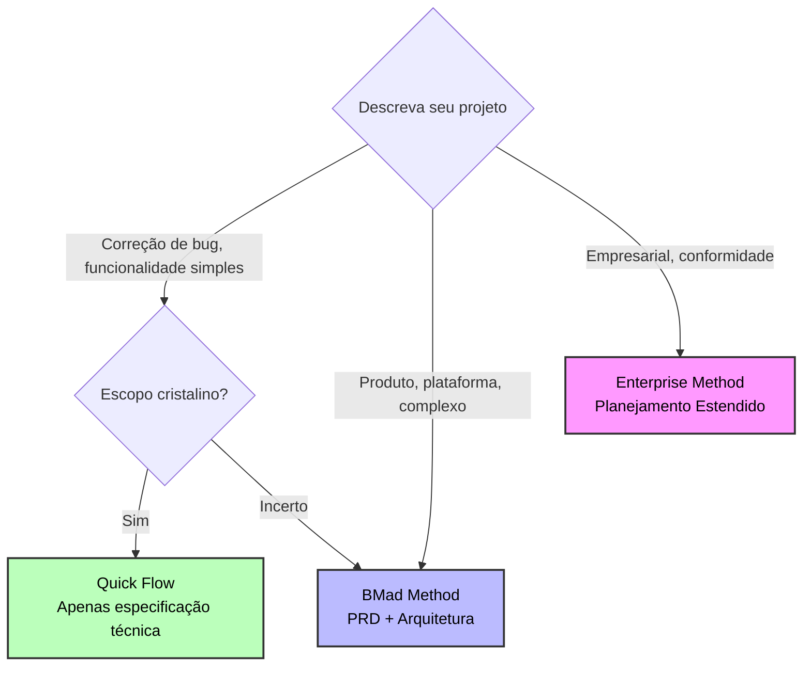
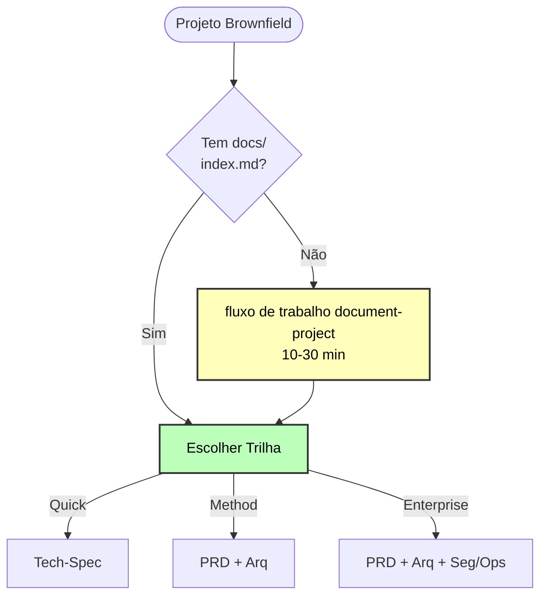

# Sistema Adaptativo de Escala do Método BMad

**Adapta automaticamente fluxos de trabalho à complexidade do projeto - de correções rápidas a sistemas empresariais**

---

## Visão Geral

O **Sistema Adaptativo de Escala** encaminha inteligentemente os projetos para a metodologia de planejamento correta com base na complexidade, e não em contagens de histórias arbitrárias.

### O Problema

Metodologias tradicionais aplicam o mesmo processo a todos os projetos:

- Correção de bug requer documentos de design completos
- Sistema empresarial construído com planejamento mínimo
- Abordagem de tamanho único que não serve para ninguém

### A Solução

O Método BMad adapta-se a três trilhas de planejamento distintas:

- **Quick Flow (Fluxo Rápido)**: Apenas especificação técnica, implementar imediatamente
- **BMad Method (Método BMad)**: PRD + Arquitetura, abordagem estruturada
- **Enterprise Method (Método Empresarial)**: Planejamento completo com segurança/devops/teste

**Resultado**: Profundidade de planejamento certa para cada projeto.

---

## Referência Rápida

### Três Trilhas em Resumo

| Trilha                | Profundidade de Planejamento | Melhor Para                                |
| --------------------- | ---------------------------- | ------------------------------------------ |
| **Quick Flow**        | Apenas especificação técnica | Funcionalidades simples, correções de bugs, escopo claro |
| **BMad Method**       | PRD + Arq + UX               | Produtos, plataformas, funcionalidades complexas |
| **Enterprise Method** | Método + Teste/Seg/Ops       | Necessidades empresariais, conformidade, multi-locatário |

### Árvore de Decisão



### Palavras-chave Rápidas

- **Quick Flow**: consertar, bug, simples, adicionar, escopo claro
- **BMad Method**: produto, plataforma, painel, complexo, múltiplas funcionalidades
- **Enterprise Method**: empresarial, multi-locatário, conformidade, segurança, auditoria

---

## Como Funciona a Seleção de Trilha

Quando você executa `workflow-init`, ele guia você através de uma escolha educativa:

### 1. Análise de Descrição

Analisa a descrição do seu projeto para indicadores de complexidade e sugere uma trilha apropriada.

### 2. Apresentação Educativa

Mostra todas as três trilhas com:

- Investimento de tempo
- Abordagem de planejamento
- Benefícios e compensações
- Nível de suporte do agente de IA
- Exemplos concretos

### 3. Recomendação Honesta

Fornece recomendação personalizada com base em:

- Palavras-chave de complexidade
- Greenfield vs brownfield
- Descrição do usuário

### 4. Escolha do Usuário

Você escolhe a trilha que se adapta à sua situação. O sistema guia, mas nunca força.

**Exemplo:**

```
workflow-init: "Com base em 'Adicionar painel de usuário com análises', recomendo o Método BMad.
               Isso envolve múltiplas funcionalidades e design de sistema. O PRD + Arquitetura
               dá aos agentes de IA contexto completo para melhor geração de código."

Você: "Na verdade, isso é mais simples do que parece. Quick Flow."

workflow-init: "Entendido! Usando Quick Flow com especificação técnica."
```

---

## As Três Trilhas

### Trilha 1: Quick Flow

**Definição**: Implementação rápida com planejamento de especificação técnica.

**Tempo**: Horas a 1 dia de planejamento

**Documentos de Planejamento**:

- Tech-spec.md (focado na implementação)
- Arquivos de história (1-15 tipicamente, detecta estrutura épica automaticamente)

**Caminho do Fluxo de Trabalho**:

```
(Brownfield: document-project primeiro se necessário)
↓
Tech-Spec → Implementar
```

**Usar Para**:

- Correções de bugs
- Funcionalidades simples
- Melhorias com escopo claro
- Adições rápidas

**Contagem de Histórias**: Tipicamente 1-15 histórias (orientação, não regra)

**Exemplo**: "Consertar bug de expiração de token de autenticação"

**Suporte do Agente de IA**: Básico - contexto mínimo fornecido

**Compensação**: Menos planejamento = maior risco de retrabalho se complexidade surgir

---

### Trilha 2: BMad Method (RECOMENDADO)

**Definição**: Planejamento completo de produto + design de sistema.

**Tempo**: 1-3 dias de planejamento

**Documentos de Planejamento**:

- PRD.md (requisitos funcionais e não funcionais)
- Architecture.md (design de sistema)
- UX Design (se componentes de UI)
- Épicos e Histórias (criados após arquitetura)

**Caminho do Fluxo de Trabalho**:

```
(Brownfield: document-project primeiro se necessário)
↓
(Opcional: Fase de Análise - brainstorm, pesquisa, brief de produto)
↓
PRD → (UX Opcional) → Arquitetura → Criar Épicos e Histórias → Verificação de Prontidão de Implementação → Implementar
```

**Visualização Completa do Fluxo de Trabalho**:


_Fluxograma detalhado mostrando todas as fases, fluxos de trabalho, agentes (codificados por cores) e pontos de decisão para a trilha do Método BMad. Cada caixa colorida representa um papel de agente diferente._

**Usar Para**:

**Greenfield**:

- Produtos
- Plataformas
- Iniciativas de múltiplas funcionalidades

**Brownfield**:

- Adições complexas (novas UIs + APIs)
- Refatorações principais
- Novos módulos

**Contagem de Histórias**: Tipicamente 10-50+ histórias (orientação, não regra)

**Exemplos**:

- "Painel de usuário com análises e preferências"
- "Adicionar colaboração em tempo real ao editor de documentos existente"
- "Sistema de integração de pagamento"

**Suporte do Agente de IA**: Excepcional - contexto completo para parceria de codificação

**Por que Arquitetura para Brownfield?**

Sua documentação brownfield pode ser enorme. O fluxo de trabalho de arquitetura destila o contexto massivo da base de código em um design de solução focado específico para o SEU projeto. Isso mantém os agentes de IA focados sem se perder no código existente.

**Benefícios**:

- Contexto completo do agente de IA
- Previne deriva arquitetural
- Menos surpresas durante a implementação
- Melhor qualidade de código
- Entrega geral mais rápida (planejamento compensa)

---

### Trilha 3: Enterprise Method

**Definição**: Planejamento estendido com segurança, devops e estratégia de teste.

**Tempo**: 3-7 dias de planejamento

**Documentos de Planejamento**:

- Todos os documentos do Método BMad MAIS:
- Arquitetura de Segurança
- Estratégia de DevOps
- Estratégia de Teste
- Documentação de conformidade

**Caminho do Fluxo de Trabalho**:

```
(Brownfield: document-project quase obrigatório)
↓
Análise (recomendado/necessário) → PRD → UX → Arquitetura
↓
Criar Épicos e Histórias
↓
Arquitetura de Segurança → Estratégia de DevOps → Estratégia de Teste
↓
Verificação de Prontidão de Implementação → Implementar
```

**Usar Para**:

- Requisitos empresariais
- Sistemas multi-locatários
- Necessidades de conformidade (HIPAA, SOC2, etc.)
- Sistemas de missão crítica
- Aplicações sensíveis à segurança

**Contagem de Histórias**: Tipicamente 30+ histórias (mas definido por necessidades empresariais, não contagem)

**Exemplos**:

- "Plataforma SaaS multi-locatário"
- "Portal de paciente compatível com HIPAA"
- "Adicionar log de auditoria SOC2 ao aplicativo empresarial"

**Suporte do Agente de IA**: Elite - planejamento empresarial abrangente

**Crítico para Empresarial**:

- Arquitetura de segurança e modelagem de ameaças
- Planejamento de pipeline DevOps
- Estratégia de teste abrangente
- Avaliação de risco
- Mapeamento de conformidade

---

## Documentos de Planejamento por Trilha

### Documentos Quick Flow

**Criado**: Antecipadamente na Fase de Planejamento

**Tech-Spec**:

- Declaração do problema e solução
- Mudanças na árvore de fontes
- Detalhes técnicos de implementação
- Stack e convenções detectadas (brownfield)
- Considerações de UX/UI (se voltado para o usuário)
- Estratégia de teste

**Serve como**: Documento de planejamento completo (substitui PRD + Arquitetura)

---

### Documentos BMad Method

**Criado**: Antecipadamente nas Fases de Planejamento e Solução

**PRD (Documento de Requisitos do Produto)**:

- Visão e objetivos do produto
- Requisitos funcionais (RFs)
- Requisitos não funcionais (RNFs)
- Critérios de sucesso
- Considerações de experiência do usuário
- Contexto de negócios

**Nota**: Épicos e histórias são criados APÓS a arquitetura no fluxo de trabalho create-epics-and-stories

**Documento de Arquitetura**:

- Componentes do sistema e responsabilidades
- Modelos de dados e esquemas
- Padrões de integração
- Arquitetura de segurança
- Considerações de desempenho
- Arquitetura de implantação

**Para Brownfield**: Atua como "design de solução" focado que destila a base de código existente em plano de integração

---

### Documentos Enterprise Method

**Criado**: Planejamento estendido através de múltiplas fases

Inclui todos os documentos do Método BMad MAIS:

**Arquitetura de Segurança**:

- Modelagem de ameaças
- Design de autenticação/autorização
- Estratégia de proteção de dados
- Requisitos de auditoria

**Estratégia de DevOps**:

- Design de pipeline CI/CD
- Arquitetura de infraestrutura
- Monitoramento e alerta
- Recuperação de desastres

**Estratégia de Teste**:

- Abordagem de teste e cobertura
- Estratégia de automação
- Portões de qualidade
- Teste de desempenho

---

## Comparação de Fluxo de Trabalho

| Trilha          | Análise     | Planejamento | Arquitetura | Segurança/Ops | Histórias Típicas |
| --------------- | ----------- | ------------ | ----------- | ------------- | ----------------- |
| **Quick Flow**  | Opcional    | Tech-spec    | Nenhuma     | Nenhuma       | 1-15              |
| **BMad Method** | Recomendado | PRD + UX     | Necessário  | Nenhuma       | 10-50+            |
| **Enterprise**  | Necessário  | PRD + UX     | Necessário  | Necessário    | 30+               |

**Nota**: Contagens de histórias são ORIENTAÇÃO baseada em uso típico, NÃO definições de trilhas.

---

## Projetos Brownfield

### Primeiro Passo Crítico

Para TODOS os projetos brownfield: Execute `document-project` ANTES de planejar fluxos de trabalho.

### Por que document-project é Crítico

**Quick Flow** usa isso para:

- Auto-detectar padrões existentes
- Entender estrutura da base de código
- Confirmar convenções

**BMad Method** usa isso para:

- Entradas de arquitetura (estrutura existente)
- Design de integração
- Consistência de padrões

**Enterprise Method** usa isso para:

- Análise de segurança
- Arquitetura de integração
- Avaliação de risco

### Padrão de Fluxo de Trabalho Brownfield



---

## Cenários Comuns

### Cenário 1: Correção de Bug (Quick Flow)

**Entrada**: "Consertar bug de validação de e-mail no formulário de login"

**Detecção**: Palavras-chave "consertar", "bug"

**Trilha**: Quick Flow

**Fluxo de Trabalho**:

1. (Opcional) Análise breve
2. Tech-spec com única história
3. Implementar imediatamente

**Tempo**: 2-4 horas total

---

### Cenário 2: Pequena Funcionalidade (Quick Flow)

**Entrada**: "Adicionar login social OAuth (Google, GitHub, Facebook)"

**Detecção**: Palavras-chave "adicionar", "funcionalidade", escopo claro

**Trilha**: Quick Flow

**Fluxo de Trabalho**:

1. (Opcional) Pesquisar provedores OAuth
2. Tech-spec com 3 histórias
3. Implementar história por história

**Tempo**: 1-3 dias

---

### Cenário 3: Portal do Cliente (BMad Method)

**Entrada**: "Construir portal do cliente com painel, tickets, faturamento"

**Detecção**: Palavras-chave "portal", "painel", múltiplas funcionalidades

**Trilha**: BMad Method

**Fluxo de Trabalho**:

1. (Recomendado) Brief de Produto
2. PRD (RFs/RNFs)
3. (Se UI) UX Design
4. Arquitetura (design de sistema)
5. Criar Épicos e Histórias
6. Verificação de Prontidão de Implementação
7. Implementar com planejamento de sprint

**Tempo**: 1-2 semanas

---

### Cenário 4: Plataforma de E-commerce (BMad Method)

**Entrada**: "Construir plataforma de e-commerce com produtos, carrinho, checkout, admin, análises"

**Detecção**: Palavras-chave "plataforma", múltiplos subsistemas

**Trilha**: BMad Method

**Fluxo de Trabalho**:

1. Pesquisa + Brief de Produto
2. PRD Abrangente (RFs/RNFs)
3. UX Design (recomendado)
4. Arquitetura de Sistema (necessário)
5. Criar Épicos e Histórias
6. Verificação de Prontidão de Implementação
7. Implementar com abordagem faseada

**Tempo**: 3-6 semanas

---

### Cenário 5: Adição Brownfield (BMad Method)

**Entrada**: "Adicionar funcionalidade de busca ao catálogo de produtos existente"

**Detecção**: Brownfield + complexidade moderada

**Trilha**: BMad Method (não Quick Flow)

**Primeiro Passo Crítico**:

1. **Executar document-project** para analisar base de código existente

**Então Fluxo de Trabalho**:

2. PRD para funcionalidade de busca (RFs/RNFs)
3. Arquitetura (design de integração - altamente recomendado)
4. Criar Épicos e Histórias
5. Verificação de Prontidão de Implementação
6. Implementar seguindo padrões existentes

**Tempo**: 1-2 semanas

**Por que Method não Quick Flow?**: Integração com sistema de catálogo existente se beneficia do planejamento de arquitetura para garantir consistência.

---

### Cenário 6: Plataforma Multi-locatário (Enterprise Method)

**Entrada**: "Adicionar multi-locação à plataforma SaaS de locatário único existente"

**Detecção**: Palavras-chave "multi-locatário", escala empresarial

**Trilha**: Enterprise Method

**Fluxo de Trabalho**:

1. Document-project (obrigatório)
2. Pesquisa (conformidade, segurança)
3. PRD (requisitos de multi-locação - RFs/RNFs)
4. Arquitetura (design de isolamento de locatário)
5. Criar Épicos e Histórias
6. Arquitetura de Segurança (isolamento de dados, auth)
7. Estratégia de DevOps (provisionamento de locatário, monitoramento)
8. Estratégia de Teste (teste de isolamento de locatário)
9. Verificação de Prontidão de Implementação
10. Implementação faseada

**Tempo**: 3-6 meses

---

## Melhores Práticas

### 1. Document-Project Primeiro para Brownfield

Sempre execute `document-project` antes de iniciar planejamento brownfield. Agentes de IA precisam de contexto da base de código existente.

### 2. Confie na Recomendação

Se `workflow-init` sugere Método BMad, provavelmente há complexidade que você não considerou. Revise cuidadosamente antes de substituir.

### 3. Comece Menor se Incerto

Incerto entre Quick Flow e Method? Comece com Quick Flow. Você pode criar PRD mais tarde se necessário.

### 4. Não Pule Verificação de Prontidão de Implementação

Para BMad Method e Enterprise, verificações de prontidão de implementação previnem erros custosos. Invista o tempo.

### 5. Arquitetura é Opcional mas Recomendada para Brownfield

BMad Method Brownfield torna arquitetura opcional, mas é altamente recomendada. Ela destila base de código complexa em design de solução focado.

### 6. Fase de Descoberta Baseada em Necessidade

Brainstorming e pesquisa são oferecidos independentemente da trilha. Use-os quando precisar pensar através do espaço do problema.

### 7. Brief de Produto para Método Greenfield

Brief de Produto é oferecido apenas para BMad Method e Enterprise greenfield. É opcional, mas ajuda com pensamento estratégico.

---

## Principais Diferenças do Sistema Legado

### Sistema Antigo (Níveis 0-4)

- Limiares de contagem de histórias arbitrários
- Nível 2 vs Nível 3 baseado em contagem de histórias
- Zonas de sobreposição confusas (5-10 histórias, 12-40 histórias)
- Tech-spec e PRD mostrados como opções conflitantes

### Novo Sistema (3 Trilhas)

- Distinção baseada em metodologia (não contagens de histórias)
- Contagens de histórias como orientação, não definições
- Propósitos de trilha claros:
  - Quick Flow = Focado na implementação
  - BMad Method = Produto + design de sistema
  - Enterprise = Estendido com segurança/ops
- Caminhos mutuamente exclusivos escolhidos antecipadamente
- Tomada de decisão educativa

---

## Migração do Sistema Antigo

Se você tem projetos existentes usando o sistema de nível antigo:

- **Nível 0-1** → Quick Flow
- **Nível 2-3** → BMad Method
- **Nível 4** → Enterprise Method

Execute `workflow-init` em projetos existentes para migrar para o novo sistema de rastreamento. Ele detecta artefatos de planejamento existentes e cria rastreamento de fluxo de trabalho apropriado.

---

## Documentação Relacionada

- **[Guia de Início Rápido](./quick-start_pt-br.md)** - Comece com BMM
- **[Fluxo de Especificação Rápida](./quick-spec-flow_pt-br.md)** - Detalhes na trilha Quick Flow
- **[Guia Brownfield](./brownfield-guide_pt-br.md)** - Fluxos de trabalho de base de código existente
- **[Glossário](./glossary_pt-br.md)** - Terminologia completa
- **[FAQ](./faq_pt-br.md)** - Perguntas comuns
- **[Guia de Fluxos de Trabalho](./README_pt-br.md#-workflow-guides)** - Referência completa de fluxo de trabalho

---

_Sistema Adaptativo de Escala - Profundidade de planejamento certa para cada projeto._
