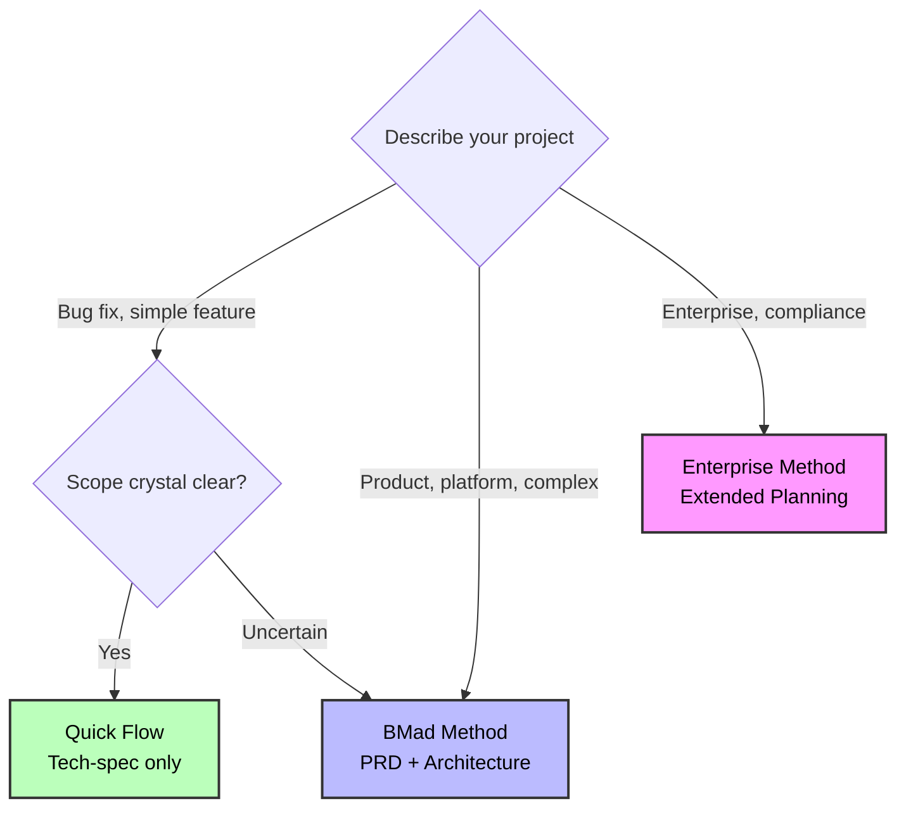

# BMad Method Scale Adaptive System

**Adapta automaticamente os fluxos de trabalho à complexidade do projeto - desde correções rápidas aos sistemas empresariais**

---

## Overview

The **Scale Adaptive System** intelligently routes projects to the right planning methodology based on complexity, not arbitrary story counts.

### The Problem

Traditional methodologies apply the same process to every project:

- Bug fix requires full design docs
- Enterprise system built with minimal planning
- One-size-fits-none approach

### The Solution

BMad Method adapts to three distinct planning tracks:

- **Quick Flow**: Tech-spec only, implement immediately
- **BMad Method**: PRD + Architecture, structured approach
- **Enterprise Method**: Full planning with security/devops/test

**Result**: Right planning depth for every project.

---

## Referência rápida

### Três faixas em um brilho

| Track                 | Planning Depth        | Best For                                   |
| --------------------- | --------------------- | ------------------------------------------ |
| **Quick Flow**        | Tech-spec only        | Simple features, bug fixes, clear scope    |
| **BMad Method**       | PRD + Arch + UX       | Products, platforms, complex features      |
| **Enterprise Method** | Method + Test/Sec/Ops | Enterprise needs, compliance, multi-tenant |

### Árvore de decisão



### Palavras-chave rápidas

- **Quick Flow**: correção, erro, simples, adicionar, escopo claro
- **Método BMad**: produto, plataforma, painel, características complexas e múltiplas
- **Método de empresa**: empresa, multilotação, conformidade, segurança, auditoria

---

## How Track Selection Works

When you run `workflow-init`, it guides you through an educational choice:

### 1. Description Analysis

Analyzes your project description for complexity indicators and suggests an appropriate track.

### 2. Educational Presentation

Shows all three tracks with:

- Time investment
- Planning approach
- Benefits and trade-offs
- AI agent support level
- Concrete examples

### 3. Honest Recommendation

Provides tailored recommendation based on:

- Complexity keywords
- Greenfield vs brownfield
- User's description

### 4. User Choice

You choose the track that fits your situation. The system guides but never forces.

**Example:**

```
workflow-init: "Based on 'Add user dashboard with analytics', I recommend BMad Method.
               This involves multiple features and system design. The PRD + Architecture
               gives AI agents complete context for better code generation."

You: "Actually, this is simpler than it sounds. Quick Flow."

workflow-init: "Got it! Using Quick Flow with tech-spec."

```

---

## As Três Faixas

### Faixa 1: Fluxo Rápido

**Definição**: BMADPROTECT009End rápido com BMADPROTECT008End técnico.

**Time**: Horas até 1 dia de planning

**Planning Docs**:

- Tech-spec.md (implementation)
- Arquivos de história (1-15 tipicamente, auto-detecta estrutura épica)

**Caminho de fluxo de trabalho**:

```
(Brownfield: document-project first if needed)
↓
Tech-Spec → Implement

```

**Utilizar para**:

- Correcções de erros
- Características simples
- Melhorias de âmbito claro
- Adições rápidas

**Contagem de história**: Normalmente 1-15 histórias (orientação, não regra)

**Exemplo**: "Fix autenticação token expiration bug"

**Agent Support**: Básico - contexto mínimo fornecido

**Comércio**: Menos planning = maior risco de retrabalho se surgir complexidade

---

### Faixa 2: Método BMad (RECOMENDADO)

**Definição**: Produto completo + projeto do sistema planning.

**Tempo**: 1-3 dias de planning

**Planning Docs**:

- PRD.md (requisitos funcionais e não funcionais)
- Architecture.md (concepção do sistema)
- UX Design (se componentes UI)
- Épicos e Histórias (criados após a arquitetura)

**Caminho de fluxo de trabalho**:

```
(Brownfield: document-project first if needed)
↓
(Optional: Analysis phase - brainstorm, research, product brief)
↓
PRD → (Optional UX) → Architecture → Create Epics and Stories → Implementation Readiness Check → Implement

```

**Visão completa do fluxo de trabalho**:

[BMad Method Workflow - Standard Greenfield](./images/workflow-method-greenfield.svg)

* Fluxograma detalhado mostrando todas as fases, fluxos de trabalho, agentes (codificados por cores) e pontos de decisão para a faixa Método BMad. Cada caixa colorida representa um papel de agente diferente.***Utilizar para**:**Greenfield**:

- Produtos
- Plataformas
- Iniciativas multicaracterísticas

**Brownfield**:

- Adições complexas (novos UI + APIs)
- Refactores principais
- Novos módulos

**Contagem de história**: tipicamente 10-50+ histórias (orientação,