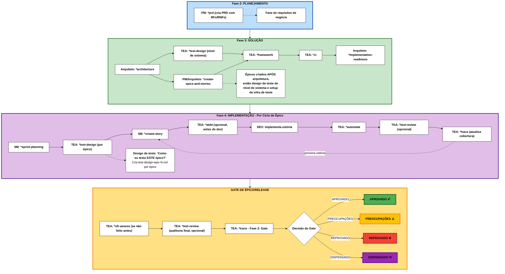

# Guia do Agente Arquiteto de Testes (TEA)

## Visão Geral

- **Persona:** Murat, Mestre Arquiteto de Testes e Consultor de Qualidade focado em testes baseados em risco, arquitetura de fixtures, ATDD e governança de CI/CD.
- **Missão:** Entregar estratégias de qualidade acionáveis, cobertura de automação e decisões de gate que escalem com a complexidade do projeto e demandas de conformidade.
- **Usar Quando:** Projetos do Método BMad ou trilha Enterprise, risco de integração não trivial, risco de regressão em brownfield, ou quando evidência de conformidade/NFR é necessária. (Projetos Quick Flow tipicamente não requerem o TEA)

## Ciclo de Vida do Fluxo de Trabalho do TEA

O TEA integra-se ao ciclo de vida de desenvolvimento do BMad durante a Solução (Fase 3) e Implementação (Fase 4):



**Nota sobre Numeração de Fases:** O BMad usa uma metodologia de 4 fases com Fase 1 opcional e pré-requisito de documentação:

- **Documentação** (Opcional para brownfield): Pré-requisito usando `*document-project`
- **Fase 1** (Opcional): Descoberta/Análise (`*brainstorm`, `*research`, `*product-brief`)
- **Fase 2** (Obrigatório): Planejamento (`*prd` cria PRD com RFs/RNFs)
- **Fase 3** (Dependente da trilha): Solução (`*architecture` → `*test-design` (nível de sistema) → `*create-epics-and-stories` → TEA: `*framework`, `*ci` → `*implementation-readiness`)
- **Fase 4** (Obrigatório): Implementação (`*sprint-planning` → por-épico: `*test-design` → por-estória: fluxos de desenvolvimento)

**Fluxos de trabalho do TEA:** `*framework` e `*ci` rodam uma vez na Fase 3 após a arquitetura. `*test-design` é **modo duplo**:

- **Nível de sistema (Fase 3):** Executar imediatamente após o rascunho de arquitetura/ADR para produzir `test-design-system.md` (revisão de testabilidade, mapeamento ADR → teste, Requisitos Arquiteturalmente Significantes (ASRs), necessidades de ambiente). Alimenta o gate de prontidão de implementação.
- **Nível de épico (Fase 4):** Executar por épico para produzir `test-design-epic-N.md` (risco, prioridades, plano de cobertura).

A trilha Quick Flow pula as Fases 1 e 3.
O Método BMad e Enterprise usam todas as fases baseadas nas necessidades do projeto.
Quando um rascunho de ADR ou arquitetura é produzido, execute `*test-design` no **modo nível de sistema** antes do gate de prontidão de implementação. Isso garante que o ADR tenha uma revisão de testabilidade anexada e mapeamento ADR → teste. Mantenha o test-design atualizado se os ADRs mudarem.

### Por que o TEA é Diferente de Outros Agentes BMM

O TEA é o único agente BMM que opera em **múltiplas fases** (Fase 3 e Fase 4) e tem sua própria **arquitetura de base de conhecimento**.

<details>
<summary><strong>Operação Entre Fases & Arquitetura Única</strong></summary>

### Agentes Específicos de Fase (Padrão)

A maioria dos agentes BMM trabalha em uma única fase:

- **Fase 1 (Análise)**: Agente Analista
- **Fase 2 (Planejamento)**: Agente PM
- **Fase 3 (Solução)**: Agente Arquiteto
- **Fase 4 (Implementação)**: Agentes SM, DEV

### TEA: Agente de Qualidade Multi-Fase (Padrão Único)

O TEA é **o único agente que opera em múltiplas fases**:

```
Fase 1 (Análise) → [TEA não tipicamente usado]
    ↓
Fase 2 (Planejamento) → [PM define requisitos - TEA não ativo]
    ↓
Fase 3 (Solução) → TEA: *framework, *ci (infra de teste APÓS arquitetura)
    ↓
Fase 4 (Implementação) → TEA: *test-design (por épico: "como testo ESTA feature?")
                        → TEA: *atdd, *automate, *test-review, *trace (por estória)
    ↓
Gate de Épico/Release → TEA: *nfr-assess, *trace Fase 2 (decisão de release)
```

### Os 8 Fluxos de Trabalho do TEA Entre Fases

**Agentes padrão**: 1-3 fluxos de trabalho por fase
**TEA**: 8 fluxos de trabalho através da Fase 3, Fase 4 e Gate de Release

| Fase        | Fluxos de Trabalho do TEA                                 | Frequência       | Propósito                                      |
| ----------- | --------------------------------------------------------- | ---------------- | ---------------------------------------------- |
| **Fase 2**  | (nenhum)                                                  | -                | Fase de Planejamento - PM define requisitos    |
| **Fase 3**  | \*framework, \*ci                                         | Uma vez/projeto  | Configurar infra de teste APÓS arquitetura     |
| **Fase 4**  | \*test-design, \*atdd, \*automate, \*test-review, \*trace | Por épico/estória| Planejamento de teste por épico, depois testes por estória |
| **Release** | \*nfr-assess, \*trace (Fase 2: gate)                      | Por épico/release| Decisão de Go/no-go                            |

**Nota**: `*trace` é um fluxo de duas fases: Fase 1 (rastreabilidade) + Fase 2 (decisão de gate). Isso reduz a carga cognitiva mantendo o fluxo natural.

### Por que o TEA Recebe Tratamento Especial

O TEA requer unicamente:

- **Conhecimento de domínio extensivo**: 32 fragmentos cobrindo padrões de teste, CI/CD, fixtures, práticas de qualidade, estratégias de auto-cura e integração opcional com playwright-utils
- **Sistema de referência centralizado**: `tea-index.csv` para carregamento de fragmentos sob demanda durante a execução do fluxo
- **Preocupações transversais**: Padrões de teste específicos de domínio (vs artefatos específicos de projeto como PRDs/estórias)
- **Integrações opcionais**: Capacidades MCP (auto-cura, exploratório, verificação) e suporte a playwright-utils

Esta arquitetura permite que o TEA mantenha padrões de teste consistentes e prontos para produção em todos os projetos BMad enquanto opera através de múltiplas fases de desenvolvimento.

### Integração Playwright Utils

O TEA opcionalmente se integra com `@seontechnologies/playwright-utils`, uma biblioteca open-source que fornece utilitários baseados em fixtures para testes Playwright.

**Instalação:**

```bash
npm install -D @seontechnologies/playwright-utils
```

**Habilite durante a instalação do BMAD** respondendo "Yes" quando solicitado.

**Utilitários suportados (11 total):**

- api-request, network-recorder, auth-session, intercept-network-call, recurse
- log, file-utils, burn-in, network-error-monitor
- fixtures-composition (padrões de integração)

**Fluxos se adaptam:** automate, framework, test-review, ci, atdd (+ menção leve em test-design).

**Base de conhecimento:** 32 fragmentos totais (21 padrões core + 11 playwright-utils)

</details>

## Cheat Sheets de Alto Nível

Estes cheat sheets mapeiam os fluxos de trabalho do TEA para as trilhas **Método BMad e Enterprise** através da **Metodologia de 4 Fases** (Fase 1: Análise, Fase 2: Planejamento, Fase 3: Solução, Fase 4: Implementação).

**Nota:** Projetos Quick Flow tipicamente não requerem o TEA (coberto na Visão Geral). Estes cheat sheets focam nas trilhas Método BMad e Enterprise onde o TEA agrega valor.

**Legenda para Deltas de Trilha:**

- ➕ = Novo fluxo ou fase adicionada (não existe na base)
- 🔄 = Foco modificado (mesmo fluxo, ênfase ou propósito diferente)
- 📦 = Requisito adicional de saída ou arquivamento

### Greenfield - Método BMad (Trabalho Simples/Padrão)

**Trilha de Planejamento:** Método BMad (PRD + Arquitetura)
**Caso de Uso:** Novos projetos com complexidade padrão

| Estágio do Fluxo           | Arquiteto de Testes                                               | Dev / Time                                                                          | Saídas                                                     |
| -------------------------- | ----------------------------------------------------------------- | ----------------------------------------------------------------------------------- | ---------------------------------------------------------- |
| **Fase 1**: Descoberta     | -                                                                 | Analista `*product-brief` (opcional)                                                | `product-brief.md`                                         |
| **Fase 2**: Planejamento   | -                                                                 | PM `*prd` (cria PRD com RFs/RNFs)                                                   | PRD com requisitos funcionais/não-funcionais               |
| **Fase 3**: Solução        | Executar `*framework`, `*ci` APÓS arquitetura e criação de épicos | Arquiteto `*architecture`, `*create-epics-and-stories`, `*implementation-readiness` | Arquitetura, épicos/estórias, scaffold de teste, pipeline CI |
| **Fase 4**: Início Sprint  | -                                                                 | SM `*sprint-planning`                                                               | Arquivo de status da sprint com todos os épicos e estórias |
| **Fase 4**: Plan. Épico    | Executar `*test-design` para ESTE épico (plano de teste por épico)| Revisar escopo do épico                                                             | `test-design-epic-N.md` com avaliação de risco e plano de teste |
| **Fase 4**: Dev Estória    | (Opcional) `*atdd` antes do dev, então `*automate` depois         | SM `*create-story`, DEV implementa                                                  | Testes, implementação da estória                           |
| **Fase 4**: Review Estória | Executar `*test-review` (opcional), re-executar `*trace`          | Endereçar recomendações, atualizar código/testes                                    | Relatório de qualidade, matriz de cobertura atualizada     |
| **Fase 4**: Gate Release   | (Opcional) `*test-review` para auditoria final, Rodar `*trace` (Fase 2) | Confirmar Definição de Pronto, compartilhar notas de release                      | Auditoria de qualidade, YAML do Gate + resumo da release   |

<details>
<summary>Notas de Execução</summary>

- Execute `*framework` apenas uma vez por repositório ou quando faltar suporte moderno de harness.
- **Fase 3 (Solução)**: Após a conclusão da arquitetura, execute `*framework` e `*ci` para configurar a infraestrutura de teste baseada nas decisões arquiteturais.
- **Início da Fase 4**: Após a solução estar completa, o planejamento da sprint carrega todos os épicos.
- **`*test-design` roda por épico**: No início do trabalho em cada épico, execute `*test-design` para criar um plano de teste para AQUELE épico/funcionalidade específico. Saída: `test-design-epic-N.md`.
- Use `*atdd` antes de codificar quando o time puder adotar ATDD; compartilhe seu checklist com o agente dev.
- Pós-implementação, mantenha o `*trace` atualizado, expanda a cobertura com `*automate`, opcionalmente revise a qualidade do teste com `*test-review`. Para o gate de release, execute `*trace` com a Fase 2 habilitada para obter a decisão de implantação.
- Use `*test-review` após `*atdd` para validar testes gerados, após `*automate` para garantir qualidade de regressão, ou antes do gate para auditoria final.

</details>

<details>
<summary>Exemplo Trabalhado – Recurso Greenfield “Nova CRM”</summary>

1. **Planejamento (Fase 2):** Analista roda `*product-brief`; PM executa `*prd` para produzir PRD com RFs/RNFs.
2. **Solução (Fase 3):** Arquiteto completa `*architecture` para o novo módulo; `*create-epics-and-stories` gera épicos/estórias baseados na arquitetura; TEA configura infra de teste via `*framework` e `*ci` baseado nas decisões arquiteturais; verificação de gate valida completude do planejamento.
3. **Início Sprint (Fase 4):** Scrum Master roda `*sprint-planning` para carregar todos os épicos no status da sprint.
4. **Planejamento Épico 1 (Fase 4):** TEA roda `*test-design` para criar plano de teste para o Épico 1, produzindo `test-design-epic-1.md` com avaliação de risco.
5. **Implementação Estória (Fase 4):** Para cada estória no Épico 1, SM gera estória via `*create-story`; TEA opcionalmente roda `*atdd`; Dev implementa com orientação dos testes falhando.
6. **Pós-Dev (Fase 4):** TEA roda `*automate`, opcionalmente `*test-review` para auditar qualidade do teste, re-executa `*trace` para atualizar cobertura.
7. **Gate de Release:** TEA roda `*trace` com Fase 2 habilitada para gerar decisão do gate.

</details>

### Brownfield - Método BMad ou Enterprise (Simples ou Complexo)

**Trilhas de Planejamento:** Método BMad ou Método Enterprise
**Caso de Uso:** Bases de código existentes - adições simples (Método BMad) ou requisitos corporativos complexos (Método Enterprise)

**🔄 Deltas Brownfield do Greenfield:**

- ➕ Documentação (Pré-requisito) - Documentar base de código existente se não documentada
- ➕ Fase 2: `*trace` - Basear cobertura de teste existente antes do planejamento
- 🔄 Fase 4: `*test-design` - Foco em hotspots de regressão e riscos brownfield
- 🔄 Fase 4: Review Estória - Pode incluir `*nfr-assess` se não feito antes

| Estágio do Fluxo                   | Arquiteto de Testes                                                          | Dev / Time                                                                          | Saídas                                                                 |
| ---------------------------------- | ---------------------------------------------------------------------------- | ----------------------------------------------------------------------------------- | ---------------------------------------------------------------------- |
| **Documentação**: Pré-requisito ➕ | -                                                                            | Analista `*document-project` (se não documentado)                                   | Documentação abrangente do projeto                                     |
| **Fase 1**: Descoberta             | -                                                                            | Analista/PM/Arquiteto re-executam fluxos de planejamento                            | Artefatos de planejamento atualizados em `{output_folder}`             |
| **Fase 2**: Planejamento           | Executar ➕ `*trace` (cobertura base)                                        | PM `*prd` (cria PRD com RFs/RNFs)                                                   | PRD com RFs/RNFs, ➕ base de cobertura                                 |
| **Fase 3**: Solução                | Executar `*framework`, `*ci` APÓS arquitetura e criação de épicos            | Arquiteto `*architecture`, `*create-epics-and-stories`, `*implementation-readiness` | Arquitetura, épicos/estórias, framework de teste, pipeline CI          |
| **Fase 4**: Início Sprint          | -                                                                            | SM `*sprint-planning`                                                               | Arquivo de status da sprint com todos os épicos e estórias             |
| **Fase 4**: Plan. Épico            | Executar `*test-design` para ESTE épico 🔄 (hotspots de regressão)           | Revisar escopo do épico e riscos brownfield                                         | `test-design-epic-N.md` com avaliação de risco brownfield e mitigação  |
| **Fase 4**: Dev Estória            | (Opcional) `*atdd` antes do dev, então `*automate` depois                    | SM `*create-story`, DEV implementa                                                  | Testes, implementação da estória                                       |
| **Fase 4**: Review Estória         | Aplicar `*test-review` (opcional), re-executar `*trace`, ➕ `*nfr-assess` se nec. | Resolver lacunas, atualizar docs/testes                                             | Relatório de qualidade, matriz de cobertura atualizada, relatório RNF  |
| **Fase 4**: Gate Release           | (Opcional) `*test-review` para auditoria final, Rodar `*trace` (Fase 2)      | Capturar aprovações, compartilhar notas de release                                  | Auditoria de qualidade, YAML do Gate + resumo da release               |

<details>
<summary>Notas de Execução</summary>

- Comece com `*trace` durante o Planejamento (Fase 2) para basear a cobertura de teste existente antes do trabalho de arquitetura começar.
- **Fase 3 (Solução)**: Após a conclusão da arquitetura, execute `*framework` e `*ci` para modernizar a infraestrutura de teste. Para brownfield, o framework pode precisar integrar com ou substituir o setup de teste existente.
- **Início da Fase 4**: Após a solução estar completa e o planejamento da sprint carregar todos os épicos.
- **`*test-design` roda por épico**: No início do trabalho em cada épico, execute `*test-design` para identificar hotspots de regressão, riscos de integração e estratégias de mitigação para AQUELE épico/funcionalidade específico. Saída: `test-design-epic-N.md`.
- Use `*atdd` quando as estórias se beneficiarem de ATDD; caso contrário, proceda para implementação e confie na automação pós-dev.
- Após o desenvolvimento, expanda a cobertura com `*automate`, opcionalmente revise a qualidade do teste com `*test-review`, re-execute `*trace` (Fase 2 para decisão de gate). Execute `*nfr-assess` agora se riscos não-funcionais não foram abordados anteriormente.
- Use `*test-review` para validar testes brownfield existentes ou auditar novos testes antes do gate.

</details>

<details>
<summary>Exemplo Trabalhado – Estória Brownfield “Atlas Payments”</summary>

1. **Planejamento (Fase 2):** PM executa `*prd` para criar PRD com RFs/RNFs; TEA roda `*trace` para basear cobertura existente.
2. **Solução (Fase 3):** Arquiteto aciona `*architecture` capturando fluxos de pagamento legado e arquitetura de integração; `*create-epics-and-stories` gera Épico 1 (Processamento de Pagamento) baseado na arquitetura; TEA configura `*framework` e `*ci` baseado nas decisões arquiteturais; verificação de gate valida planejamento.
3. **Início Sprint (Fase 4):** Scrum Master roda `*sprint-planning` para carregar Épico 1 no status da sprint.
4. **Planejamento Épico 1 (Fase 4):** TEA roda `*test-design` para o Épico 1 (Processamento de Pagamento), produzindo `test-design-epic-1.md` que sinaliza casos de borda de liquidação, hotspots de regressão e planos de mitigação.
5. **Implementação Estória (Fase 4):** Para cada estória no Épico 1, SM gera estória via `*create-story`; TEA roda `*atdd` produzindo specs Playwright falhando; Dev implementa com orientação de testes e checklist.
6. **Pós-Dev (Fase 4):** TEA aplica `*automate`, opcionalmente `*test-review` para auditar qualidade do teste, re-executa `*trace` para atualizar cobertura.
7. **Gate de Release:** TEA realiza `*nfr-assess` para validar SLAs, roda `*trace` com Fase 2 habilitada para gerar decisão do gate (APROVADO/PREOCUPAÇÕES/REPROVADO).

</details>

### Greenfield - Método Enterprise (Trabalho Enterprise/Compliance)

**Trilha de Planejamento:** Método Enterprise (Método BMad + estratégias estendidas de segurança/devops/teste)
**Caso de Uso:** Novos projetos corporativos com compliance, segurança, ou requisitos regulatórios complexos

**🏢 Deltas Enterprise do Método BMad:**

- ➕ Fase 1: `*research` - Pesquisa de domínio e conformidade (recomendado)
- ➕ Fase 2: `*nfr-assess` - Capturar requisitos de RNFs cedo (segurança/performance/confiabilidade)
- 🔄 Fase 4: `*test-design` - Foco Enterprise (alinhamento com compliance, arquitetura de segurança)
- 📦 Gate Release - Arquivar artefatos e evidências de conformidade para auditorias

| Estágio do Fluxo           | Arquiteto de Testes                                                      | Dev / Time                                                                          | Saídas                                                             |
| -------------------------- | ------------------------------------------------------------------------ | ----------------------------------------------------------------------------------- | ------------------------------------------------------------------ |
| **Fase 1**: Descoberta     | -                                                                        | Analista ➕ `*research`, `*product-brief`                                           | Pesquisa de domínio, análise de conformidade, product brief        |
| **Fase 2**: Planejamento   | Executar ➕ `*nfr-assess`                                                | PM `*prd` (cria PRD com RFs/RNFs), UX `*create-ux-design`                           | PRD Enterprise com RFs/RNFs, design UX, ➕ documentação RNF        |
| **Fase 3**: Solução        | Executar `*framework`, `*ci` APÓS arquitetura e criação de épicos        | Arquiteto `*architecture`, `*create-epics-and-stories`, `*implementation-readiness` | Arquitetura, épicos/estórias, framework de teste, pipeline CI      |
| **Fase 4**: Início Sprint  | -                                                                        | SM `*sprint-planning`                                                               | Plano de sprint com todos os épicos                                |
| **Fase 4**: Plan. Épico    | Executar `*test-design` para ESTE épico 🔄 (foco em compliance)          | Revisar escopo do épico e requisitos de conformidade                                | `test-design-epic-N.md` com foco em segurança/performance/compliance |
| **Fase 4**: Dev Estória    | (Opcional) `*atdd`, `*automate`, `*test-review`, `*trace` por estória    | SM `*create-story`, DEV implementa                                                  | Testes, fixtures, relatórios de qualidade, matrizes de cobertura   |
| **Fase 4**: Gate Release   | Auditoria final `*test-review`, Rodar `*trace` (Fase 2), 📦 arquivar artefatos | Capturar aprovações, 📦 evidência de conformidade                                   | Auditoria de qualidade, avaliações atualizadas, YAML do gate, 📦 trilha de auditoria |

<details>
<summary>Notas de Execução</summary>

- `*nfr-assess` roda cedo no Planejamento (Fase 2) para capturar requisitos de conformidade, segurança e performance antecipadamente.
- **Fase 3 (Solução)**: Após a conclusão da arquitetura, execute `*framework` e `*ci` com configurações de nível enterprise (testes seletivos, jobs de burn-in, cache, notificações).
- **Início da Fase 4**: Após a solução estar completa e o planejamento da sprint carregar todos os épicos.
- **`*test-design` roda por épico**: No início do trabalho em cada épico, execute `*test-design` para criar um plano de teste focado em enterprise para AQUELE épico específico, garantindo alinhamento com arquitetura de segurança, metas de performance e requisitos de conformidade. Saída: `test-design-epic-N.md`.
- Use `*atdd` para estórias quando viável para que testes de aceitação possam guiar a implementação.
- Use `*test-review` por estória ou sprint para manter padrões de qualidade e garantir conformidade com melhores práticas de teste.
- Antes do release, re-execute cobertura (`*trace`, `*automate`), realize auditoria final de qualidade com `*test-review`, e formalize a decisão com `*trace` Fase 2 (decisão de gate); arquive artefatos para auditorias de conformidade.

</details>

<details>
<summary>Exemplo Trabalhado – Release Enterprise “Helios Ledger”</summary>

1. **Planejamento (Fase 2):** Analista roda `*research` e `*product-brief`; PM completa `*prd` criando PRD com RFs/RNFs; TEA roda `*nfr-assess` para estabelecer metas de RNF.
2. **Solução (Fase 3):** Arquiteto completa `*architecture` com considerações enterprise; `*create-epics-and-stories` gera épicos/estórias baseados na arquitetura; TEA configura `*framework` e `*ci` com configurações de nível enterprise baseado nas decisões arquiteturais; verificação de gate valida completude do planejamento.
3. **Início Sprint (Fase 4):** Scrum Master roda `*sprint-planning` para carregar todos os épicos no status da sprint.
4. **Por Épico (Fase 4):** Para cada épico, TEA roda `*test-design` para criar plano de teste específico do épico (e.g., `test-design-epic-1.md`, `test-design-epic-2.md`) com avaliação de risco focada em conformidade.
5. **Por Estória (Fase 4):** Para cada estória, TEA usa `*atdd`, `*automate`, `*test-review` e `*trace`; Times Dev iteram sobre os achados.
6. **Gate de Release:** TEA re-checa cobertura, realiza auditoria final de qualidade com `*test-review`, e registra a decisão final do gate via `*trace` Fase 2, arquivando artefatos para conformidade.

</details>

## Catálogo de Comandos

<details>
<summary><strong>Melhorias Opcionais do Playwright MCP</strong></summary>

**Dois servidores Playwright MCP** (mantidos ativamente, atualizados continuamente):

- `playwright` - Automação de browser (`npx @playwright/mcp@latest`)
- `playwright-test` - Executor de testes com análise de falhas (`npx playwright run-test-mcp-server`)

**Como o MCP Melhora os Fluxos de Trabalho do TEA**:

MCP fornece capacidades adicionais sobre a abordagem baseada em IA padrão do TEA:

1. `*test-design`:
   - Padrão: Análise + documentação
   - **+ MCP**: Descoberta interativa de UI com `browser_navigate`, `browser_click`, `browser_snapshot`, observação de comportamento

   Benefício: Descobrir funcionalidade real, casos de borda, recursos não documentados

2. `*atdd`, `*automate`:
   - Padrão: Infere seletores e interações de requisitos e fragmentos de conhecimento
   - **+ MCP**: Gera testes **então** verifica com `generator_setup_page`, ferramentas `browser_*`, valida contra app ao vivo

   Benefício: Seletores precisos do DOM real, comportamento verificado, código de teste refinado

3. `*automate`:
   - Padrão: Correções baseadas em padrões de mensagens de erro + fragmentos de conhecimento
   - **+ MCP**: Correções de padrão **aprimoradas com** `browser_snapshot`, `browser_console_messages`, `browser_network_requests`, `browser_generate_locator`

   Benefício: Contexto visual de falha, inspeção de DOM ao vivo, descoberta de causa raiz

**Exemplo de config**:

```json
{
  "mcpServers": {
    "playwright": {
      "command": "npx",
      "args": ["@playwright/mcp@latest"]
    },
    "playwright-test": {
      "command": "npx",
      "args": ["playwright", "run-test-mcp-server"]
    }
  }
}
```

**Para desabilitar**: Defina `tea_use_mcp_enhancements: false` em `_bmad/bmm/config.yaml` OU remova MCPs da config da IDE.

</details>

<details>
<summary><strong>Integração Opcional Playwright Utils</strong></summary>

**Utilitários Playwright open-source** da SEON Technologies (testados em produção, publicados no npm):

- **Pacote**: `@seontechnologies/playwright-utils` ([npm](https://www.npmjs.com/package/@seontechnologies/playwright-utils) | [GitHub](https://github.com/seontechnologies/playwright-utils))
- **Instalar**: `npm install -D @seontechnologies/playwright-utils`

**Como Playwright Utils Melhora os Fluxos de Trabalho do TEA**:

Fornece utilitários baseados em fixtures que se integram aos fluxos de geração e revisão de testes do TEA:

1. `*framework`:
   - Padrão: Scaffold básico Playwright
   - **+ playwright-utils**: Scaffold com fixtures api-request, network-recorder, auth-session, burn-in, network-error-monitor pré-configurados

   Benefício: Padrões prontos para produção desde o primeiro dia

2. `*automate`, `*atdd`:
   - Padrão: Padrões de teste padrão
   - **+ playwright-utils**: Testes usando api-request (validação de schema), intercept-network-call (mocking), recurse (polling), log (logging estruturado), file-utils (CSV/PDF)

   Benefício: Padrões avançados sem boilerplate

3. `*test-review`:
   - Padrão: Revisa contra base de conhecimento core (21 fragmentos)
   - **+ playwright-utils**: Revisa contra base de conhecimento expandida (32 fragmentos: 21 core + 11 playwright-utils)

   Benefício: Revisões incluem composição de fixtures, padrões de autenticação, melhores práticas de gravação de rede

4. `*ci`:
   - Padrão: Fluxo de trabalho CI padrão
   - **+ playwright-utils**: Fluxo CI com script de burn-in (seleção inteligente de testes) e integração network-error-monitor

   Benefício: Feedback de CI mais rápido, detecção de erro HTTP

**Utilitários disponíveis** (11 total): api-request, network-recorder, auth-session, intercept-network-call, recurse, log, file-utils, burn-in, network-error-monitor, fixtures-composition

**Habilite durante a instalação do BMAD** respondendo "Yes" quando solicitado, ou defina manualmente `tea_use_playwright_utils: true` em `_bmad/bmm/config.yaml`.

**Para desabilitar**: Defina `tea_use_playwright_utils: false` em `_bmad/bmm/config.yaml`.

</details>

<br></br>

| Comando        | README do Fluxo de Trabalho                       | Saídas Primárias                                                                              | Notas                                                | Com Melhorias Playwright MCP                                                                                 |
| -------------- | ------------------------------------------------- | --------------------------------------------------------------------------------------------- | ---------------------------------------------------- | ------------------------------------------------------------------------------------------------------------ |
| `*framework`   | [📖](../workflows/testarch/framework/README.md)   | Scaffold Playwright/Cypress, `.env.example`, `.nvmrc`, specs de exemplo                       | Use quando não existir harness pronto para produção  | -                                                                                                            |
| `*ci`          | [📖](../workflows/testarch/ci/README.md)          | Fluxo de trabalho CI, scripts de teste seletivos, checklist de segredos                       | Consciente da plataforma (Padrão GitHub Actions)     | -                                                                                                            |
| `*test-design` | [📖](../workflows/testarch/test-design/README.md) | Avaliação de risco combinada, plano de mitigação e estratégia de cobertura                    | Pontuação de risco + modo exploratório opcional      | **+ Exploratório**: Descoberta interativa de UI com automação de browser (descobrir funcionalidade real)     |
| `*atdd`        | [📖](../workflows/testarch/atdd/README.md)        | Testes de aceitação falhando + checklist de implementação                                     | Fase vermelha TDD + modo de gravação opcional        | **+ Gravação**: Geração por IA verificada com browser ao vivo (seletores precisos do DOM real)               |
| `*automate`    | [📖](../workflows/testarch/automate/README.md)    | Specs priorizadas, fixtures, atualizações de README/script, resumo DoD                        | Auto-cura/gravação opcional, evitar cobertura duplicada | **+ Auto-cura**: Correções de padrão aprimoradas com depuração visual + **+ Gravação**: IA verificada com browser ao vivo |
| `*test-review` | [📖](../workflows/testarch/test-review/README.md) | Relatório de revisão de qualidade de teste com pontuação 0-100, violações, correções          | Revisa testes contra padrões da base de conhecimento | -                                                                                                            |
| `*nfr-assess`  | [📖](../workflows/testarch/nfr-assess/README.md)  | Relatório de avaliação de RNF com ações                                                       | Foco em segurança/performance/confiabilidade         | -                                                                                                            |
| `*trace`       | [📖](../workflows/testarch/trace/README.md)       | Fase 1: Matriz de cobertura, recomendações. Fase 2: Decisão do gate (APROVADO/PREOCUPAÇÕES/REPROVADO/DISPENSADO) | Fluxo de duas fases: rastreabilidade + decisão de gate | -                                                                                                            |

**📖** = Clique para ver a documentação detalhada do fluxo de trabalho
