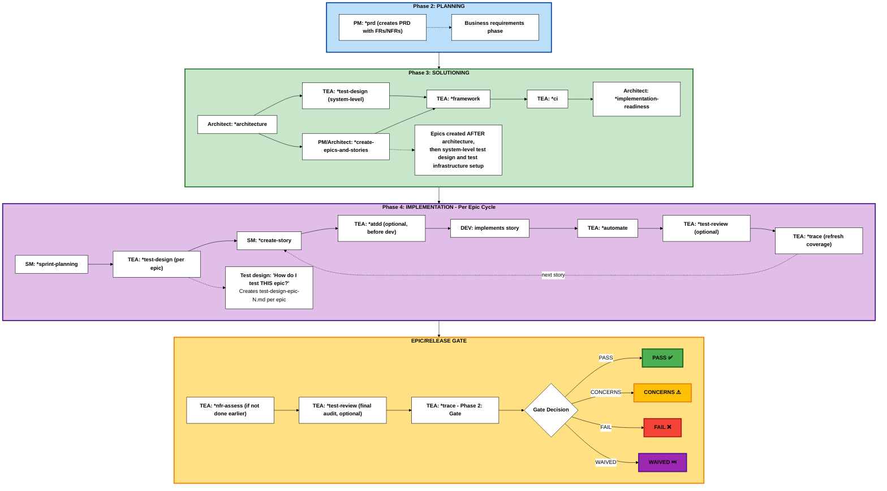

# Guia do agente do arquitecto de ensaio (TEA)

## Visão geral

- **Persona:** Murat, Master Test Architecte and Quality Advisor focado em testes baseados em risco, arquitetura de acessórios, ATDD e governança CI/CD.
- **Missão:** Forneça estratégias de qualidade acionáveis, cobertura de automação e decisões de porta que dimensionem com a complexidade do projeto e exigências de conformidade.
- **Use Quando:** Método BMad ou projetos de trilha empresarial, risco de integração é não trivial, risco de regressão de campo marrom existe, ou evidência conformidade / NFR é necessária. (Projetos de fluxo rápido normalmente não requerem TEA)

## Ciclo de vida do fluxo de trabalho do TEA

A TEA integra-se no ciclo de vida de desenvolvimento BMad durante a Solução (Fase 3) e Implementation (Fase 4):

**Nota de numeração de fase:** BMad utiliza uma metodologia de 4 fases com fase 1 opcional e pré-requisito de documentação:

- **Documentação** (Opcional para brownfield): Pré-requisito usando `*document-project`
- **Fase 1** (Opcional): Descoberta/Análise (`*brainstorm`, `*research`, `*product-brief`)
- **Fase 2** (obrigatório): Planning (`*prd` cria PRD com FRs/NFRs)
- **Fase 3** (dependente da faixa): Solução (`*architecture` → `*test-design` (nível do sistema) → `*create-epics-and-stories` → EA: `*framework`, `*ci` → `*implementation-readiness`)
- **Fase 4** (necessária): Implementation (`*sprint-planning` → per-epic: `*test-design` → per-story: fluxos de trabalho dev)

**workflows TEA:**`*framework` e `*ci` funcionam uma vez na Fase 3 após a arquitetura. `*test-design` é**modo dual**:

- **Nível do sistema (Fase 3):** Executar imediatamente após a redacção da arquitectura/ADR para produzir `test-