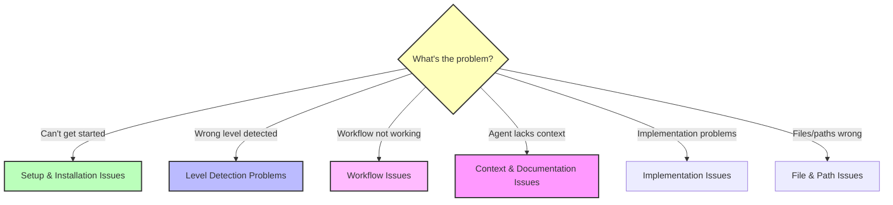

Guia de Resolução de Problemas do BMM

Problemas e soluções comuns para o Módulo Método BMad.

---

## Quick Diagnosis

**Use this flowchart to find your issue:**



---

## Índice

- [Questões de instalação e instalação](#setup-and-installation-issues)
- [Problemas de detecção de nível](#level-detection-problems)
- [Questões de fluxo de trabalho](#workflow-issues)
- [Questões de contexto e documentação](#context-and-documentation-issues)
- [Implementation Edições ](#implementation-issues)
- [Questões de Arquivo e Caminho](#file-and-path-issues)
- [Questões de comportamento do agente ](#agent-behavior-issues)
- [Questões de integração (Brownfield)](#integration-issues-brownfield)

---

## Setup and Installation Issues

### Problem: BMM not found after installation

**Symptoms:**

- `bmad` command not recognized
- Agent files not accessible
- Workflows don't load

**Solution:**

```bash

# Check if BMM is installed
ls bmad/

# If not present, run installer
npx bmad-method@alpha install

# For fresh install
npx bmad-method@alpha install --skip-version-prompt

```

### Problem: Agents don't have menu

**Symptoms:**

- Load agent file but no menu appears
- Agent doesn't respond to commands

**Solution:**

1. Ensure you're loading the correct agent file path: `bmad/bmm/agents/[agent-name].md`
2. Wait a few seconds for agent to initialize
3. Try asking "show menu" or "help"
4. Check IDE supports Markdown rendering with context
5. For Claude Code: Ensure agent file is open in chat context

### Problem: Workflows not found

**Symptoms:**

- Agent says workflow doesn't exist
- Menu shows workflow but won't run

**Solution:**

1. Check workflow exists: `ls bmad/bmm/workflows/`
2. Verify agent has access to workflow (check agent's workflow list)
3. Try using menu number instead of workflow name
4. Restart chat with agent in fresh session

---

## Problemas de detecção de nível

### Problema: o início do fluxo de trabalho sugere nível errado

**Simptomas:**

- Detecta o Nível 3 mas só precisa do Nível 1
- Sugere Nível 1 mas projeto é realmente Nível 2
- Não consigo perceber o nível apropriado.

**Solução:**

1. **Substituir a sugestão** - workflow-init sempre pede confirmação, basta dizer "não" e escolher o nível correto
2. **Seja específico na descrição** - Use palavras-chave de nível ao descrever:
- "erro de correção" → Nível 0
- "adicionar pequena característica" → Nível 1
- "painel de construção" → Nível 2
3. **Aumento manual** - Você sempre pode mudar de níveis mais tarde, se necessário

**Exemplo:**

```
workflow-init: "Level 3 project?"
You: "No, this is just adding OAuth login - Level 1"
workflow-init: "Got it, creating Level 1 workflow"

```

### Problema: Nível do projeto incerto

**Simptomas:**

- Entre Nível 1 e Nível 2
- Não sei se a arquitectura precisa
- Contagem de histórias incerta

**Solução:**
**Quando em dúvida, começar menor:**

- Escolha o Nível 1 em vez do Nível 2
- Você sempre pode executar `create-prd` mais tarde, se necessário
- Nível 1 é mais rápido, menos sobrecarga
- Fácil de atualizar, difícil de diminuir

**Critérios de decisão:**

- Épico único com histórias relacionadas? → Nível 1
- Vários épicos independentes? → Nível 2
- Precisa de nível de produto planning? → Nível 2
- Só precisas de um plano técnico? → Nível 1

### Problema: Documentos antigos planning influenciam a detecção de nível

**Simptomas:**

- Antigo nível 3 PRD na pasta
- Trabalhando na nova correção de bug Nível 0
- o início do fluxo de trabalho sugere Nível 3

**Solução:**
workflow-init pergunta: "Este trabalho está em andamento ou esforço anterior?"

- Answer: "Previous effort"
- Então descreva o seu novo trabalho claramente
- Sistema irá detectar nível com base no trabalho NEW, não artefatos antigos

---

## Questões de fluxo de trabalho

### Problema: O fluxo de trabalho falha ou trava

**Simptomas:**

- O fluxo de trabalho começa mas não termina
- O agente pára de responder ao fluxo de trabalho.
- Paragens de progresso

**Solução:**

1. **Verificar limites de contexto** - Iniciar novo chat para fluxos de trabalho complexos
2. **Verificar pré-requisitos**:
- Necessidades de fase 2 Fase 1 completa (se utilizada)
- Necessidades de Fase 3 Fase 2 completas
- Fase 4 necessita de Fase 3 completa (se Nível 3-4)
3. **Reiniciar o fluxo de trabalho** - Carregar agente em novo chat e reiniciar
4. **Verificar ficheiro de estado** - Verificar `bmm-workflow-status.md` ou `sprint-status.yaml` está presente e válido

### Problema: Agente diz "fluxo de trabalho não encontrado"

**Simptomas:**

- Solicitar fluxo de trabalho pelo nome
- O agente não o reconhece.
- Menu não mostra fluxo de trabalho

**Solução:**

1. Verifique ortografia / formato - Use e