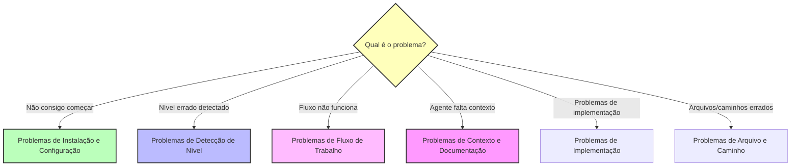

# Guia de Solução de Problemas BMM

Problemas comuns e soluções para o Módulo de Método BMad.

---

## Diagnóstico Rápido

**Use este fluxograma para encontrar seu problema:**



---

## Índice

- [Problemas de Instalação e Configuração](#problemas-de-instalação-e-configuração)
- [Problemas de Detecção de Nível](#problemas-de-detecção-de-nível)
- [Problemas de Fluxo de Trabalho](#problemas-de-fluxo-de-trabalho)
- [Problemas de Contexto e Documentação](#problemas-de-contexto-e-documentação)
- [Problemas de Implementação](#problemas-de-implementação)
- [Problemas de Arquivo e Caminho](#problemas-de-arquivo-e-caminho)
- [Problemas de Comportamento do Agente](#problemas-de-comportamento-do-agente)
- [Problemas de Integração (Brownfield)](#problemas-de-integração-brownfield)

---

## Problemas de Instalação e Configuração

### Problema: BMM não encontrado após instalação

**Sintomas:**

- Comando `bmad` não reconhecido
- Arquivos de agente não acessíveis
- Fluxos de trabalho não carregam

**Solução:**

```bash
# Verifique se o BMM está instalado
ls bmad/

# Se não presente, rode o instalador
npx bmad-method@alpha install

# Para instalação limpa
npx bmad-method@alpha install --skip-version-prompt
```

### Problema: Agentes não têm menu

**Sintomas:**

- Carrega arquivo de agente mas nenhum menu aparece
- Agente não responde a comandos

**Solução:**

1. Garanta que você está carregando o caminho de arquivo correto do agente: `bmad/bmm/agents/[agent-name].md`
2. Espere alguns segundos para o agente inicializar
3. Tente pedir "show menu" ou "help"
4. Verifique se a IDE suporta renderização Markdown com contexto
5. Para Claude Code: Garanta que o arquivo do agente está aberto no contexto do chat

### Problema: Fluxos de trabalho não encontrados

**Sintomas:**

- Agente diz que fluxo não existe
- Menu mostra fluxo mas não roda

**Solução:**

1. Verifique se fluxo existe: `ls bmad/bmm/workflows/`
2. Verifique se agente tem acesso ao fluxo (cheque lista de fluxos do agente)
3. Tente usar número do menu em vez do nome do fluxo
4. Reinicie o chat com agente em sessão fresca

---

## Problemas de Detecção de Nível

### Problema: workflow-init sugere nível errado

**Sintomas:**

- Detecta Nível 3 mas você só precisa de Nível 1
- Sugere Nível 1 mas projeto é na verdade Nível 2
- Não consegue descobrir nível apropriado

**Solução:**

1. **Sobrescreva a sugestão** - workflow-init sempre pede confirmação, apenas diga "não" e escolha o nível correto
2. **Seja específico na descrição** - Use palavras-chave de nível ao descrever:
   - "fix bug" → Nível 0
   - "add small feature" → Nível 1
   - "build dashboard" → Nível 2
3. **Override manual** - Você sempre pode trocar níveis depois se necessário

**Exemplo:**

```
workflow-init: "Projeto Nível 3?"
Você: "Não, isso é apenas adicionar login OAuth - Nível 1"
workflow-init: "Entendido, criando fluxo Nível 1"
```

### Problema: Nível do projeto incerto

**Sintomas:**

- Entre Nível 1 e Nível 2
- Não tem certeza se arquitetura é necessária
- Contagem de estórias incerta

**Solução:**
**Na dúvida, comece menor:**

- Escolha Nível 1 em vez de Nível 2
- Você sempre pode rodar `create-prd` depois se necessário
- Nível 1 é mais rápido, menos overhead
- Fácil de fazer upgrade, difícil de fazer downgrade

**Critério de decisão:**

- Épico único com estórias relacionadas? → Nível 1
- Múltiplos épicos independentes? → Nível 2
- Precisa de planejamento nível de produto? → Nível 2
- Só precisa de plano técnico? → Nível 1

### Problema: Docs de planejamento antigos influenciando detecção de nível

**Sintomas:**

- PRD antigo Nível 3 na pasta
- Trabalhando em correção de bug nova Nível 0
- workflow-init sugere Nível 3

**Solução:**
workflow-init pergunta: "Isso é trabalho em andamento ou esforço anterior?"

- Responda: "Esforço anterior"
- Então descreva seu NOVO trabalho claramente
- Sistema detectará nível baseado no NOVO trabalho, não em artefatos antigos

---

## Problemas de Fluxo de Trabalho

### Problema: Fluxo falha ou trava

**Sintomas:**

- Fluxo começa mas não completa
- Agente para de responder no meio do fluxo
- Progresso estagna

**Solução:**

1. **Cheque limites de contexto** - Comece chat fresco para fluxos complexos
2. **Verifique pré-requisitos**:
   - Fase 2 precisa de Fase 1 completa (se usada)
   - Fase 3 precisa de Fase 2 completa
   - Fase 4 precisa de Fase 3 completa (se Nível 3-4)
3. **Reinicie fluxo** - Carregue agente em novo chat e reinicie
4. **Cheque arquivo de status** - Verifique `bmm-workflow-status.md` ou `sprint-status.yaml` presente e válido

### Problema: Agente diz "fluxo não encontrado"

**Sintomas:**

- Requisita fluxo por nome
- Agente não o reconhece
- Menu não mostra fluxo

**Solução:**

1. Cheque ortografia/formato - Use nome exato do fluxo ou atalho do menu (`*prd` não `*PRD`)
2. Verifique se agente tem fluxo:
   - Agente PM: prd, tech-spec
   - Agente Arquiteto: create-architecture, validate-architecture
   - Agente SM: sprint-planning, create-story
3. Tente número do menu em vez do nome
4. Cheque se está usando agente correto para o fluxo

### Problema: Fluxo sprint-planning falha

**Sintomas:**

- Não consegue criar sprint-status.yaml
- Épicos não extraídos de arquivos
- Arquivo de status vazio ou incorreto

**Solução:**

1. **Verifique se arquivos de épico existem**:
   - Nível 1: tech-spec com épico
   - Nível 2-4: epics.md ou arquivos de épico fragmentados
2. **Cheque formato de arquivo**:
   - Arquivos de épico devem ser Markdown válido
   - Headers de épico devem ser claros (## Epic Name)
3. **Rode na Fase 4 apenas** - Garanta Fase 2/3 completa primeiro
4. **Cheque caminhos de arquivo** - Arquivos de épico devem estar na pasta de saída correta

---

## Problemas de Contexto e Documentação

### Problema: Agentes de IA faltam entendimento da base de código (Brownfield)

**Sintomas:**

- Sugestões não alinham com padrões existentes
- Ignora componentes disponíveis
- Propõe abordagens que conflitam com arquitetura
- Não referencia código existente

**Solução:**

1. **Rode document-project** - Crítico para projetos brownfield
   ```
   Carregue Agente Analista → rode document-project
   Escolha nível de scan: Deep (recomendado para prep PRD)
   ```
2. **Verifique se docs/index.md existe** - Este é o ponto de entrada mestre para agentes de IA
3. **Cheque completude da documentação**:
   - Revise docs/index.md gerado
   - Garanta que sistemas chave estão documentados
4. **Rode deep-dive em áreas específicas** se necessário

### Problema: Tem documentação mas agentes não conseguem encontrar

**Sintomas:**

- README.md, ARCHITECTURE.md existem
- Agentes de IA ainda perguntam questões respondidas nos docs
- Sem arquivo docs/index.md

**Solução:**
**Opção 1: Conserto rápido (2-5min)**
Rode tarefa `index-docs`:

- Localizada em `bmad/core/tasks/index-docs.xml`
- Escaneia docs existentes e gera index.md
- Leve, apenas cria navegação

**Opção 2: Abrangente (10-30min)**
Rode fluxo document-project:

- Descobre docs existentes no Passo 2
- Gera NOVA documentação amigável para IA da base de código
- Cria index.md linkando para AMBOS docs existentes e novos

**Por que isso importa:** Agentes de IA precisam de ponto de entrada estruturado (index.md) para navegar docs eficientemente.

### Problema: document-project demora muito

**Sintomas:**

- Scan exaustivo rodando por horas
- Impaciente para começar planejamento

**Solução:**
**Escolha nível de scan apropriado:**

- **Quick (2-5min)** - Análise de padrão, sem leitura de fonte - Bom para visão geral inicial
- **Deep (10-30min)** - Lê caminhos críticos - **Recomendado para maioria dos projetos brownfield**
- **Exhaustive (30-120min)** - Lê todos os arquivos - Apenas para planejamento de migração ou entendimento completo

Para a maioria dos projetos brownfield, **Deep scan é suficiente**.

---

## Problemas de Implementação

### Problema: Testes existentes quebrando (Brownfield)

**Sintomas:**

- Falhas em testes de regressão
- Funcionalidade previamente funcionando quebrada
- Testes de integração falhando

**Solução:**

1. **Revise mudanças contra padrões existentes**:
   - Cheque se novo código segue convenções existentes
   - Verifique contratos de API inalterados (a menos que intencionalmente versionados)
2. **Rode fluxo test-review** (Agente TEA):
   - Analisa cobertura de teste
   - Identifica riscos de regressão
   - Sugere correções
3. **Adicione teste de regressão ao DoD**:
   - Todos testes existentes devem passar
   - Adicione testes de integração para novo código
4. **Considere feature flags** para lançamento gradual

### Problema: Estória demora muito mais que estimado

**Sintomas:**

- Estória estimada 4 horas, demorou 12 horas
- Critérios de aceite mais difíceis que o esperado
- Complexidade oculta descoberta

**Solução:**
**Isso é normal!** Estimativas são estimativas. Para lidar:

1. **Continue até DoD atendido** - Não comprometa qualidade
2. **Documente aprendizados na retrospectiva**:
   - O que causou o atraso?
   - O que devemos observar na próxima vez?
3. **Considere dividir estória** se for verdadeiramente duas estórias
4. **Ajuste estimativas futuras** baseado nesses dados

**Não estresse sobre precisão de estimativa** - use-as para aprendizado, não julgamento.

### Problema: Pontos de integração pouco claros

**Sintomas:**

- Não tem certeza de como conectar código novo ao existente
- Incerto quais arquivos modificar
- Múltiplas abordagens de integração possíveis

**Solução:**

1. **Para brownfield**:
   - Garanta que document-project capturou arquitetura existente
   - Revise docs de arquitetura antes de implementar
2. **Cheque arquivo de estória** - Deve documentar pontos de integração
3. **Em tech-spec/arquitetura** - Documente explicitamente:
   - Quais módulos existentes modificar
   - Quais APIs/serviços integrar
   - Fluxo de dados entre código novo e existente
4. **Rode fluxo integration-planning** (Nível 3-4):
   - Agente Arquiteto cria estratégia de integração

### Problema: Padrões inconsistentes sendo introduzidos

**Sintomas:**

- Novo estilo de código não combina com existente
- Abordagem arquitetural diferente
- Não seguindo convenções do time

**Solução:**

1. **Cheque detecção de convenção** (Quick Spec Flow):
   - Deve detectar padrões existentes
   - Pede confirmação antes de proceder
2. **Revise documentação** - Garanta que document-project capturou padrões
3. **Use arquivos de estória abrangentes** - Inclua orientação de padrão na estória
4. **Adicione ao checklist de code-review**:
   - Aderência a padrão
   - Consistência de convenção
   - Correspondência de estilo
5. **Rode retrospectiva** para identificar desvios de padrão cedo

---

## Problemas de Arquivo e Caminho

### Problema: Arquivos de saída em localização errada

**Sintomas:**

- PRD criado na pasta errada
- Arquivos de estória não onde esperados
- Documentação espalhada

**Solução:**
Cheque `bmad/bmm/config.yaml` para caminhos configurados:

```yaml
output_folder: '{project-root}/docs'
dev_story_location: '{project-root}/docs/stories'
```

Localizações padrão:

- Docs de planejamento (PRD, épicos, arquitetura): `{output_folder}/`
- Estórias: `{dev_story_location}/`
- Arquivos de status: `{output_folder}/bmm-workflow-status.md`, `{output_folder}/sprint-status.yaml`

Para mudar localizações, edite config.yaml então re-execute fluxos.

### Problema: Não consegue encontrar arquivo de status

**Sintomas:**

- workflow-status diz sem arquivo de status
- Não consegue rastrear progresso
- Lugar perdido no fluxo

**Solução:**

1. **Cheque localização padrão**: `docs/bmm-workflow-status.md`
2. **Se faltando, reinicialize**:
   ```
   Carregue Agente Analista → rode workflow-init
   ```
3. **Para Fase 4**: Procure por `sprint-status.yaml` na mesma pasta do PRD
4. **Busque por ele**:
   ```bash
   find . -name "bmm-workflow-status.md"
   find . -name "sprint-status.yaml"
   ```

### Problema: Sprint-status.yaml não atualizando

**Sintomas:**

- Fluxos completam mas status inalterado
- Estórias presas em status antigo
- Status de épico não progredindo

**Solução:**

1. **Atualização manual requerida** - Maioria das mudanças de status são manuais:
   ```yaml
   stories:
     - id: epic-1-story-1
       status: done # Mude isto manualmente
   ```
2. **Alguns fluxos auto-atualizam**:
   - sprint-planning cria arquivo
   - create-story muda estória para "ready-for-dev"
   - dev-story pode auto-atualizar (cheque fluxo)
3. **Re-execute sprint-planning** para resincronizar se necessário

---

## Problemas de Comportamento do Agente

### Problema: Agente fornece respostas vagas ou genéricas

**Sintomas:**

- "Use framework apropriado"
- "Siga melhores práticas"
- Conselho genérico sem especificidades

**Solução:**

1. **Forneça mais contexto** - Seja específico na sua descrição:
   - "Adicione OAuth usando passport.js ao servidor Express"
   - Não: "Adicione autenticação"
2. **Para brownfield**:
   - Garanta que document-project foi rodado
   - Agente precisa de contexto de base de código para conselho específico
3. **Referencie docs existentes**:
   - "Baseado no sistema de auth existente em UserService..."
4. **Comece chat fresco** - Sobrecarga de contexto pode causar respostas genéricas

### Problema: Agente alucinando ou inventando informação

**Sintomas:**

- Referencia arquivos que não existem
- Sugere APIs que não estão na sua stack
- Cria requisitos imaginários

**Solução:**

1. **Use chat fresco** - Estouro de contexto principal causa de alucinações
2. **Forneça restrições concretas**:
   - "Usamos Express 4.18.2, não Next.js"
   - "Nosso banco é PostgreSQL, não MongoDB"
3. **Para brownfield**:
   - Document-project fornece base factual
   - Agente vê código real, não suposições
4. **Corrija imediatamente**:
   - "Não, não temos UserService, temos AuthenticationModule"

### Problema: Agente não segue instruções

**Sintomas:**

- Ignora pedidos específicos
- Faz algo diferente do pedido
- Não respeita restrições

**Solução:**

1. **Seja mais explícito** - Agentes respondem a instruções claras e específicas:
   - "Use EXATAMENTE estes três passos..."
   - "NÃO inclua migrações de banco nesta estória"
2. **Cheque capacidades do agente** - Agente pode não ter acesso ao fluxo requisitado
3. **Tente fraseado diferente** - Reformule pedido para ser mais direto
4. **Use sistema de menu** - Números são mais claros que comandos de texto

---

## Problemas de Integração (Brownfield)

### Problema: Novo código conflita com arquitetura existente

**Sintomas:**

- Abordagem de integração não encaixa na estrutura existente
- Requereria refatoração maior
- Conflita com padrões estabelecidos

**Solução:**

1. **Cheque se document-project foi rodado** - Agentes precisam de contexto de arquitetura
2. **Revise docs de arquitetura existentes**:
   - Leia docs/architecture.md (de document-project)
   - Entenda design de sistema atual
3. **Para Nível 3-4**:
   - Rode fluxo validate-architecture antes de planejar
   - Use fluxo integration-planning
4. **Documente explicitamente estratégia de integração** na arquitetura:
   - Como novos componentes encaixam na estrutura existente
   - Que modificações necessárias para código existente
   - Caminho de migração se mudando padrões

### Problema: Mudanças quebrando APIs existentes

**Sintomas:**

- Mudar API quebra consumidores
- Serviços downstream afetados
- Precisa de compatibilidade reversa

**Solução:**

1. **Identifique todos consumidores de API** (document-project deve mostrar isso)
2. **Planeje estratégia de versionamento**:
   - API v1 (existente) + v2 (nova)
   - Linha do tempo de depreciação
3. **Use feature flags** para lançamento gradual
4. **Documente guia de migração** para consumidores de API
5. **Adicione à estratégia de teste**:
   - Consumidores existentes ainda funcionam (v1)
   - Nova funcionalidade funciona (v2)

### Problema: Migração de dados requerida

**Sintomas:**

- Mudanças de esquema necessárias
- Dados existentes precisam de transformação
- Risco de perda de dados

**Solução:**

1. **Crie estratégia de migração explícita** na arquitetura:
   - Migração para frente (esquema velho → novo)
   - Plano de rollback (esquema novo → velho)
   - Abordagem de validação de dados
2. **Teste migrações extensivamente**:
   - Em cópia de dados de produção
   - Meça impacto de performance
3. **Planeje lançamento**:
   - Ambiente de staging primeiro
   - Lançamento de produção gradual
   - Monitoramento para problemas
4. **Documente em tech-spec/arquitetura**:
   - Scripts de migração
   - Procedimentos de rollback
   - Downtime esperado

---

## Ainda Travado?

### Obtendo Mais Ajuda

Se seu problema não está coberto aqui:

1. **Cheque outra documentação**:
   - [FAQ](./faq.md) - Perguntas comuns
   - [Glossário](./glossary.md) - Terminologia
   - [Início Rápido](./quick-start.md) - Uso básico
   - [Guia Brownfield](./brownfield-guide.md) - Bases de código existentes
   - [Sistema Adaptativo à Escala](./scale-adaptive-system.md) - Entendendo níveis

2. **Suporte da comunidade**:
   - [Discord](https://discord.gg/gk8jAdXWmj) - #general-dev, #bugs-issues
   - Comunidade ativa, respostas rápidas
   - Compartilhe sua situação específica

3. **Reporte bugs**:
   - [Issues do GitHub](https://github.com/bmad-code-org/BMAD-METHOD/issues)
   - Inclua versão, passos para reproduzir, comportamento esperado vs real

4. **Tutoriais em vídeo**:
   - [Canal YouTube](https://www.youtube.com/@BMadCode)
   - Walkthroughs visuais de fluxos comuns

---

## Mensagens de Erro Comuns

### "No workflow status file found"

**Causa:** Ainda não rodou workflow-init
**Conserto:** Carregue Agente Analista → rode workflow-init

### "Epic file not found"

**Causa:** PRD/épicos não criados, ou caminho errado
**Conserto:** Verifique se PRD/épicos existem na pasta de saída, cheque caminhos config.yaml

### "Story not in sprint-status.yaml"

**Causa:** Sprint-planning não rodado, ou arquivo de estória não criado
**Conserto:** Rode fluxo sprint-planning, verifique se arquivos de estória existem

### "Documentation insufficient for brownfield"

**Causa:** Sem docs/index.md ou document-project não rodado
**Conserto:** Rode fluxo document-project com Deep scan

### "Level detection failed"

**Causa:** Descrição de projeto ambígua
**Conserto:** Seja mais específico, use palavras-chave de nível (fix, feature, platform, etc.)

### "Context generation failed"

**Causa:** Faltando pré-requisitos (arquivo de estória ou docs)
**Conserto:** Verifique se arquivo de estória existe, docs presentes

---

## Dicas de Prevenção

**Evite problemas comuns antes que aconteçam:**

1. ✅ **Sempre rode document-project para brownfield** - Salva horas de problemas de contexto depois
2. ✅ **Use chats frescos para fluxos complexos** - Previne alucinações e estouro de contexto
3. ✅ **Verifique existência de arquivos antes de rodar fluxos** - Cheque se PRD, épicos, estórias estão presentes
4. ✅ **Leia menu do agente antes de requisitar fluxos** - Confirme se agente tem o fluxo
5. ✅ **Comece com nível menor se incerto** - Fácil de atualizar (Nível 1 → 2), difícil de fazer downgrade
6. ✅ **Mantenha arquivos de status atualizados** - Atualizações manuais quando necessário, não deixe derivar
7. ✅ **Rode retrospectivas após épicos** - Pegue problemas cedo, melhore próximo épico
8. ✅ **Siga sequência de fase** - Não pule fases obrigatórias (Fase 2 antes de 3, 3 antes de 4)

---

**Problema não listado?** Por favor [reporte-o](https://github.com/bmad-code-org/BMAD-METHOD/issues) para que possamos adicioná-lo a este guia!
